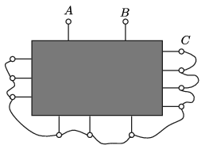
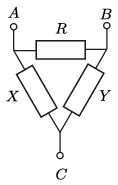

**Megoldás.**
 Jelöljük a mérendő pontokat $A$-val és $B$-vel. Röpzsinórok segítségével kössük össze az összes további kivezetést, és jelöljük a közös pontjukat $C$-vel ( 1. ábra ).
 1. ábra
 Legyen az $A$ és $B$ pontok közötti (keresett) ellenállás nagysága $R$, az $AC$ pontpár közötti ellenállások eredője $X$, a $B$ és $C$ közöttiek eredője pedig $Y$ ( 2. ábra ).
 2. ábra
 Három ellenállásmérést végzünk.
 $a)$ Rövidre zárjuk $A$-t és $B$-t, majd megmérjük az $A$ és $C$ közötti $R_1$ eredő ellenállást:
 $(1)$ $\frac{1}{R_1}=\frac{1}{X}+\frac{1}{Y},$
 $b)$ Rövidre zárjuk $A$-t és $C$-t, majd megmérjük az $A$ és $B$ közötti $R_2$ eredő ellenállást:
 $(2)$ $\frac{1}{R_2}=\frac{1}{R}+\frac{1}{Y},$
 $c)$ Rövidre zárjuk $B$-t és $C$-t, majd megmérjük az $A$ és $B$ közötti $R_3$ eredő ellenállást:
 $(3)$ $\frac{1}{R_3}=\frac{1}{R}+\frac{1}{X}.$
 Vonjuk ki a (2) és (3) egyenletek összegéből az (1) egyenletet:
 $\frac{1}{R_2}+\frac{1}{R_3}-\frac{1}{R_1}=\frac{2}{R}.$
 Innen kifejezhetjük a keresett $R$ ellenállás nagyságát a mért (ismert) $R_1$, $R_2$ és $R_3$ segítségével:
 $R=
 2\left(\frac{1}{R_2}+\frac{1}{R_3}-\frac{1}{ R_1} \right)^{-1}.$

