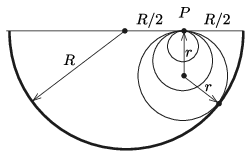
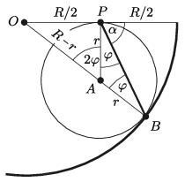

**Megoldás.**
 A lejtőnek nyilván a vályú tengelyére merőleges, függőleges síkban kell feküdnie. A továbbiakban ezt a ,,síkbeli'' nézetet vizsgáljuk.
 Ismert tétel, hogy egy adott $P$ pontból induló, különböző hajlásszögű lejtőkön súrlódásmentesen lecsúszó testek bármelyik pillanatban egy olyan körön helyezkednek el, ami a $P$ pontra illeszkedik, és a körnek a $P$ ponthoz tartozó sugara függőleges. A kör sugara az eltelt idő négyzetével arányos, tehát a legrövidebb időnek az a kör felel meg, amelyik érinti vályú keresztmetszetének megfelelő félkört ( 1. ábra ).

 1. ábra

 Jelöljük a vályú sugarát $R$-rel, a leggyorsabb lecsúszáshoz tartozó kör sugarát $r$-rel és a lejtőnek a függőlegessel bezárt szögét $\varphi$-vel ( 2. ábra ).

 2. ábra

 Az $OPA$ derékszögű háromszögre felírt Pitagorasz-tétel szerint
 $\left(\frac{R}{2}\right)^2+r^2=(R-r)^2,$
 vagyis
 $r=\frac{3}{8}R,$
 tehát
 ${\rm tg}\,2\varphi=\frac{R}{2r}=\frac{4}{3},$
 azaz
 $\varphi=26{,}6^\circ,$
 a lejtő hajlásszöge pedig
 $\alpha=90^\circ-\varphi=63{,}4^\circ.$

