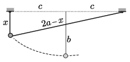

**Megoldás.**
 A golyó pályája (a damil hosszának állandósága miatt) egy olyan ellipszis, amelynek fél nagytengelye $a= 40~\rm cm$ hosszúságú, és a fókuszpontjai a damilszál rögzítési pontjai. A fókuszpontok távolságát $2c$-vel jelölve az ellipszis fél kistengelye $b=\sqrt{a^2-c^2}$. A lecsúszó test sebessége akkor lesz a legnagyobb, amikor a kezdeti helyzetéhez képest a legnagyobb a függőleges irányú lesüllyedése. Ez a helyzet az ellipszis kistengelyének alsó végpontja.

 $a)$ Kezdetben az acélgolyó a nagytengely alatt, attól $x $ távolságra van. Az ábrán látható derékszögű háromszögre felírt Pitagorasz-tételből leolvashatjuk, hogy
 $x^2+(2c)^2=(2a-x)^2,$
 innen
 $x=\frac{a^2-c^2}{a}=\frac{b^2}{a}.$
 A pálya legmélyebb pontjánál a test távolsága a nagytengelytől $b$, tehát a munkatétel szerint
 $\frac{1}{2}mv_\text{max}^2=mg\left(b-\frac{b^2}{a}\right),$
 ahonnan
 $v_\text{max}=\sqrt{2g\left(b-\frac{b^2}{a}\right)}.$
 Mivel $g$ és $a$ adott nagyságú, a zárójelben álló, $b$-től kvadratikusan függő kifejezés akkor lesz a legnagyobb, amikor a $b=a/2$. Innen már következik, hogy
 $v_\text{max}=\sqrt{\frac{ga}{2}}=1{,}4~\frac{\rm m}{\rm s}.$
 $b)$ A kistengely végpontjánál az ellipszis görbületi sugara: $R=a^2/b$, esetünkben $R=2a$. Ha a damilt az acélgolyó legnagyobb sebességénél $F$ erő feszíti, akkor a két oldalon ható erők eredője függőlegesen felfelé mutat, és a nagysága $b=a/2$ miatt ugyancsak $F$. A mozgásegyenlet szerint
 $F-mg=m\frac{v_\text{max}^2}{R},$
 ahonnan a keresett erő:
 $F=mg+m\frac{v_\text{max}^2}{R}=mg+m\frac{ga}{2\cdot 2a}=\frac 54 mg\approx 0{,}06~\rm N.$

