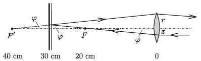

**Megoldás.**
 A lencse területe $r^2\pi=78{,}5~\rm cm^2$, ekkora területre 7,85 W sugárzási teljesítmény esik, amelynek $5/6\approx0{,}83=83$%-a, vagyis 6,5 W a melegítés szempontjából hasznos teljesítmény. Nézzük meg, hogy ekkora teljesítmény mennyi idő alatt tud megolvasztani $0,1\ \text{cm}^3\ 0\ ^{\circ}\text{C}$ hőmérsékletű jeget. Az alumíniumtégely nem vesz fel hőt, hiszen az olvadás során a hőmérséklet végig $0\ ^{\circ}\text{C}$ marad. A jég sűrűsége $0,9\ \text{g/cm}^3$, tehát $0,1\
\text{cm}^3$ jég tömege $0,09\ \text{g}$. $1\ \text{g}\ 0\ ^{\circ}\text{C}$-os jég megolvasztásához $335~\rm J$ hő szükséges, így $0,09~\text{g}$ jég megolvasztásához
 $t=\frac{m\,L }{P}=\frac{(0,09~\text{g})\cdot 335~\rm J/g}{6{,}5~\rm W}
=4{,}6\ \text{s}$
 időre van szükség.
 A síktükör által visszavert sugarak egy részét a lencse ismét fókuszálja, tehát a ,,második fókuszpontba'' helyezett tégelyben is gyorsabban fog megolvadni a jég , mint a környező helyeken. Az $F$ fókuszponton áthaladó sugarak a tükröződés után úgy haladnak tovább, mintha az $F'$ pontből indultak volna el. Ez a pont éppen a lencse kétszeres fókusztávolságánál van, tehát a megfelelő képtávolság is ugyanekkora lesz. A tégelyt tehát a lencse elé, attól 40 cm-távolságra elhelyezve viszonylag gyors jégolvadást várhatunk. Az ábráról leolvasható, hogy a tükröződő képalkotásban csak azok a fénysugarak vesznek rész, amelyek az optikai tengelytől mérve $x=2{,}5$ cm-nél kisebb távolságban érték el a lencsét. Ez a távolság a lencse sugarának felét, felületének $\tfrac14$ részét jelenti, tehát a második helyzetben négyszer hosszabb idő, kb. 18 s alatt olvad meg a jég.

 Megjegyzések. 1. A lencse Nap felöli oldalára helyezett tégely kitakarja a napsugárzás egy részét. Ez a hatás a melegítést nem csökkenti, mert maga a tégely fogja fel a sugarakat, azok pedig közvetlenül melegítik a bekormozott fémet.
 2. A feladat szövege a veszteségeket – szokatlan módon – nem az összes beeső energia, hanem a ,,hasznos'' energia 20%-ként adta meg. Ha a szokásos módon értelmezzük az arányokat, akkor 80%-os hatásfokkal kell számoljunk, és ekkor az olvadási idők mintegy 4%-kal nagyobbnak adódnak. (Bármelyik értelmezés szerint számolt megoldást – ha az egyébként helyes – teljes értékűnek fogadjuk el.)

