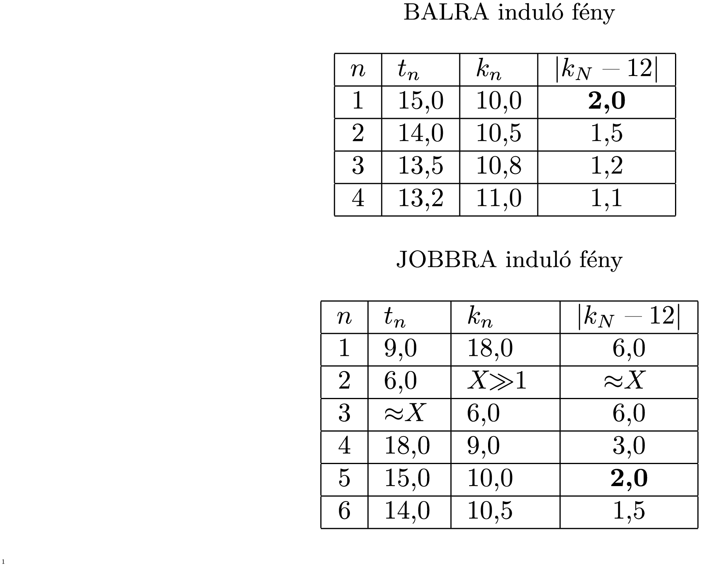

**Megoldás.**
 Az $R$ sugarú búra tükröző falának mint gömbtükörnek $f=\frac{R}{2}=6~$cm a fókusztávolsága.
 A leképezési törvény szerint a búrától $t$ távolságból lévő fényforrás (tárgy) képe $k=\frac{tf}{t-f}$ távolságban jön létre. Ha minden távolságot cm egységekben mérünk, akkor $k=6t/(t-6)$.

 Megjegyzés. Ha a búrának az optikai tengely közelében lévő két kis felületdarabját tükröző bevonattal látjuk el, akkor csak az optikai tengelyhez közeli sugarak vesznek részt a képalkotásban, és ezekre érvényesek a szokásos közelítések, alkalmazható a leképezési törvény.

 Ha többszörös tükröződés során valamelyik tárgytávolság $t_n$, a hozzá tartozó képtávolság
 $(1)$ $k_n=\frac{6t_n}{t_n-6},$
 ami a szemközti tükörtől $24-k_n$ távolságra van, és így a következő leképezés tárgytávolsága
 $(2)$ $t_{n+1}=24-\frac{6t_n}{t_n-6}\equiv 18\frac{t_n-8}{t_n-6}.$
 Ez a rekurziós képlet megadja az egymást követő tükröződések hatására kialakuló képek helyét, amennyiben ismerjük a legelső $t_1$ távolságot. Esetünkben a jobbra kiinduló fénysugarakra $t_1=12-3=9~$cm, a bal felé induló sugarakra pedig $t_1=12+3=15~\rm cm$. A feladat követelményének az felel meg, ha van olyan $n=N$ egész szám, amelyre
 $\vert k_N-12\vert=2,$
 vagyis $k_N=14$ és 10 (centiméter) valamelyike.
 Az izzószálból balra, illetve jobbra kiinduló fénysugarakra a tárgy- és képtávolságok (1) és (2) szerint így követik egymást:

 A második táblázatban a ($X\gg 1$) jel arra utal, hogy a kép valahol nagyon messze (vagy sehol se) keletkezik, mert a fénysugarak majdnem pontosan párhuzamosan haladnak. A táblázatok adatait nézve megállapíthatjuk, hogy a balra induló fénysugarak már az első tükröződés után a gömb középpontjától 2 cm-re, annak bal oldalán. A jobbra induló fénysugarak 5 tükröződés után teszik meg ugyanezt, és a kép a gömb középpontjának jobb oldalánál keletkezik.
 A képeknek a tárgy méretéhez viszonytott nagyságát (a nagyítást) az egyes tükröződések során kiszámítható nagyítások szorzata adja meg:
 $N_\text{balra}=\frac{k_1}{t_1}=\frac{2}{3},$
 illetve
 $N_\text{jobbra}=\frac{k_1}{t_1}
\cdot\frac{X}{t_2} \cdot\frac{k_3}{X} \cdot\frac{k_4}{t_4} \cdot\frac{k_5}{t_5} =\frac{2}{3},$
 tehát a két kép nagysága megegyezik.

 Megjegyzések. A geometriai optikai feladatok megoldásakor célszerű a problémát egyszerre vizsgálni algebrailag és geometriailag. Most, ebben a feladatban előfordul, hogy egy fókuszsíkban lévő pont a tárgypont, ebből indul ki széttartó sugárnyaláb. Ez párhuzamos nyalábként verődik vissza, s halad a másik oldali tükröző felület felé. Miután onnan visszaverődik, egy olyan összetartó nyalábbá alakul, mely e második tükör fókuszsíkjának valamelyik pontja felé halad. Geometriailag könnyű belátni, hogy ez a képpont ugyanolyan messze lesz az optikai tengelytől, mint amilyen messze volt az eredeti tárgypont. Ezzel a geometriai érveléssel kikerülhető az az algebrai képlet, amely szerint a nagyítás az egymás utáni nagyítások szorzata, és amely értelmét veszti a fókuszsík egy pontjából kiinduló, majd párhuzamosan haladó fénysugarak esetében.
 2. Be lehet látni, hogy bármelyik irányban induló fénysugár esetében a táblázat további folytatásával kapható $\vert
k_i-12\vert$ sorozat monoton csökken és nullához tart, tehát a ki nem számított képek egyike sem lehet éppen 2 cm-re a búra középpontjától. Ennek bebizonyítását azonban nem kérte a feladat, a megoldás enélkül is teljes értékűnek tekintendő.

