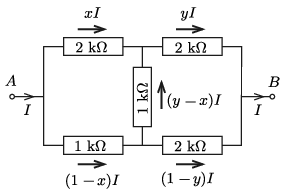
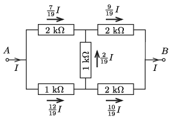
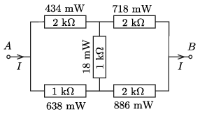

**Megoldás.**
 $a)$ Jelöljük a felső ágban folyó áramok erősségét $xI$ és $yI$ módon. A többi ágban ( Kirchhoff csomóponti törvényét figyelembe véve) az 1. ábra jelöléseinek megfelelő áramok folynak.

 1. ábra

 A Kirchhoff-féle huroktörvény szerint:
 $2x-(y-x)-(1-x)=0\qquad\text{és}\qquad (y-x)+2y-2(1-y)=0.$
 Ennek az egyenletrendszernek a megoldása:
 $x=\frac{7}{19}\qquad\text{és}\qquad y=\frac{9}{19},$
 vagyis az egyes ellenállásokon folyó áramok a 2. ábrán jelölt értékek ($I=40$ mA).

 2. ábra

 $b)$ A teljesítmények a $P=I^2R$ összefüggés szerint számíthatók ( 3. ábra ):

 3. ábra

 $c)$ Az 5 ellenállás összteljesítménye $P=2{,}69$ W. Ha az eredő ellenállás $R$, akkor $P=I^2R,$ vagyis
 $R=\frac{2{,}69~\rm W}{(40~\rm mA)^2}\approx 1{,}68~\rm k\Omega.$
 Ugyanezt az eredményt delta-csillag átalakítással is megkaphatjuk: $R=\tfrac{32}{19}~\rm k\Omega\approx 1{,}68~\rm
k\Omega.$

