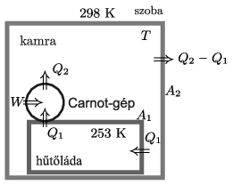

**Megoldás.**
 Jelöljük a kamra abszolút hőmérsékletét (kelvinben mérve) $T$-vel; az első esetben $T=273+25=298$. A hűtőláda belsejének hőmérséklete mindkét esetben $273-20=253,$ a szoba hőmérséklete pedig $273+20=293$.
 I. eset: egyetlen hűtőláda van a kamrában.

 Legyen a hűtőláda belsejéből egységnyi idő alatt elvont hő $Q_1$, a kamrának leadott hő pedig $Q_2$. ($Q_2>Q_1$, hiszen a hűtőláda motorja is energiát visz be a rendszerbe.) Ha a ládát ideális Carnot-gépnek tekinthetjük, akkor
 $(1)$ $\frac{Q_2}{Q_1}=\frac{T}{253}.$
 A hűtőláda belső hőmérséklete akkor marad állandó, ha a láda falain keresztül hővezetéssel egységnyi idő alatt éppen $Q_1$ hő áramlik vissza, vagyis (Newton hővezetési egyenlete szerint)
 $(2)$ $Q_1=\alpha_1 A_1(T-253),$
 ahol $A_1$ a hűtőláda felülete, $\alpha_1$ pedig az (átlagos) hővezetési együttható.
 A kamra hőmérséklete akkor marad állandó, ha a falain keresztül a lakás felé időegységenként $Q_2-Q_1$ hő távozik:
 $(3)$ $Q_2-Q_1=\alpha_2 A_2(T-293),$
 ahol $A_2$ a kamra és a lakás közötti fal nagysága, $\alpha_2$ pedig a kamra és a lakás közötti hővezetési együttható.
 Osszuk el a (3) egyenletet a (2)-vel, majd a $Q_2/Q_1$ arányt (1)-et felhasználva helyettesítsük be. Így kapjuk, hogy
 $(4)$ $\frac{T}{253}-1=\frac{\alpha_2 A_2 }{\alpha_1 A_1}\cdot\frac{T-293}{T-253}.$
 Tudjuk, hogy $T=298$, ennek megfelelően adódik, hogy
 $(5)$ $\frac{\alpha_2 A_2 }{\alpha_1 A_1}=1{,}6.$

 II. eset: két hűtőláda van a kamrában. Mi változott az előzőekhez képest? A hővezetési együtthatók, valamint a kamra falfelülete ugyanakkora, mint korábban, a hűtőládák és a kamra közötti $A_1$ felület viszont kétszer nagyobb lett. Ennek megfelelően a (4) egyenlet helyett ezt írhatjuk fel:
 $\frac{T}{253}-1=\frac{\alpha_2 A_2 }{\alpha_1 (2 A_1)}\cdot\frac{T-293}{T-253},$
 azaz (5) behelyettesítése után
 $(6)$ $\frac{T}{253}-1=0{,}8\cdot\frac{T-293}{T-253}.$
 A nevezőkkel beszorozva egy másodfokú egyenletet kapunk, aminek a megoldásai:
 $T_1=308~{\rm K}=35~^\circ{\rm C},$
 illetve
 $T_2=401~{\rm K}=128~^\circ{\rm C}.$
 Érezzük, hogy ezek közül az alacsonyabb érték felel meg a kamra tényleges hőmérsékletének.

 Megjegyzés. Az ,,érezzük, hogy ...'' indoklásnál komolyabb érvekkel is alátámaszthatjuk, hogy miért az alacsonyabb kamrahőmérséklet a jó megoldás. Ehhez a megoldások stabilitását kell megvizsgálnunk. Ha a kamrában $T$ hőmérséklet van, a két hűtőládának egységnyi idő alatt együttesen $W(T)=\alpha_1(2A_1)(T-253)^2/253$ munkát kell végeznie, hogy tartani tudja a hűtött tér 253 K-es hőmérsékletét. A kamrát ez a $W(T)$ fűti, miközben időegység alatt $Q(T)=\alpha_2A_2(T-293)$ hő távozik a lakás többi része felé. Egyensúlyban a két mennyiség (6) szerint egyenlő, ha azonban $T<T_1$ vagy $T>T_2$, akkor $W(T)>Q(T)$, míg $T_1<T<T_2$ esetén $W(T)<Q(T)$. Ennek megfelelően, ha kezdetben $T<T_1$, akkor $T$ egészen addig növekszik, amíg el nem éri a $T_1$ értéket. $T>T_2$ kezdőállapotból kiindulva $T$ ugyancsak növekedni kezd, és a rendszer egyre jobban eltávolodik a stacionárius állapottól. (A korlátlan melegedésnek az szab határt, hogy a hűtőláda termosztátja állandóan bekapcsolt állapotban lesz, és még így sem tudja tartani a $-20~^\circ$C-os belső hőmérsékletet. Ezt a jelenséget erős kánikulában akár még egyetlen hűtőszekrény is produkálhatja.) Végül $T_1<T<T_2$ kezdeti hőmérséklettől indulva $T$ időben csökken, egészen a $T=T_1$ egyensúlyi állapot eléréséig. Mindez azt mutatja, hogy $T_1$ stabil egyensúlyi állapotnak, $T_2$ pedig instabil (labilis) állapotnak felel meg.

