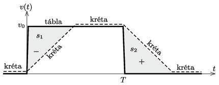
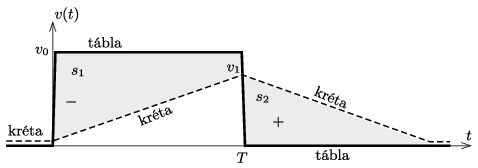

**Megoldás.**
 A tábla hirtelen megindításakor a kréta sebessége még nulla, a tábláé $v_0$. Ezután a kréta sebessége a $\mu m g$ súrlódási erő miatt $a=\mu g$ gyorsulásnak megfelelő ütemben növekszik mindaddig, amíg a relatív sebességük nullára nem csökken, vagy a relatív sebesség előjele meg nem változik.
 A továbbiakban két esetet kell megkülönböztetnünk:
 $a)$ Ha $v_0/(\mu g)\le T$, akkor a kréta $t_1= v_0/(\mu g)$ idő múlva (a táblához képest) megáll, miközben az elmozdulása a táblán (vagyis a krétanyom ,,előjeles hossza'')
 $s_1=-\frac{1}{2}v_0 t_1= -\frac{v_0^2}{2\mu g}.$
 (A negatív előjel azt fejezi ki, hogy a kréta lemarad a táblától.) A tábla későbbi – ugyancsak hirtelen – megállításakor a kréta sebessége $+v_0$, további mozgását pedig $a=-\mu g$ lassulás jellemzi. A kréta sebessége
 $v(t)=v_0-\mu g t$
 módon változik, és a megállásig
 $s_2=+\frac{v_0^2}{2\mu g}$
 utat tesz meg. A krétanyom látható hossza
 $s=s_1=\frac{v_0^2}{2\mu g},$
 hiszen a táblához képest előrefelé mozgó kréta csak vastagítja a már meglévő nyomot, de annak hosszát nem növeli ( 1. ábra ).

 1. ábra

 $b)$ Amennyiben $v_0/(\mu g)> T$, a kréta sebessége a tábla megindulása után $T$ idő elteltével $v_1=\mu g T<v_0.$ Ezalatt a kréta
 $s_1= \frac{v_0+\left(v_0-v_1\right)}{2}T=v_0T-\frac{\mu g}{2}T^2$
 hosszú nyomot hagy a táblán. A tábla hirtelen megállítása után a kréta sebessége a $v_1$ kezdeti értékről $T$ idő alatt nullára csökken, vagyis
 $s_2=\frac{v_1}{2}T$
 hosszú nyomot húz a táblán az előző nyommal ellentétes irányban ( 2. ábra ). Mivel $s_1>s_2,$ a teljes krétanyom hossza
 $s=s_1=v_0T-\frac{\mu g}{2}T^2.$

 2. ábra

