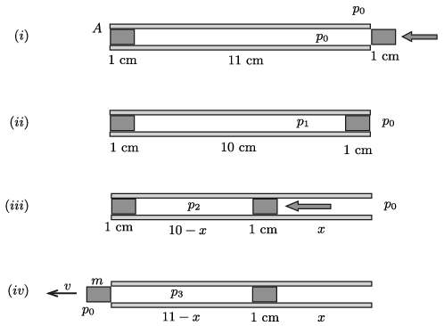

**Megoldás.**
 A folyamat jellegzetes pillanatait az ábra mutatja.

 $(i)$ A tárgyalást kezdhetjük annál az állapotnál, amikor a lövedék már a csőben van, de a dugattyút még nem toltuk bele a csőbe. A csőben a levegő nyomása ekkor $p_0$.
 Érdemes megjegyezni, hogy a cső $A$ nagyságú keresztmetszetén a külső légnyomás $p_0A=3~\rm N$ erőt fejt ki. (Ezt az összefüggést a továbbiakban többször is felhasználjuk.)
 $(ii)$ Lassan betoljuk az 1 cm hosszú dugattyút is a csőbe. A bent lévő levegő állapotváltozása izotermikus, a nyomás (a Boyle–Mariott-törvény szerint
 $p_1=\frac{11~\rm cm}{10~\rm cm}p_0=1{,}1~p_0$
 értékre nő meg.
 Az általunk végzett munka három részből tehető össze:
 – Az átlagos súrlódási erő ellenében végzett munka:
 $W_\text{súrl.}=\frac{3{,}5~\rm N}{2}\cdot (1~{\rm cm})=0{,}0175~\rm J.$
 – A gázon végzett izotermikus munkavégzés:
 $W_\text{gázon}=p_0V_0\ln\frac{p_1}{p_0}=p_0A\cdot(0{,}11~{\rm m})\cdot\ln 1{,}1=0{,}0315~\rm J.$
 – A $p_0$ nyomású légkör térfogata megnő, ennek megfelelő munkavégzésünk:
 $W_\text{légkör}=-p_0A\cdot (0{,}01~\rm m)=-0{,}030~\rm J.$
 A puska megtöltése során végzett összes munkánk:
 $W_{(i)\rightarrow(ii)}=W_\text{súrl.}+W_\text{gázon}+W_\text{légkör}=0{,}019~\rm J.$
 $(iii)$ Ha a dugattyút (lassan) $x$ cm-rel beljebb toljuk a csőbe, a bezárt levegő nyomása izotermikusan
 $p_2=\frac{10}{10-x}p_1=\frac{11}{10-x}p_0$
 értékre nő. A lövedék akkor mozdul meg a csőben, ha
 $p_2A=p_0A+(4~\rm N)=7~\rm N,$
 vagyis
 $p_2=\frac{7}{3}p_0=\frac{7}{3}p_0.$
 Az izotermikus állapotegyenlet szerint ez akkor teljesül, ha
 $\frac{11}{10-x}p_0=\frac{7}{3}p_0,$
 ahonnan
 $x=\frac{37}{7}\approx 5{,}29.$
 A megtöltött krumplipuska dugattyúját tehát 5,29 cm-rel kell betoljuk a csőbe, ekkor fog a puska ,,elsülni''.
 Az általunk végzett munka most is három részből tehető össze:
 – A súrlódási erő ellenében végzett munka:
 $W_\text{súrl.}= {3{,}5~\rm N} \cdot (5{,}29~{\rm cm})=0{,}185~\rm J.$
 – A gázon végzett izotermikus munkavégzés:
 $W_\text{gázon}=p_0V_0\ln\frac{p_2}{p_1}=p_0A\cdot(0{,}11~{\rm m})\cdot\ln\frac{7/3}{1{,}1} =0{,}248~\rm J.$
 – A $p_0$ nyomású légkör térfogata megnő, ennek megfelelő munkavégzésünk:
 $W_\text{légkör}=-p_0A\cdot (0{,}053~\rm m)=-0{,}159~\rm J.$
 A már megtöltött puska elsütéséig végzett összes munkánk:
 $W_{(ii)\rightarrow(iii)}=W_\text{súrl.}+W_\text{gázon}+W_\text{légkör}=0{,}274~\rm J.$
 $(iv)$ A már megmozdult lövedékre korábban ható tapadó súrlódási erő lecsökken 3,5 N-nyi csúszási súrlódásra, és emiatt a lövedék (krumplidugó) hirtelen elhagyja a csövet. A gyors folyamatban adiabatikus állapotváltozás történik, és a nyomás 1 cm út megtétele után lecsökken valamekkora $p_3$ értékre. Az adiabatikus tágulás $pV^\kappa=\text{állandó}$ állapotegyenlete szerint
 $p_3(11-x)^{1{,}4}=p_2(10-x)^{1{,}4},$
 azaz
 $p_3=\frac{7}{3}p_0\cdot \left(\frac{10-x}{11-x}\right)^{1{,}4}=1{,}78\,p_0.$
 A lövedék kirepülése közben az adiabatikusan táguló gáz nem vesz fel és nem ad le hőt, a gáz által végzett tágulási munka tehát a belső energiájának csökkenésével egyezik meg:
 $W_\text{gáz}=\frac{5}{2}\left(p_2V_2-p_3V_3\right)= \frac{5}{2}p_0A\left[2{,}33\cdot(10-x)-1{,}78\cdot(11-x) \right]=
=0{,}061 ~\rm J.$
 Ha ebből levonjuk a súrlódási erő $0{,}017~\rm J$ munkáját és a légkör ,,megemeléséhez'' szükséges 0,030 J munkát, a lövedék mozgási energiájára
 $W_{(iii)\rightarrow(iv)}=E_{\rm m}=\frac{1}{2}mv^2=0{,}014~\rm J$
 energia marad. A krumplilövedék tömege 0,32 g, így a torkolati sebessége
 $v=\sqrt{\frac{2E_{\rm m}}{m}}\approx 9~\frac{\rm m}{\rm s}.$

