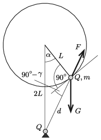
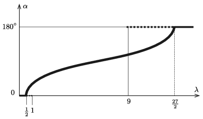

**Megoldás.**
 $a)$ Ha a fonál $\alpha$ szöget zár be a függőlegessel, akkor a töltések távolsága (a koszinusztétel szerint)
 $(1)$ $d=\sqrt{(2L)^2+L^2-2L\cdot L\cdot \cos\alpha}=L\sqrt{5-4\cos \alpha}.$
 A két töltés között ható (taszító) Coulomb-erő nagysága:
 $(2)$ $F(\alpha)=k\frac{Q^2}{d^2},$
 a nehézségi erő pedig
 $(3)$ $G=mg.$

 1. ábra

 A felfüggesztett golyócska akkor lehet egyensúlyban, ha $\boldsymbol F$ és $\boldsymbol G$ eredője a fonál irányába mutat, vagyis ezen két erőnek a fonálra merőleges (érintő irányú) komponense egyforma nagyságú. Az 1. ábrán látható jelölésekkel az egyensúly feltétele:
 $G\,\sin\alpha=F\,\cos(\gamma-90^\circ),$
 vagyis
 $(4)$ $G\,\sin\alpha=F\,\sin\gamma.$
 Az ábrán látható háromszögre felírható szinusztétel szerint
 $\frac{\sin\gamma}{\sin\alpha}=\frac{2L}{d},$
 és így az egyensúly (4) feltétele:
 $(5)$ $mg\cdot\sin\alpha=k\frac{2Q^2L}{d^3}\cdot\sin\alpha.$
 Az $\alpha=0$ helyzethez tartozó elektrosztatikus erő és a nehézségi erő hányadosára érdemes bevezetni a
 $(6)$ $\lambda=k\frac{Q^2}{L^2mg}$
 dimenziótlan mennyiséget. Ennek segítségével az (5) egyensúlyi egyenlet:
 $(7)$ $\sin\alpha\, \left(2\lambda\frac{L^3}{d^3}-1\right)=0.$
 Az $\alpha=0$ és $\alpha=180^\circ$ helyzetek nyilván egyensúlyi állapotok, azonban ezek – a töltések és a tömeg nagyságától függően – lehetnek stabil vagy instabil egyensúlyi helyzetek. Emellett figyelembe kell vegyük azt is, hogy $\lambda>1$ esetén az legalsó ($\alpha=0$) helyzetben a fonál meglazul, és ugyanez történik $\lambda<9$ esetén az $\alpha=180^\circ$-os felső helyzetben.
 További egyensúlyi helyzetek is lehetségesek, ha a (7)-ben szerepló zárójeles tényező válik nullává, vagyis ha (1)-et felhasználva teljesül, hogy
 $2\lambda\left(5-4\cos\alpha\right)^{- {3}/{2}}=1,$
 azaz
 $(8)$ $\cos\alpha=\frac{5-(2\lambda)^{2/3}}{4}.$
 Mivel $-1\le\cos\alpha\ge 1$, (8)-nak csak akkor van megoldása, ha
 $\frac{1}{2}\le\lambda\le \frac{27}{2}.$

 2. ábra

 A 2. ábra a lehetséges egyensúlyi helyzetekhez tartozó szögeket mutatja a $\lambda$ paraméter (ami kifejezhető az $m$ tömeggel) függvényében. A folytonos (vastag) vonal a stabil, a szaggatott vonal pedig az instabil állapotat jelzi. (Az instabil állapotok vonala a fonál meglazulása miatt szakad meg $\lambda=1$ és $\lambda=9$ értékeknél.)
 $b)$ Ha $\lambda\le \frac12$, vagyis
 $m\ge \frac{2kQ^2}{L^2g}=\frac{2\cdot\cdot9\cdot10^9\cdot 10^{-12}}{0{,}04\cdot 9{,}81}~{\rm kg}\approx 46~\rm g,$
 akkor $\alpha=0$, tehát a két golyó távolsága $L$ marad.
 $c)$ Ha $\lambda\ge \frac{27}2$, vagyis
 $m\le \frac{2\,kQ^2}{27\,L^2g}\approx 1{,}7~\rm g,$
 akkor $\alpha=180^\circ$, tehát a két golyó távolsága $3L$ lesz.

