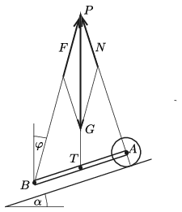
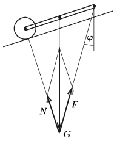
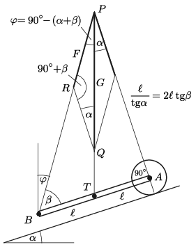

**Megoldás.**
 A vízszintes helyzetben kifejtett erőből látszik, hogy a talicska súlypontja éppen a kerék és a rudak vége között középen, mindkettőtől ugyanakkora ($\ell$) távolságra van.
 Készítsünk olyan ábrát, amelyen az $\alpha$ szöget szögmérővel kimért $18^\circ$-ra állítjuk be ( 1. ábra ). A talicska méretét a rajzon önkényesen választhatjuk meg.
 Tudjuk, hogy a súlyerő hatásvonala a $T$ tömegközépponton átmenő függőleges egyenes. Azt is tudjuk, hogy a keréknél a lejtő irányára merőleges erő hat (ellenkező esetben a kerékre ható eredő forgatónyomaték nem lenne nulla). A kerékre ható $\boldsymbol N$ nyomóerő nagyságát nem ismerjük, csak azt tudjuk, hogy a hatásvonala átmegy az $A$ ponton (a kerék tengelyén). A súlyerő és a nyomóerő hatásvonala a $P$ pontban metszi egymást, és ugyanezen a pontok kell áthaladnia a $B$ pontban kifejtett, ismeretlen nagyságú $\boldsymbol F$ erőnek is.
 1. ábra

 A $P$ pontig eltolt $\boldsymbol F$ és $\boldsymbol N$ vektor összege $-\boldsymbol G$-t kell adjon. Az ábráról vonalzóval és szögmérővel leolvashatjuk, hogy az erők nagyságával arányos $F$ és $G$ távolságok aránya kb. 0,57, vagyis $F\approx 57~$N, és a függőlegessel bezárt $\varphi$ szög kb. $15^\circ$. A talicska száraira tehát egyenként kb. 28,5 N erőt kell kifejteni, és azok a függőlegestől $15^\circ$-kal ,,előrefelé'' dőlnek.
 Hasonló módon végezhetjük el a szerkesztést a lefelé haladó talicskánál is ( 2. ábra ).

 2. ábra

 Az ábráról leolvashatjuk, hogy $F$ nagysága itt is kb. 57 N, és a függőlegessel bezárt szöge ugyancsak kb. $15^\circ$, de most a rudak végénél kifejtett erő ,,hátrafelé'' dől.
 A kétféle elrendezés azonos végeredménye nem véletlen. Ha ugyanis az 1. ábrán látható talicska erőrendszerét a $T$ ponton átmenő és az ábra síkjára merőleges tengely körül $180^\circ$-kal elforgatjuk, majd mindhárom erő irányát megfordítjuk, akkor éppen a 2. ábra erőrendszerét kapjuk.
 A szerkesztéssel kapott eredményt számítással is ellenőrizhetjük, pontosíthatjuk. A 3. ábrán látható jelöléseket fogjuk használni.

 3. ábra

 A $PAB$ derékszögű háromszögből leolvashatjuk, hogy $AP=2\ell \tan\beta$, a $PAT$ derékszögű háromszögből pedig azt, hogy $AP=\frac{\ell}{ \tan\alpha}$. Ezek szerint
 $\tan\beta=\frac{1}{2\tan\alpha}=\frac{1}{2\tan18^\circ}=1{,}539 \qquad \Rightarrow \qquad \beta=56{,}98^\circ\approx 57^\circ.$
 A talicska rúdjainak végénél összesen kifejtett $\boldsymbol F$ erőnek a függőlegessel bezárt szöge
 $\varphi=90^\circ-(\alpha+\beta)=15{,}02^\circ\approx 15^\circ.$
 Felírhatjuk meg a $PSR$ háromszögre a szinusztételt:
 $\frac{\vert\boldsymbol F\vert}{\vert\boldsymbol G\vert}=\frac{PR}{PQ}=\frac{\sin\alpha}{\sin(90^\circ+\beta)}=0{,}567.$
 Ezek szerint a rúdvégekre összesen $56{,}7~{\rm N}\approx 57~{\rm N}$ erőt kell kifejtenünk.

