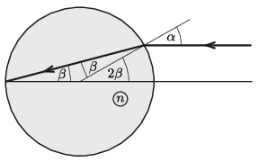

**Megoldás.**
 Tekintsünk egy olyan fénysugarat, amely $\alpha$ beesési szöggel éri el a gömb felületét. Az optikai tengelyhez közeli fénysugarakra $\alpha\ll 1$, emiatt $\sin\alpha\approx \alpha$. A megtört fénysugár akkor metszi az optikai tengelyt a felület átellenes pontjában, ha a törési szög $\beta=\alpha/2$ (lásd az ábrát). Mivel $\beta\ll 1$, fennáll, hogy $\sin\beta\approx \beta.$

 A törési törvény szerint a törésmutató:
 $n=\frac{\sin\alpha}{\sin\beta}\approx \frac{ \alpha}{ \beta}=2.$
 A gömb anyagának törésmutatója tehát 2. Mivel ez a feltétel $\alpha$-tól független (ha $\alpha$ kicsi), ezért a keskeny nyaláb minden fénysugara ugyanott éri el a szemközti felületet, tehát valóban fókuszálódik a nyaláb.

