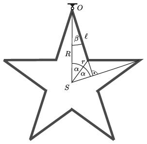
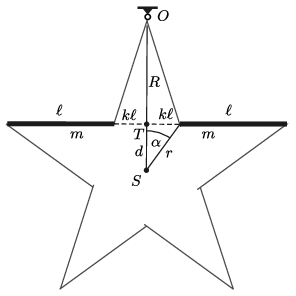

**I. megoldás.**
 $a)$ A homogén rúd (mint fizikai inga) lengésideje:
 $T_0=2\pi \sqrt{\frac{\frac13m\ell^2}{\frac12 mg\ell}}=2\pi\sqrt{\frac{2\ell }{3g}},$
 ahonnan a rúd hossza:
 $(1)$ $\ell=\frac{3}{8\pi^2}\,gT_0^2\approx 1{,}5\ \rm m.$
 $b)$ Az ötágú csillag tehetetlenségi nyomatékát először az $S$ súlypontra vonatkozóan számoljuk ki. Az $S$ pontból az egyes oldalak végpontjaiba mutató vektorok hosszára az 1. ábra alapján az alábbi egyenleteket írhatjuk:
 $R \cos 2 \alpha = r
\cos \alpha\qquad \text{és}\qquad r \sin \alpha = \ell\sin \beta,$
 ahol $\alpha = \frac{360^\circ}{10}=36^\circ$ és $\beta = 90^\circ -2\alpha = 18 ^\circ$. Innen kapjuk, hogy
 $R = \ell \, \mathrm{ctg}\,\alpha = 1{,}376\, \ell \qquad \text{és}\qquad r =
\frac{\cos 2\alpha}{\sin \alpha} \,\ell = 0{,}526\, \ell. $
 1. ábra

 A hivatkozott cikk (4) képlete alapján a súlypontra vonatkoztatott tehetetlenségi nyomaték:
 $\Theta_S = \frac{10 m}{6}\, \left(3 R^2 + 3 r^2-\ell^2 \right) = 0{,}919\, {M \ell^2},
$
 ahol $M= 10 m$ a csillag teljes tömege. A Steiner-tétel szerint a csillag teljes tehetetlenségi nyomatéka az $O$ pontra vonatkoztatva:
 $\Theta = \Theta _S + M R^2 = 2{,}813 \, M \ell^2.
 $
 Mivel a súlypont távolsága az $O$ ponttól $R$, így az $M$ tömegű csillag lengésének peridusideje:
 $T = 2 \pi \, \sqrt{\frac{\Theta}{M g R}} = 8{,}98 \, \sqrt{\frac{\ell}{g}},
$
 azaz (1) felhasználásával
 $T \approx 3{,}5~\rm s.$

**II. megoldás.**
 Az ötágú csillag tehetetlenségi nyomatékát más megfontolással is kiszámíthatjuk. Tekintsük a 2. ábrán vastag vonallal jelölt két rudat, és számítsuk ki a tehetetlenségi nyomatékukat a $T$ tömegközéppontjukra vonatkoztatva. (Használjuk az I. megoldás jelöléseit!)
 2. ábra
 Az ábrán $2k\ell$-lel jelölt ,,hiányzó rész'' hossza
 $2k\ell=2\ell\sin 18^\circ, \qquad \text{vagyis}\qquad k=\sin 18^\circ=0{,}309.$
 Egy-egy rúd tehetetlenségi nyomatéka a saját tömegközéppontjára $\frac{1}{12}m\ell^2,$ így a két rúdé a $T$ tömegközéppontra vonatkoztatva (a Steiner-tétel alkalmazásával):
 $\Theta_T^\text{(két rúd)}=2\left(\frac{1}{12}+\left(k+\frac{1}{2}\right)^2 \right)m\ell^2=1{,}476\,m\ell^2.$
 Az $S$ középpontra vonatkoztatva a két rúd tehetetlenségi nyomatéka (felhasználva, hogy $PT=d=\frac{\sin
18^\circ}{{\rm tg}\, 36^\circ}\ell=0{,}425\,\ell$)
 $\Theta_P^\text{(két rúd)}=\Theta_T^\text{(két rúd)}+2md^2=1{,}837\,m\ell^2,
$
 a teljes csillagé pedig (ugyancsak $S$-re vonatkoztatva)
 $\Theta_T^\text{(csillag)}=5\cdot \Theta_T^\text{(két rúd)}=9{,}186\,m\ell^2=0{,}919\,M\ell^2.$
 (A megoldás további menete megegyezik az I. megoldáséval.)

