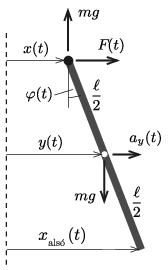

**Megoldás.**
 A szabad lengések körfrekvenciájából kiszámíthatjuk, hogy a fizikai inga $\ell$ hossza és az $\omega$ körfrekvencia közötti kapcsolat
 $T=2\pi\sqrt{ \frac{\frac{1}{3}m\ell^2}{mg\frac{\ell}{2}}},$
 ahonnan
 $(1)$ $\omega=\frac{2\pi}{T}=\sqrt{\frac{3g}{2\ell}},\qquad \text{vagyis}\qquad \ell=\frac{3g}{2\omega^2}.$
 (A megadott $A\omega^2\ll g$ feltétel szerint $A\ll \ell$, vagyis az inga $\varphi$ szögkitérése feltehetően nagyon kicsi marad, és így érvényes, hogy $\sin\varphi\approx \varphi$, valamint $\cos\varphi\approx 1$.)

 Megjegyzés. Kezdetben, amikor a rúd felső végpontját mozgatni kezdjük, a rúd szögkitérése nagy, akár $90^\circ$-os is lehet. Ez azonban a közegellenállás miatt (akármilyen kicsi is az) idővel lecsillapodik, tehát az állandósult állapotban már kicsivé válik.

 Jelöljük az $m$ tömegű rúdra annak felfüggesztési pontjában ható vízszintes erőt $F(t)$-vel, az inga tömegközéppontjának vízszintes irányú elmozdulását $y(t)$-vel, a tömegközéppont pillanatnyi gyorsulását pedig $a_y(t)$-vel. (A vízszintes koordináta kezdőpontjának válasszuk a felső végpont rezgésének középpontját.) Az inga szögkitérése
 $\varphi(t)= \frac{2}{\ell}(y-x),$
 a szöggyorsulása pedig
 $\beta(t)=\frac{2}{\ell}\left[a_y(t)+4A\omega^2\cos(2\omega t)\right].$
 (Az egyes mennyiségek irányítását az ábrán látható módon értelmezzük.)

 A rúdinga tömegközéppontjának függőleges irányú gyorsulása kis kitérések esetén – jó közelítéssel – nulla , így a felfüggesztési pontban függőlegesen felfelé ható erő $mg$ nagyságú.
 A rúd tömegközéppontjának (vízszintes irányú) mozgásegyenlete:
 $(2)$ $F(t)=ma_y(t),$
 a tömegközéppont körüli forgómozgásának egyenlete pedig
 $(3)$ $-F(t) \frac{\ell}{2}-mg\left[y(t)-A\cos(2\omega t)\right]=\frac{1}{12}m\ell^2\cdot \frac{2}{\ell}
\left[a_y(t)+4A\omega^2\cos(2\omega t)\right].$

 Megjegyzés. A forgómozgás (3) egyenlete akkor is helyes, ha a tömegközéppont gyorsul. Más gyorsuló pontokra felírt hasonló egyenlet azonban hibás eredményre vezethet (lásd a ,,Merev testek mozgásegyenletei'' című cikket a honlapon, a fizika cikkek között az ,,Ami a tankönyvekből kimaradt, de a versenyzőknek hasznos lehet'' részben).

 Az (1), (2) és (3) egyenletekből ($\ell$ és $F(t)$ kiküszöbölése után) kapjuk, hogy
 $a_y(t)+\omega^2y(t)=0. $
 Ez egy $\omega$ körfrekvenciájú harmonikus rezgőmozgás egyenlete, amelynek megoldása
 $y(t)=K \cos\omega(t-t_0).$
 A $K$ és a $t_0$ állandókat a rúd középpontjának kezdeti helyzete és a kezdeti sebessége határozza meg.
 A $K$ amplitúdó – ha még a gyenge csillapítást is figyelembe vesszük – fokozatosan csökken, és elegendően hosszú idő múlva (vagyis az állandósult állapotban) nullává válik . Ebből az is következik, hogy az állandósult állapotban $F(t)\equiv 0$. Mondhatjuk, hogy a kényszerrezgést végző rendszer – a csekély csillapítás miatt – fokozatosan ,,elfelejti'' a kezdőállapotát, és az állandósult állapotban a rezgés (lengés) menete a kezdeti adatoktól függetlenül mindig ugyanolyan lesz.
 A rúd közepe tehát a rúdinga mozgása során – jó közelítéssel – mozdulatlan marad, és a felső végpontjának mozgatásához nincs szükség külső erőre. (Ez utóbbi állítás csak csillapításmentes esetben igaz. Ha a közegellenállás egy kicsi, de nem nulla csillapítást jelent, akkor a külső erő munkájának kell ellensúlyoznia a közegellenállásból adódó kicsiny energiaveszteséget.)
 A rúd alsó végpontjának elmozdulása
 $x_\text{alsó}(t)=-x(t)=-A\cos(2\omega t).$
 A rúd alja tehát a felső végponttal azonos amlitúdójú, de azzal ellentétes fázisú, $2\omega$ körfrekvenciájú harmonikus rezgómozgást végez.

