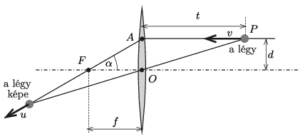
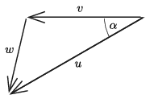
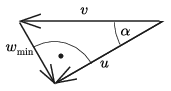

**I. megoldás.**
 A légy képét a nevezetes sugármenetek segítségével kaphatjuk meg ( 1. ábra ). A kép biztosan rajta van az optikai tengelytől $d$ távolságban lévő $AP$ egyenes megtört fénysugarán, vagyis az $AF$ egyenesen, amely $\alpha={\rm arctg}\, \frac{d}{f}$ szöget zár be az optikai tengellyel. A kép $\boldsymbol u$ sebességgel mozog az $AF$ egyenes mentén, nagysága attól függ, hogy a légy éppen hol tartózkodik. ($u$ nulla és végtelen között bármilyen értéket felvehet.)

 1. ábra

 A légy és a légy képének $\boldsymbol w$ relatív sebessége a 2. ábrán látható szerkesztéssel határozható meg. $\boldsymbol w$ nagyságának legkisebb értéke annak a helyzetnek felel meg, amelynél $\boldsymbol w$ merőleges $\boldsymbol u$-ra, és ilyenkor (lásd a 3. ábrát )
 $w_\text{min}=v\sin\alpha= v\frac{d}{\sqrt{d^2+f^2}}.$

 2. ábra

 3. ábra

**II. megoldás.**
 Számítsuk ki a légy képének sebességét, annak az optikai tengellyel párhuzamos ($u_1$), illetve merőleges ($u_2$) komponensét. Célszerű lesz, ha a $t$ tárgytávolság és a $k$ képtávolság helyett az
 $x=t-f \qquad \text{és} \qquad y=k-f$
 változókat használjuk, ahogy ezt Newton is tette. A leképezési törvény ezekkel a változókkal így néz ki:
 $x\cdot y=f^2.$
 Az optikai tengellyel párhuzamos sebességkomponens
 $u_1=\frac{\Delta k}{\Delta t}=\frac{\Delta y}{\Delta t},$
 a $t$ tárgytávolság változás sebessége pedig
 $\frac{\Delta x}{\Delta t}=-v.$
 Egy adott pillanatbeli és annál egy kicsiny $\Delta t$ időtartammal későbbi állapot között fennáll, hogy
 $xy=f^2, \qquad \text{illetve}\qquad (x-v \Delta t)(y+\Delta y)=f^2,$
 ahonnan
 $u_1=\frac{\Delta y}{\Delta t}=v\frac{y}{x}+v\frac{\Delta y}{x}\approx v\frac{y}{x}=v\frac{f^2}{x^2}.$
 A légy képének és a légynek a relatív sebességét $\boldsymbol w$-vel jelölve, ennek a vektornak az optikai tengely irányú komponense:
 $w_1=u_1-v=v\left(\frac{f^2}{x^2}-1\right).$
 A légy képének az optikai tengelytől mért távolsága:
 $K=d\frac{k}{t}=\frac{ fd}{t-f}=\frac{fd}{x}.$
 A fentiekhez hasonló megfontolással adódik, hogy
 $w_2=u_2=\frac{\Delta K}{\Delta t}=v \frac{fd }{x^2}.$
 A relatív sebesség nagyságának négyzete:
 $\vert\boldsymbol w\vert^2=w_1^2+w_2^2=v^2\left(\frac{f^2}{x^2}-1\right)^2+v^2\frac{f^2d^2}{x^4},$
 ennek legkisebb értékét keressük.
 Teljes négyzetté alakítással kapjuk, hogy
 $w^2=\left(\frac{vf\sqrt{f^2+d^2}}{x^2}-\frac{vf}{\sqrt{f^2+d^2}}\right)^2+ \frac{d^2v^2} {f^2+d^2} \ge
v^2\frac{d^2} {f^2+d^2},$
 azaz
 $w\ge w_\text{min}=v\frac{d}{\sqrt{f^2+d^2}}.$

