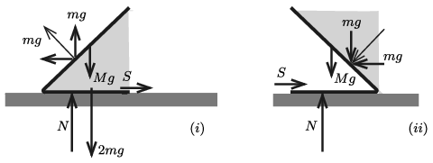

**Megoldás.**
 $a)$ Jelöljük a mobilgát 1 méter hosszú szakaszának tömegét $M$-mel, a ferde rész alatti, illetve feletti víz tömegét pedig $m$-mel, a fémlap vastagságát $d$-vel, a vízszint legnagyobb magasságát $\ell$-lel (ami megegyezik a mobilgát talajon fekvő részének szélességével).
 A megadott adatokból és az ismert anyagi állandókból kiszámíthatjuk, hogy
 $M=(1+\sqrt2)\ell d \varrho_\text{vas}\cdot \text{(1 méter)}=2{,}41\cdot 0{,}02\cdot 7860\ {\rm kg}\approx 380\ \rm kg,$
 $m=\frac12 \ell^2\varrho_\text{víz}\cdot \text{(1 méter)}=500\ \rm kg.$
 Az ábrán a vaslemezre ható erőket ábrázoltuk, a talaj nyomóerejét $N$-nel, a súrlódási erőt pedig $S$-sel jelöltük.
 $(i)$ eset. A víz függőleges irányban összesen $mg$ erőt fejt ki a mobilgátra. A vízszintes vaslapra ható, a víz nyomásából származó erő $2mg$ (hidrosztatikai paradoxon), tehát a ferde lapra a víz függőlegesen $mg$ erőt kell, hogy kifejtsen. De mivel a ferde lapra ható eredő erő a $45^\circ$-os szögben álló vaslapra merőleges, ennek az erőnek a vízszintes komponense is $mg$. A vízszintes és a függőleges erők egyensúlyából következik, hogy
 $S=mg, \qquad \text{továbbá} \qquad N=Mg+mg.$
 Mivel $S\le \mu N,$ a súrlódási együttható legkisebb értéke (ami mellett még nem csúszik meg a gát):
 $\mu_\text{min}=\frac{S}{N}=\frac{m}{m+M}\approx \frac{500}{500+380}=0{,}57.$

 $(ii)$ eset. A víz most is ugyanolyan nyomással hat a ferde lapra, viszont a víz nyomásából származó erő nem ,,emeli'', hanem ,,leszorítja'' a ferde lapot. A lapra merőleges nyomóerőnek mind a függőleges, mind a vízszintes összetevője $mg$, a vízszintes lemezre viszont nem hat a hidrosztatikai nyomás, hiszen közvetlenül felette nincs is víz. Most is igaz, hogy $S=mg$ és $N=Mg+mg.$ A súrlódási együttható legkisebb értéke ugyanakkora, mint az előző esetben: $\mu_\text{min}\approx 0{,}57.$

 Megjegyzés. Ilyen nagy súrlódás a nedves, felázott talaj és a vaslap között aligha létezik. A ténylegesen megépített, hasonló szerkezetű mobilgátaknál a vízszintes vaslapból függőleges ,,tüskék'' nyúlnak ki, és ezek a talajba mélyedve megakadályozzák a gát elcsúszását.

 $b)$ Számítsuk ki az $N$ erő hatásvonalának a vaslapok törésvonalától mért $x$ távolságát. Felhasználjuk, hogy a folyadék hidrosztatikai nyomásából származó eredő erő támadáspontja a folyadék alsó egyharmadánál van.
 A mobilgátra ható erők forgatónyomatékának egyensúlyából megkaphatjuk $x$ értékét. A gát feldőlés szempontjából akkor stabil, ha $0<x<\ell$.
 Az $(i)$ esetben fennáll, hogy
 $x(mg+Mg) +\frac{\ell}3mg +\frac{\ell}3mg=\frac{\ell}2(2m+M)g,$
 vagyis
 $x=\frac{\frac12 +\frac{m}{3M}}{1+\frac{m}{M} }\ell\approx 0{,}4\ \rm m.$
 Ez a távolság más vastagságú vaslemez (tehát más $M$ tömeg, vagyis más $\frac{m}{M}$ arány) esetén biztosan $\frac13\ell$ és $\frac12\ell$ közé esik, tehát a gát nem borulhat fel.
 A $(ii)$ esetben felírhatjuk, hogy
 $x(mg+Mg) -\frac{\ell}3mg -\frac{\ell}3mg=\frac{\ell}2Mg,$
 ahonnan
 $x=\frac{\frac12 +\frac{2m}{3M}}{1+\frac{m}{M} }\ell\approx 0{,}6\ \rm m.$
 Tetszőleges tömegarány mellett érvényes, hogy
 $\frac12\ell<x<\frac23\ell,$
 tehát a gát ebben az esetben sem borulhat fel.

