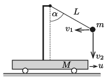
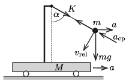

**Megoldás.**
 $a)$ Legyen az $m$ tömegű golyó talajhoz viszonyított sebességének vízszintes komponense a kérdéses pillanatban $v_1$, függőleges komponense pedig $v_2$ ( 1. ábra ). Haladjon ugyanekkor a kocsi $u$ sebességgel.
 1. ábra
 A rendszerre nem hat vízszintes irányú külső erő, ezért a vízszintes irányú lendület mindvégig nulla marad. Eszerint
 $(1)$ $3mu=mv_1, \qquad \text{azaz}\qquad v_1=3u.$
 A mechanikai energia megmaradásásak törvénye szerint
 $mgL\cos\alpha=\frac12 m\left(v_1^2+v_2^2\right)+\frac12\,(3m)\,u^2,$
 vagyis (1) felhasználásával
 $(2)$ $gL=v_2^2+12 u^2.$
 Az $m$ tömegű golyó az $u$ sebességgel mozgó kiskocsihoz képest körpályán mozog. A fonál hosszának állandóságát kifejező kényszerfeltétel miatt:
 $\frac{v_2}{v_1+u}=\frac{v_2}{4u}={\rm tg}\,\alpha=\sqrt{3},$
 vagyis
 $(3)$ $v_2=4\sqrt{3}\,u.$
 Ezt (2)-be helyettesítve kapjuk, hogy a kiskocsi sebessége
 $u=\sqrt{\frac{gL}{60}}=0{,}28\ \frac{\rm m}{\rm s}.$

 $b)$ Legyen a fonalat feszítő erő $K$, a kiskocsi gyorsulása pedig $a$ ( 2. ábra ). A kiskocsi mozgásegyenlete:
 $K\sin\alpha=Ma=3m\,a,\qquad \text{vagyis}\qquad ma=\frac{1}{3}K\sin\alpha. $
 2. ábra
 A golyónak a kiskocsihoz viszonyított sebessége az energiatétel szerint (az első rész megoldásánál használt jelöléseket követve):
 $v_\text{rel}=\sqrt{(u+v_1)^2+v_2^2}=\sqrt{(4u)^2+\left(4\sqrt{3}u\right)^2}=8u=\sqrt{\frac{16}{15}\,gL}.$
 Ezen relatív sebesség miatt a golyónak
 $a_\text{cp}=\frac{v_\text{rel}^2}{L}= \frac{16}{15}\,g$
 nagyságú, fonál irányú centripetális gyorsulása van. Ehhez járul még a kiskocsi $a$ nagyságú, vízszintes irányú gyorsulásának fonál irányú komponense, ami $-a\sin\alpha$. A fonál irányú mozgásegyenlet:
 $K-mg\cos\alpha=m\left(a_\text{cp}-a\sin\alpha\right),$
 amiből az $a$-ra és $a_\text{cp}$-ra vonatkozó összefüggések behelyettesítése után megkapjuk a fonalat feszítő erőt:
 $K=\frac{mg\cos\alpha+\frac{16}{15}\,mg}{1+\frac{1}{3}\sin^2\alpha}=\frac{94}{75}\,mg=1{,}84\ \rm N.$

