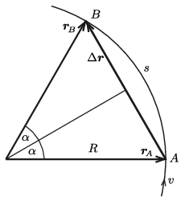

**Megoldás.**
 A síkbeli pályán mozgó test érintő irányú (tangenciális) gyorsulása nulla , hiszen a sebességvektor nagysága állandó. A gyorsulásvektor nagysága úgy lehet állandó, hogy az érintőre merőleges (radiális- vagy centripetális) gyorsulás nagysága is állandó:
 $a_\text{cp.}=\frac{v^2}{R}=\text{állandó},$
 ahol $R$ a pálya görbületi sugara. Mivel a centripetális gyorsulás és a sebesség nagysága is állandó, az $R$ görbületi sugárnak is állandónak kell lennie, vagyis a pályagörbe csakis kör lehet.

 A test elmozdulása $A$-tól $B$-ig (lásd az ábrát )
 $\vert \Delta {\boldsymbol r}\vert=2R\sin\alpha,$
 a megtett út hossza pedig
 $s=2R\alpha.$
 A megadott feltétel szerint
 $2R\alpha=1{,}2\cdot 2R\sin\alpha,$
 vagyis
 $1{,}2\cdot \frac{\sin\alpha}{\alpha}=1.$
 Ennek a trigonometrikus egyenletnek a megoldása (amit numerikusan, próbálgatásokkal vagy számítógépes segítséggel lehet megkapni): $\alpha=1{,}027$ radián.
 Ha a test a $2R\alpha$ hosszú utat $v$ sebességgel haladva $T=2~\rm s$ alatt teszi meg, akkor
 $v=\frac{2R\alpha}{T},\qquad \text{vagyis}\qquad R=\frac{vT}{2\alpha}=\frac{6\cdot 2}{2\cdot 1{,}027}\,{\rm m}=5{,}84~\rm
m,$
 tehát a test gyorsulásának nagysága:
 $a_\text{cp.}=\frac{v^2}{R}=\frac{36}{5{,}84}~\frac{\rm m}{\rm s^2}\approx 6{,}16~\frac{\rm m}{\rm s^2}.$

