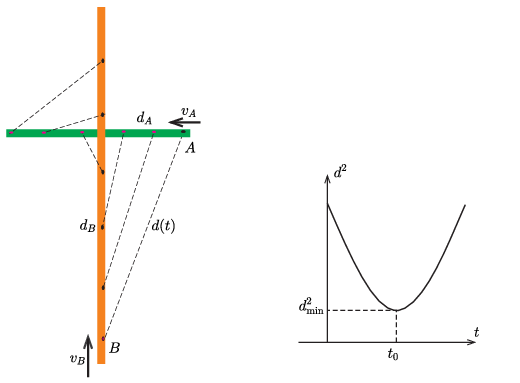
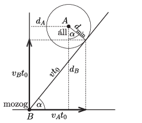
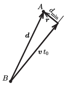

**I. megoldás**
. A két autó pillanatnyi $d$ távolságának négyzete a Pitagorasz-tétel szerint ( 1. ábra ):
 $d^2=\left(d_{\rm A}-v_{\rm A}t\right)^2+\left(d_{\rm B}-v_{\rm B}t\right)^2
 =(d_{\rm A}^2+d_{\rm B}^2)-2(d_{\rm A}v_{\rm A}+d_{\rm B}v_{\rm B})t+(v_{\rm A}^2+v_{\rm B}^2)t^2.
$

 1. ábra                                          2. ábra

 Ez – $d^2$-et tekintve függvényértéknek a $t$ változóban – egy felfelé nyitott parabola ( 2. ábra ), aminek a csúcsa (tehát a minimuma) a
 $t_0=\frac{d_{\rm A}v_{\rm A}+d_{\rm B}v_{\rm B}}{v_{\rm A}^2+v_{\rm B}^2}
$
 értéknél van. Itt
 $d_{\rm min}^2=\frac{(d_{\rm A}^2+d_{\rm B}^2)(v_{\rm A}^2+v_{\rm B}^2)-(d_{\rm A}v_{\rm A}+d_{\rm B}v_{\rm B})^2}{v_{\rm A}^2+v_{\rm B}^2}
=\frac{(d_{\rm A}v_{\rm B}-d_{\rm B}v_{\rm A})^2}{v_{\rm A}^2+v_{\rm B}^2}.
$
 Adatainkkal:
 $a)$ $d_{\rm min}=15{,}6\ {\rm km}$,
 $b)$ $t_0=0{,}595\ \text{óra, azaz}\ 35{,}7\ {\rm min}$.

**II. megoldás**
. Írjuk le a történetet az $A$ autóhoz rögzített (tehát $v_A$ sebességgel egyenletesen mozgó) koordináta-rendszerben. Ebben a rendszerben az $A$ autó áll, a $B$ autó pedig $\boldsymbol v=\left(v_A, v_B\right)$ sebességgel mozog. A két autó ott kerül a legközelebb egymáshoz, ahol az $A$ pont körül rajzolt $d_{\rm min}$ sugarú kör éppen érinti a $B$ autó pályáját.

 3. ábra

 Ha a $B$ autó $t$ idő alatt jut el az érintési pontba, akkor (amint az a 3. ábráról leolvasható) a következő összefüggések teljesülnek:
 $(1)$ $d_{\rm min}\sin\alpha=v_At_0-d_A,$
 $(2)$ $d_{\rm min}\cos\alpha=d_B-v_Bt_0,$
 ahol
 $v=\vert \boldsymbol v\vert=\sqrt{v_A^2+v_B^2}\qquad\text{és}\qquad \tan\alpha=\frac{v_B}{v_A}.$
 (1)-et (2)-vel elosztva kapjuk, hogy
 $\tan\alpha=\frac{v_B}{v_A}=\frac{v_At_0-d_A}{d_B-v_Bt_0},$
 azaz
 $v_Bd_B-v_B^2t_0=v_A^2t_0-v_Ad_A,$
 tehát
 $t_0=\frac{d_{\rm A}v_{\rm A}+d_{\rm B}v_{\rm B}}{v_{\rm A}^2+v_{\rm B}^2}.
$
 Ezt (1)-be helyettesítve kifejezhetjük a legkisebb távolságot:
 $d_{\rm min}=\frac{\left\vert d_Av_B-d_Bv_A\right\vert }{\sqrt{v_{\rm A}^2+v_{\rm B}^2}}.$

**III. megoldás**
. A II. megoldás koordináta-rendszerét használjuk, de vektorokkal és vektorműveletekkel számolunk. Legyen a $B$-ből $A$ felé mutató vektor az adott (,,kezdeti'') pillanatban
 $\boldsymbol d=\left(d_A, d_B \right),$
 és $B$ sebessége $\boldsymbol v=\left(v_A, v_B\right)$.
 A két autó helyvektorának különbsége tetszőleges $t$ időpillanatban:
 $\boldsymbol r=\boldsymbol d-\boldsymbol v t$
 A két autó abban a $t_0$ pillanatban van legközelebb egymáshoz, amikor $\boldsymbol r$ merőleges $\boldsymbol v$-re (lásd a 4. ábrát ).

 4. ábra

 Ezt a vektorok skalárszorzatával is kifejezhetjük:
 $\boldsymbol v{\boldsymbol \cdot}\left(\boldsymbol d-\boldsymbol v t_0\right)=0,$
 azaz
 $t_0= \dfrac{\boldsymbol d{\boldsymbol \cdot} \boldsymbol v }{v^2 }=\frac{d_{\rm A}v_{\rm A}+d_{\rm B}v_{\rm B}}{v_{\rm A}^2+v_{\rm B}^2}.
$
 Az autók közötti legkisebb távolságot a $\boldsymbol d$ vektor és a $\boldsymbol v$ irányú egységvektor vektoriális szorzatának nagysága adja meg:
 $d_{\rm min}=\left\vert \boldsymbol d \times \frac{\boldsymbol v}{v}\right\vert=
\frac{\left\vert d_Av_B-d_Bv_A\right\vert }{\sqrt{v_{\rm A}^2+v_{\rm B}^2}}.$

