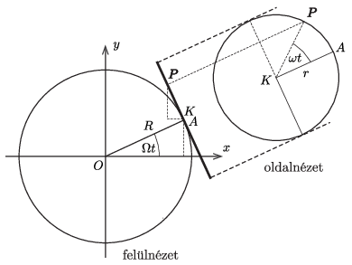

**I. megoldás**
. $a)$ A kerék tengelyeként szolgáló rúd egyenletesen forog körbe, pontjainak kerületi sebessége a tengelytől mért távolságukkal arányos. Ezért a megadott adatok alapján a kerék középpontja
 $v_{\rm{kp}}=\frac{75\,\rm{cm}}{180\,\rm{cm}}\cdot2{,}4\,\frac{\rm{m}}{\rm{s}}=1\,\frac{\rm{m}}{\rm{s}}$
 sebességgel halad. Mivel a kerék tisztán gördül, a legfelső $A$ pont a középpont sebességének kétszeresével mozog, tehát az olajbogyó sebessége:
 $v_A = 2\,\frac{\rm m}{\rm s}. $
 Másképp is megkaphatjuk ezt az eredményt. A vízszintes rúd
 $\Omega=\dfrac{2{,}4~\rm m/s}{1{,}8~\rm m}=\frac 43~\frac1{\rm ~s}$
 szögsebességgel forog körbe, így a függőleges tengelytől $R=0{,}75~\rm m$ távolságra lévő zúzókerék középpontja
 $v_\text{kp}=R\Omega=1~\dfrac{\rm m}{\rm s}$
 sebességgel halad. Az $r=0{,}45~\rm m$ sugarú zúzókerék $\omega$ szögsebességgel forog a vízszintes rúd körül, tehát az olajbogyó sebessége a kerék középpontjához képest $r\omega$. A zúzókerék legalsó pontjának sebessége nulla, emiatt
 $R\Omega-r\omega=0, \qquad \text{azaz}\qquad r\omega=R\Omega= v_\text{kp}= 1\,\frac{\rm m}{\rm s}.$
 Az $A$ pontban tehát az olajbogyó sebessége
 $v_A =R\Omega+r\omega= 2R\Omega=2\,\frac{\rm m}{\rm s}. $
 $b)$ Az olajbogyó gyorsulásának kiszámítása nehezebb feladat. A bogyó mozgása – mint már leírtuk – két egyenletes körmozgásból tehető össze. A zúzókerék középpontja a függőleges tengely körül $\Omega$ szögsebességgel forog, a gyorsulása ($\boldsymbol a_\text{rúd}$) tehát $R\Omega^2$, iránya vízszintes és a tengely felé mutat. Az olajbogyó a zúzókerék középpontja körül $\omega$ szögsebességű, $r$ sugarú körpályán mozog, ehhez a mozgáshoz függőlegesen lefelé irányuló, $r\omega^2$ nagyságú ($\boldsymbol a_\text{kerék}$) gyorsulás tartozik. Az olajbogyó teljes $\boldsymbol a$ gyorsulása a talajhoz rögzített inerciarendszerben nem egyszerűen $\boldsymbol a_\text{rúd}+\boldsymbol a_\text{kerék}$, hanem ehhez még egy harmadik tag, az ún. Coriolis-gyorsulás is hozzáadódik (lásd pl. a Négyjegyű függvénytáblázatok Tehetetlenségi erők alpontját). Azy $\boldsymbol\Omega$ szögsebességgel forgó rendszerben a rendszerhez képest $\boldsymbol v$ sebességgel mozgó test Coriolis-gyorsulása
 $\boldsymbol a_\text{Coriolis}=2 \boldsymbol\Omega \times\boldsymbol v.$
 Esetünkben $\boldsymbol\Omega$ függőlegesen felfelé mutató $\Omega$ nagyságú vektor, $\boldsymbol v$ a kerék középpontjának pillanatnyi sebességével párhuzamos, vízszintes vektor. Ezek szerint a Coriolis-gyorsulás nagysága
 $a_\text{Coriolis}=2r\omega\Omega=2R\Omega^2,$
 iránya a rúddal párhuzamos és a függőleges tengely felé mutat.

 Megjegyzés. 1. A Coriolis-gyorsulás szerepét jól illusztrálja a következő példa. Ha egy $\Omega$ szögsebességgel forgó korongon a forgástengelytől $R$ távolságban, a koronghoz képest $v$ sebességgel körpályán mozog egy test, akkor a sebessége az inerciarendszerben $R\Omega+v$, a gyorsulása pedig
 $a=\frac{v_\text{teljes}^2}{R}=\frac{(R\Omega+v)^2}{R}=R\Omega^2+\frac{v^2}{R}+2v\Omega.$
 A jobb oldal első tagja a korong pontjainak centripetális gyorsulása, a második tag a koronghoz viszonyított mozgás centripetális gyorsulása, a harmadik pedig a Coriolis-gyorsulás.

 Az olajbogyó teljes gyorsulása végül:
 $\boldsymbol a_\text{teljes}=\boldsymbol a_\text{rúd}+\boldsymbol a_\text{kerék}
+\boldsymbol a_\text{Coriolis},$
 amelynek vízszintes (,,befelé'' mutató) komponense
 $a_\text{be}=R\Omega^2+2R\Omega^2=3R\Omega^2=4{,}0~\frac{\rm m}{\rm s^2},$
 függőleges (lefelé mutató) összetevője
 $a_\text{le}=r\omega^2=2{,}22~\frac{\rm m}{\rm s^2},$
 a gyorsulásvektor nagysága pedig
 $a_\text{teljes}=\sqrt{a^2_\text{be}+a^2_\text{le}}=
4{,}58~\frac{\rm m}{\rm s^2}.$
 $c)$ Az olajbogyóra két erő hat: az $mg$ nagyságú nehézségi erő és a kerék felülete által kifejtett $\boldsymbol F$ erő, melynek vízszintes komponense $F_\text{be}$, függőleges komponense $F_\text{fel}$. A mozgásegyenletek:
 $mg-F_\text{fel}=ma_\text{le}, \qquad \rightarrow \qquad
 F_\text{fel}=m(g-a_\text{le})=7{,}59\cdot 10^{-3}~\rm N,$
 illetve
 $F_\text{be}=ma_\text{be}=4{,}00\cdot 10^{-3}~\rm N.$
 Az erő nagysága
 $F=\sqrt{F^2_\text{fel}+F^2_\text{be}}=8{,}58\cdot 10^{-3}~\rm N,$
 a vízszintessel bezárt szöge
 $\alpha=\arctan\dfrac{F_\text{fel}}{F_\text{be}} =62{,}2^\circ. $

**II. megoldás**
. Az olajbogyó sebességét és gyorsulását a tehetetlenségi erők (a Coriolis erő és a centrifugális erő) elkerülésével is kiszámíthatjuk, ha mindvégig a talajhoz képest álló inerciarendszerben számolunk.

 Az ábrán látható derékszögű koordináta-rendszerben a kerék $K$ középpontjának koordinátái az olajbogyó $A$ ponton való áthaladását követő $t$ idő elteltével:
 $\boldsymbol r_K=(R\cos\Omega t, R\sin\Omega t, r).$
 Ennyi idő alatt a zúzókerék síkja $\Omega t$ szöggel fordult el a függőleges tengely körül, a kerék rúd körüli elfordulása pedig $\omega t$. Ez utóbbi miatt az olajbogyó $P$ pontja $r\sin \omega t$ távolságra kerül az $A$ ponton átmenő függőleges egyenestől. Az ábráról leolvasható, hogy az olajbogyó koordinátái:
 $x(t)=R\cos\Omega t-r\sin\Omega t\cdot \sin \omega t,$
 $y(t)=R\sin\Omega t+r\cos\Omega t\cdot \sin \omega t,$
 $z(t)=r(1+\cos\omega t).$
 Az $x(t)$ függvény a
 $\sin\alpha\sin\beta=\tfrac12\cos(\alpha-\beta)-
\tfrac12\cos(\alpha+\beta)$
 azonosság felhasználásával így is felírható:
 $x(t)=R\cos\Omega t+\frac{r}2\cos(\Omega+\omega)t-\frac{r}2\cos(\Omega-\omega)t.$
 Ez három koszinuszos függvény összege, éppen olyanoké, mint amilyenek a kezdősebesség nélkül induló harmonikus rezgőmozgást írják le. Az analógia alapján a $P$ pont $x$ tengely irányú gyorsulása $t=0$ pillanatban:
 $a_x(0)=-R\Omega^2-\frac{r}2 (\Omega+\omega)^2+\frac{r}2 (\Omega-\omega)^2=
-R\Omega^2-2r\omega\Omega=-3R\Omega^2.$
 Hasonlóan olvashatjuk le, hogy
 $v_y(0)=2R\Omega,\qquad a_y(0)=0,$
 továbbá
 $v_z(0)=0,\qquad a_z(0)=-r\omega^2.$

 Megjegyzés. Hasonló módon számíthatjuk ki az olajbogyó gyorsulását abban a pillanatban, amikor az $A$-val átellenes helyzetben van (feltételezve, hogy még ott is hozzátapad a zúzókerékhez). Meglepő módon azt kapjuk, hogy a pálya legalsó pontjánál (vagyis ott, ahol az olajbogyó sebessége nulla) a vízszintes irányú gyorsulása $+R\Omega^2$, tehát ,,kifelé'' gyorsulna. Ennek szemléletes magyarázata az, hogy az olajbogyó pályája nem egy $R$ sugarú hengerpaláston történik, hanem egy $R$ és egy $\sqrt{R^2+r^2}$ sugarú henger között megy végbe. A bogyó bizonyos helyzetekben egyre jobban eltávolodik a függőleges tengelytől, emiatt lehet kifelé irányuló sebessége és gyorsulása is.

