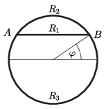

**Megoldás**
. Három párhuzamosan kapcsolt ellenállás eredőjéről van szó.

 Ezek (az ábrán látható $\varphi$ szöggel kifejezve)
 $R_1=2R\cos\varphi,\qquad R_2=R(\pi-2\varphi), \qquad R_3=R(\pi+2\varphi),$
 és
 $\frac1{R_\text{eredő}}=\frac1{R_1}+\frac1{R_2}+\frac1{R_3}=\frac1{R}\left(\frac1{2\cos\varphi}+\frac{2\pi}{\pi^2-4\varphi^2}\right).$
 A fenti kifejezés zárójelében álló mindkét tört nevezője $\varphi=0$-nál a legnagyobb, a zárójeles kifejezés tehát $\varphi=0$-nál a legkisebb, értéke $\frac12+\frac2\pi$. Ennek megfelelően az eredő ellenállás legnagyobb értéke
 $R_\text{eredő}^ \text{(max)}= \frac{2\pi}{4+\pi}R\approx 0{,}88\,R.$

