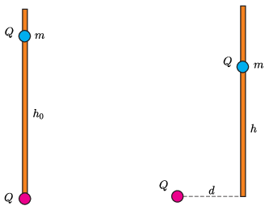

**Megoldás**
. Kiinduló helyzetben az elektromos taszítás tart egyensúlyt a rúdon lévő, $Q$ töltésű test $mg$ súlyával. Ennek megfelelően a testek feltételezett adataival kifejezve $h_0=\sqrt{kQ^2/mg}$.

 Egy általános helyzetben legyen $d$ az alsó test távolsága a rúdtól, és jelölje $h$ azt a magasságot, ahol a rúdon lévő test egyensúlyban van! Ekkor az eletromos erő függőleges komponense tart egyensúlyt a rúdon lévő test súlyával, tehát
 $\frac{kQ^2}{d^2+h^2}\frac{h}{\sqrt{d^2+h^2}}=mg.$
 Ebből a testek adatait kiküszöbölve a
 $\frac{h h_0^2}{\left(h^2+d^2\right)^{3/2}}=1$
 egyenletet kapjuk, amit a következő alakra rendezünk:
 $\left(h^2+d^2\right)^{3}-\left(h^2+d^2\right)h_0^4+d^2h_0^4=0. $
 A könnyebb írásmód kedvéért legyen $x=\left(h^2+d^2\right)$, tehát az egyenletünk
 $x^3-xh_0^4+d^2h_0^4=0.$
 Ez egy harmadfokú egyenlet, egy vagy három valós gyökkel. Elemezzük a bal oldalon álló függvény alakját! $d=0$ esetén minden szimmetrikus, a gyökök pedig $\pm h_0^2$ és $0$. $d$-t növelve két pozitív és egy negatív gyök adódik, de ez utóbbi nem fizikai megoldás, hiszen $x>0$.
 Egy bizonyos $d_{\rm max}$ mellett a két pozitív gyök egybeesik, ha pedig $d>d_{\rm max}$, az egyenletnek nincs pozitív megoldása. A $d=d_{\rm max}$ esethez tartozó pozitív gyök legyen $x_0$! Ez egy kettős gyök, és mivel az összes gyök összege nulla (hiszen nincs kvadratikus tag az egyenletben) a harmadik gyök $-2x_0$. Ennek megfelelően az
 $x^3-xh_0^4+d_{\rm max}^2h_0^4=0$
 egyenlet azonos az
 $(x-x_0)^2(x+2x_0)=x^3-3x_0^2 x+2x_0^3=0$
 egyenlettel. Ebből
 $3x_0^2=h_0^4,\qquad \ \mbox{és}\qquad \ 2x_0^3=d_{\rm max}^2h_0^4,$
 azaz
 $d_{\rm max}=\sqrt[4]{\frac{4}{27}}h_0.$
 Ilyenkor
 $h=\sqrt[4]{\frac{1}{27}}h_0.$

 Megjegyzés. Bár a feladat paraméteres, numerikusan is megoldható. A harmadfokú egyenlet $h_0^6$-nal való osztásával a
 $\xi^3-\xi+(d/h_0)^2=0$
 egyenletre jutunk (ahol $\xi=x/h_0^2$). Ennek az egyenletnek akkor van pont egy pozitív megoldása, ha az
 $f(\xi)=\xi^3-\xi+(d/h_0)^2$
 függvény éppen érinti az $f=0$ tengelyt. Az a $\xi_0$ érték, ahol ez lehetséges (ahol az $f(\xi)$-nek lokális minimuma van) akár deriválással ($\xi_0=1/\sqrt3$), akár numerikusan $(\xi_0\approx 0{,}58)$ megtalálható, és ebből a $d_{\rm max}/h_0$ megkapható:
 $d_{\rm max}/h_0 = \sqrt{\xi_0-\xi_0^3}=\sqrt[4]{\frac{4}{27}}\approx 0{,}62.
$

