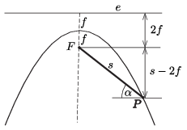

**Megoldás**
. Legyen a parabola fókusztávolsága $f$, és jelöljük a parabola $P$ pontjának $F$-től mért távolságát $s$-sel. A parabola definíciója szerint a $P$ pont az $e$ vezéregyenestől is $s$ távolságra van.

 Az ábra szerint a $P$ pontba érkező test lejtőjének hajlásszögére igaz, hogy
 $\sin\alpha=\dfrac{s-2f}{s}=1- 2\dfrac{f}{s},$
 és ennek megfelelően a test gyorsulása
 $a=g\sin\alpha=\left(1- 2\dfrac{f}{s}\right)g.$
 Ha a csúszás ideje $t$, akkor az egyenletesen gyorsuló mozgás út-idő képlete szerint
 $t=\sqrt{\dfrac{2s}{a}},$
 vagyis
 $\dfrac{1}{t^2}=\dfrac{g}{2}\left(\dfrac{1}{s}-\dfrac{2f}{s^2}\right),$
 amit teljes négyzetté alakíthatunk:
 $\dfrac{1}{t^2}=\dfrac{g}{16\,f}-gf\left(\dfrac{1}{s}-\dfrac{1}{4f} \right)^2 \le \dfrac{g}
{16\,f}=\dfrac{1}{t_\text{min}^2}.$
 Látszik, hogy a legrövidebb lecsúszási idő:
 $t_\text{min}=4\sqrt{\dfrac{f}{g}},$
 ami akkor valósul meg, amikor
 $s=4f, \qquad \sin\alpha=\dfrac{1}{2}, \qquad \alpha=30^\circ.$

