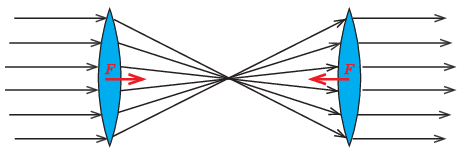

**Megoldás**
. $a)$ Az idealizált feltételek miatt az első lencsére eső fotonok száma megegyezik az első lencsét elhagyó fotonok számával, sőt a második lencsére is ugyanennyi foton esik, és végül a második lencsét is ugyanennyi foton hagyja el. A lencsék tehát nem a fotonok számát változtatják meg, hanem a fotonok mozgásirányát (kivéve az optikai tengely mentén mozgó fotonokét). A fotonok $p=h/\lambda$ impulzust hordoznak, ahol $h$ a Planck-állandó, $\lambda$ pedig a foton hullámhossza. Ha összeadjuk a fotonok egységnyi idő alatti impulzusváltozását, akkor megkapjuk a lencsére ható mechanikai erő nagyságát. Az első lencse csökkenti a beeső fotonok összimpulzusát, a második pedig növeli azt. Ennek megfelelően mindkét lencsére a fókuszpont felé mutató erő hat, amint ezt az alábbi ábra mutatja.

 A két erő nagysága megegyezik, irányuk ellentétes, és ez emlékeztethet minket Newton harmadik törvényének erő-ellenerő párjára. Azonban nem a két lencse áll kölcsönhatásban egymással, hanem kétszeres fény-lencse kölcsönhatással van dolgunk. Ha például a második lencse átmérője kisebb lenne, akkor rá kisebb erő hatna, és így szóba sem kerülhetne a lencsék párkölcsönhatása.
 $b)$ A lencsék szélén történik a fotonok mozgásirányának legnagyobb megváltozása. A beeső fotonok maximális eltérülési szöge: $\varphi=\arctan{\frac{d}{2f}}=14^{\circ}$, ahol $d$ a lencsék átmérője, $f$ pedig a fókusztávolságuk. Durva becslésként tekintsük úgy, hogy a fotonok átlagos eltérülése $\frac{\varphi}2 = 7^{\circ}$. Egyetlen fotonnak az optikai tengellyel párhuzamos irányba eső ,,átlagos'' lendületváltozása:
 $\Delta p\approx p\left(1-\cos\frac{\varphi}2\right)=\frac{h}{\lambda}\left(1-\cos\frac{\varphi}2\right).$
 A $\Delta t$ idő alatt beeső fotonok $\Delta N$ számát a lencsékre jutó $P$ fényteljesítményből határozhatjuk meg:
 $\Delta N=\frac{P\Delta t}{hc/\lambda},$
 ahol $c$ a fénysebesség. Végül a lencsékre ható mechanikai erő nagyságát így számolhatjuk ki:
 $F=\frac{\Delta N\Delta p}{\Delta t}\approx\frac{P}{c}\left(1-\cos\frac{\varphi}2\right)=2{,}5\, \cdot \, 10^{-11}\,\rm{N}.$

 Megjegyzések. 1. Láthatjuk, hogy a lencsékre ható erők nagysága csak a megvilágítás teljesítményétől és a lencsék méretétől, valamint fókusztávolságától függ. A lencsékre eső fény hullámhossza kiesik a számításból, megadott értéke legfeljebb arra utal, hogy igazán jó antireflexiós réteget csak monokromatikus fényre lehet létrehozni.
 2. Az $F$ erő számszerű értékének becslését kicsit pontosabbá tehetjük a következő módon. Osszuk fel az $R=2{,}5$ cm sugarú lencsére eső fotonokat két részre. Az egyik rész legyen az, amelynél a fotonok egy $R/2$ sugarú körlapra esnek; az összes foton 1/4 része jut ide. A maradék rész egy $R/2$ ,,széles'' körgyűrű, amelyre a fotonok 3/4 része esik. A körgyűrűre eső fény legnagyobb eltérülése $14^{\circ}$, a legkisebb pedig kb. $7^{\circ}$, átlaguk tehát $10{,}5^{\circ}$. A kis körlapnál a legnagyobb eltérülés $7^{\circ}$, a legkisebb nulla, az átlagukat vehetjük $3{,}5^{\circ}$-nak. Ennek megfelelően a fotonok időegységre eső impulzusváltozása, vagyis az általuk kifejtett erő nagysága
 $F\approx \frac{P}{c}\left(\frac34(1-\cos 10{,}5^\circ)+
\frac14(1-\cos 3{,}5^\circ) \right)\approx
4{,}3
\, \cdot 10^{-11}\,\rm{N}.$
 3. Ha a lencse körlapját nagyon sok körgyűrűre osztjuk, és az ezekre eső fotonok járulékait összegezzük, akkor – határesetben (integrálszámítással) – megkapjuk az ,,egzakt''' eredményt. A lencsékre ható erők nagysága a legpontosabb számolás szerint $F=5{,}06 \cdot 10^{-11}\,\rm{N},$ ami kicsit több, mint a kétszerese a durva becslésen alapuló számítás eredményének. Eszerint az átlagos szögeltérítés nem $7^{\circ}$, hanem majdnem $10^{\circ}$.

