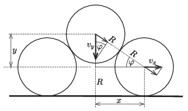
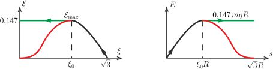

**Megoldás**
. Tekintsük azt a helyzetet, amikor az alsó két jéghenger tengelyének távolsága $2x$, a felső henger tengelye pedig $R+y$ magasságban van ( 1. ábra ). A jéghengerek sebessége $\pm v_x$, illetve $v_y$. Mivel a súrlódás elhanyagolható, a hengerek nem jönnek forgásba. Az indulás pillanatában
 $x=R;\qquad y=\sqrt3R\qquad\text{és}\qquad v_x=v_y=0.$
 1. ábra
 A középső henger (függőleges) elmozdulása így írható:
 $(1)$ $s=\sqrt3R-y.$
 A felső és bármelyik alsó jéghenger távolsága állandó, vagyis fennáll az
 $\sqrt{x^2+y^2}=2R$
 kényszerfeltétel. Ez a távolság akkor marad időben állandó, ha a sebességek megfelelő komponensei megegyeznek:
 $v_y\sin\varphi\left(\equiv v_y \dfrac{y}{2R}\right)=v_x\cos\varphi\left(\equiv v_x\frac{x}{2R}\right),$
 tehát
 $(2)$ $v_y=v_x\dfrac{x}{y}=v_x\dfrac{\sqrt{4R^2-y^2}}{y}.$
 Az energiamegmaradás tétele szerint
 $2\cdot \frac12mv_x^2+\frac12mv_y^2=mgs,$
 vagyis (1) és (2) felhasználásával az alsó hengerek valamelyikének mozgási energiája
 $E=\frac12mv_x^2=mgR \frac{\sqrt3-(y/R)}{ 1+4(R/y)^2}.$
 Vezessük be a $\xi=\frac{y}{R}$ és az ${\cal E}=
\dfrac{E}{mgR} $ dimenziótlan változókat (az $s$ elmozdulás $(\sqrt3-\xi)R$ alakban fejezhető ki). Fejezzük ki, majd ábrázoljuk $\cal E$-t $\xi$, illetve $s$ függvényében ( 2. ábra ).
 ${\cal E}=\xi^2\frac{\sqrt3-\xi}{4+\xi^2}.$
 2. ábra

 Az ábrán látszik, hogy csökkenő $\xi$ (vagyis növekvő $s$) mellett $\cal E$-nek $\xi=\xi_0=1{,}056$-nál lokális maximuma van, ennél kisebb $\xi$ értékeknél $\cal E$ (és ezzel arányosan az $E$ mozgási energia) egyre kisebbnek adódik, amint azt a grafikonok piros ága mutatja. Ha ez valóban így történne, akkor a felső jéghenger lassítaná az alsó hengereket, vagyis az érintkezési pontoknál nem tolná, hanem visszafelé húzná azokat. Ez nyilván nem lehetséges, hanem a hengerek elválnak egymástól, és a két alsó henger szabadon mozogva megtartja a mozgási energiáját (lásd a grafikonok zöld ágát), és $v_\text{x,max}$ sebességgel fognak mozogni még akkor is, amikor a középső henger a talajhoz csapódik. Ez a sebesség
 $v_\text{x,max}=\sqrt{\dfrac{2E_\text{max}}{m}}=
\sqrt{\dfrac{2mgR{\cal E}_\text{max}}{m}}=0{,}54\sqrt{Rg}.$
 A függőlegesen lefelé mozgó henger maximális mozgási energiáját ugyancsak az energiamegmaradás törvényéből kaphatjuk meg:
 $\frac12mv_\text{y,max}^2=\sqrt3 mgR-2E_\text{max}=
(\sqrt3-2\cdot 0{,}147)mgR,$
 ahonnan
 $v_\text{y,max}=1{,}69\sqrt{Rg}.$

