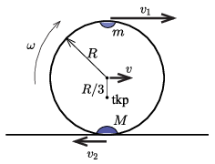

**Megoldás**
. Legyen a testek sebessége a kérdéses pillanatban az ábrán jelölt irányításokkal $v_1$ és $v_2$.

 A rendszerre nem hat vízszintes irányú külső erő, emiatt a vízszintes irányú összimpulzus nulla marad:
 $(1)$ $mv_1-2mv_2=0, \qquad \text{tehát}\qquad v_1=2v_2.$
 Mivel az asztallap súrlódásmentes, a mechanikai energia megmaradásának törvénye is alkalmazható:
 $\frac{m}2v_1^2+\frac{M}2v_2^2=Mg\cdot 2R-mg\cdot 2R,$
 ahonnan $M=2m$ és (1) felhasználásával kapjuk, hogy
 $v_1=\sqrt{\frac{8}{3}Rg} \qquad\text{és}\qquad v_2=\sqrt{\frac{2}{3}Rg}.$
 $a)$ Az abroncs középpontjának sebessége
 $v=\frac{v_1-v_2}{2}=\sqrt{\frac{Rg}{6} }.$
 $b)$

**I. megoldás.**
 Az abroncs szögsebessége a vizsgált helyzetben
 $\omega=\frac{v}{R/3}=\frac{v_1-v_2}{2R/3}=\sqrt{\frac{3g}{2R} }.$
 A rendszer tömegközéppontja $s=R/3$ távol van az abroncs középpontjától, így az abroncshoz képest $s\omega^2$ nagyságú, függőlegesen felfelé irányuló gyorsulással mozog. (Az abroncs középpontja vízszintes irányban ide-oda mozog, éppen úgy, hogy a tömegközéppont vízszintes irányba ne mozduljon el.)
 Ha az asztalra ható nyomóerő $N$, ennek függőlegesen felfelé mutató ellenereje is $N$ nagyságú, így a függőleges irányú mozgás Newton-egyenlete:
 $N-3mg=3m \ s\omega^2=\frac32 mg,$
 vagyis $N=\frac92mg.$

**II. megoldás.**
 Az $N$ nyomóerőt másképpen is megkaphatjuk. Ahogy már láttuk, a kérdéses pillanatban az abroncs középpontja (az ábrán is láthatóan jobbra) $v$ sebességgel mozog:
 $v=\frac{v_1-v_2}{2}=\frac{v_2}{2}=\sqrt{\frac{Rg}{6} }.$
 Üljünk be az abroncs középpontjával együtt mozgó rendszerbe, ami ebben a pillanatban inerciarendszer, mert ekkor nincs vízszintes gyorsulása a karika középpontjának.
 Ebben a rendszerben mindkét nehezék $3v$ sebességgel mozog, így mindkettőnek a gyorsulása
 $a_{\rm{cp}}=\frac{(3v)^2}{R}=\frac{3}{2}g.$
 A felső nehezéket az abroncs $N_1=ma_{\rm{cp}}-mg$ erővel nyomja lefelé, az alsót pedig $N_2=2ma_{\rm{cp}}+2mg$ erővel nyomja felfelé. Ezek előjeles összege adja meg az asztalra ható nyomóerőt:
 $N=N_2-N_1=(2ma_{\rm{cp}}+2mg)-(ma_{\rm{cp}}-mg)=ma_{\rm{cp}}+3mg=m\frac{3}{2}g+3mg=\frac92mg.$
 A rendszer tömegközéppontjának eredő (felfelé mutató) gyorsulását úgy kaphatjuk meg, ha az eredő erőt elosztjuk a teljes tömeggel:
 $a=\frac{N-3mg}{3m}=\frac{g}{2},$
 ami megegyezik az előzőekben tárgyalt
 $s\omega^2=\frac{R}{3}\frac{3g}{2R}=\frac{g}{2}$
 gyorsulással.
 Felmerülhet az a kérdés is, hogyan lehet az abroncs nyomóerejét úgy kiszámítani a két nehezék gyorsulásából, hogy nem ülünk be a $v$ sebességgel mozgó rendszerbe. Megmutatható, hogy mozgása során mindkét nehezék ellipszispályán mozog, de ezek különböző ellipszisek. A nagyobb nehezék ,,álló'' ellipszisen mozog, melynek fél-nagytengelye $R$, fél-kistengelye pedig $2R/3$. A kisebb tömegű nehezék ,,fekvő" ellipszisen mozog, melynek fél-kistengelye $R$, míg fél-nagytengelye $4R/3$. Az ellipszis nagytengelyének végpontjaiban a görbületi sugár $r_{\rm{g1}}=b^2/a$, ahol $a$ a fél-nagytengely és $b$ a fél-kistengely, míg a kistengely végpontjaiban $r_{\rm{g2}}=a^2/b$ a görbületi sugár. Így a nagyobb nehezék mozgására nézve a görbületi sugár a legalsó pontban
 $r_{\rm{g1}}=\frac{(2R/3)^2}{R}=\frac{4}{9}R,$
 míg a kisebb nehezék pályájának görbületi sugara a legfelső pontban
 $r_{\rm{g2}}=\frac{(4R/3)^2}{R}=\frac{16}{9}R.$
 A gyorsulást úgy számíthatjuk ki, hogy a sebesség négyzetét elosztjuk a görbületi sugárral. A nagyobb nehezék $2v$ sebességgel mozog, míg a kisebbik $4v$ sebességgel. A nagyobb gyorsulása
 $a_{\rm{cp}}=\frac{(2v)^2}{r_{\rm{g1}}}=\frac{(2v)^2}{(4R/9)}=\frac{9v^2}{R}=\frac{3}{2}g.$
 A kisebbik nehezék kétszer gyorsabb, $4v$ sebességgel mozog, tehát a gyorsulása
 $a_{\rm{cp}}=\frac{(4v)^2}{r_{\rm{g2}}}=\frac{(4v)^2}{(16R/9)}=\frac{9v^2}{R}=\frac{3}{2}g.$
 Láthatjuk, hogy a két gyorsulás megegyezik, visszakaptuk a mozgó rendszer használatával kiszámított értékeket. Egymáshoz képest mozgó inerciarendszerekben a gyorsulásoknak meg kell egyezniük. Abban a rendszerben, ahol a kör középpontja áll, és mindkét test ugyanazon a körpályán, ugyanakkora kerületi sebességgel mozog, a gyorsulások nagysága megegyezik, tehát az asztallaphoz rögzített rendszerben is ugyanazokat a gyorsulásokat kell kapnunk. Nehézséget jelent, hogy ilyenkor a pálya görbületi sugarát kell használnunk a centripetális gyorsulás meghatározásakor.

