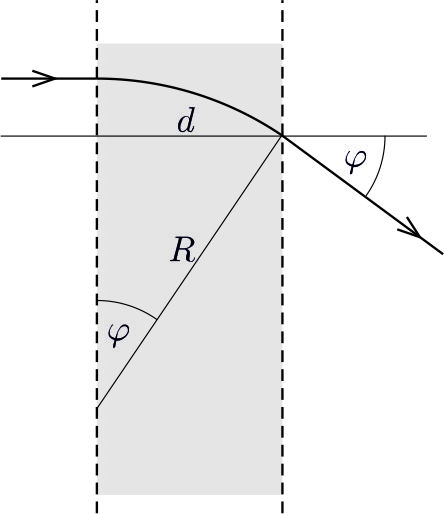

**Megoldás**
. A lényegében nyugvó helyzetből $U$ feszültséggel felgyorsított $\alpha$ részecskék sebességét az
 $\frac{1}{2}m_{\alpha}v^2=q_{\alpha}U
$
 energiamérlegből számolva ($m_{\alpha}=6{,}6447\cdot10^{-27}\ \textrm{kg}$, $q_{\alpha}=2e=3{,}20435\cdot10^{-19}\ \textrm{C}$, azaz $(q/m)_{\alpha}=4{,}8224\cdot10^7\ \textrm{C/kg}$ mellett)
 $v=9{,}82\cdot 10^{6}\ \textrm{m/s}
$
 adódik. (Ez a fénysebesség $\beta=3{,}274\cdot 10^{-2}$-szöröse, így ${\beta}^2=1{,}072\cdot 10^{-3}$, azaz adataink pontossága mellett biztos használhatjuk a klasszikus közelítést.)
 A mágneses térben az $\alpha$ részecskék a Lorentz erő (mint centripetális erő) hatására körpályán haladnak. Ennek sugara az
 $\frac{m_{\alpha}v^2}{R}=q_{\alpha}vB
$
 összefüggésből
 $R=\frac{v}{B\left(q/m\right)_{\alpha}}=0{,}136\ \textrm{m}.
$

 $a)$ Az eltérítés szöge az ábra szerint
 $\varphi=\arcsin(d/R)=0{,}541\ \textrm{rad}=31{,}0^\circ .
$
 $b)$ A $\varphi$ nyílásszöghöz tartozó $R\varphi$ körív befutásához az $v$ sebességgel haladó részecskéknek
 $t=\frac{R\varphi}{v}=7{,}49\cdot10^{-9}\ \textrm{s}
$
 időre van szükségük, azaz ennyit töltenek a mágneses térben.

