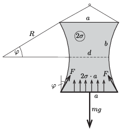

**I. megoldás**
. A cérnaszálak által kifejtett $F$ erő és a cérnaszál görbületi sugara között fennálló összefüggés
 $(1)$ $F=2\sigma R,$
 ahol $2\sigma$ a hártya két oldalának együttes felületi feszültsége. (Ezt pl. a cérnaszál kicsiny darabkájára ható erők egyensúlyából kaphatjuk meg.) Mivel $F$ a cérnaszál mentén nem változik, $R$ is állandó, tehát a cérnaszál körív alakot vesz fel.

 Az ábra jelöléseit követve a
 $(2)$ $b=2\varphi R,$
 és az
 $(3)$ $R(1-\cos\varphi)=\frac{a-d}{2}$
 geometriai feltételeket, valamint az alsó drótszál erőegyensúlyának
 $(4)$ $mg=2\sigma a+2F\cos\varphi$
 feltételét írhatjuk fel.
 A (2) és (3) egyenleteket összeszorozva kapjuk, hogy
 $\frac{1-\cos\varphi}{\varphi}=\frac{a-d}{b}=0{,}175,$
 amit
 $(5)$ $2\sin^2\frac{\varphi}2=0{,}175\,\varphi $
 alakban is felírhatunk. Ennek a trigonometrikus egyenletnek (mint azt számítógépes segítséggel könnyen meghatározhatjuk) $\varphi\approx0{,}354$ rad a megoldása. Ezt elemi úton is megkaphatjuk, ha a viszonylag kis szögekre érvényes
 $\sin\frac{\varphi}2\approx \frac{\varphi}2$
 összefüggést alkalmazzuk. Ennek megfelelően (5) közelítő, nullától különböző megoldása:
 $\varphi\approx 2\cdot 0{,}175=0{,}350,$
 ami csak 1%-kal tér el a pontosabb eredménytől.
 (1) és (2) szerint
 $F=\frac{b\sigma}\varphi,$
 amit (4)-be helyettesítve kapjuk, hogy
 $(5)$ $2\sigma\left(a+b\,\frac{\cos\varphi}{\varphi}\right)=mg,$
 ahonnan az adatok és a kiszámított $\varphi$ szög behelyettesítése után a
 $\sigma\approx 0{,}05\ \frac{\rm N}{\rm m}$
 eredmény adódik. Ez kicsit kisebb, mint a víz felületi feszültsége, amit a mosogatószer okozhatott.

**II. megoldás**
. Az egyensúlyi helyzetet (és abból a felületi feszültséget) a rendszer energiájának vizsgálatával is meghatározhatjuk. Az elrendezés összes energiája az alsó drótszál $E_1$ helyzeti energiájából és a hártya felületével arányos $E_2$ energiából tevődik össze.
 Válasszuk független változónak az I. megoldás ábráján látható $\varphi$ szöget, és a cérnaszálak görbületi sugarát (2) szerint fejezzük ki $\varphi$-vel: $R=b/(2\varphi)$. A nehezék helyzeti energiája (annak nullpontját a felső drótszál magasságánál rögzítve)
 $E_1(\varphi)=-mg\cdot 2R\sin\varphi=-mgb\frac{\sin\varphi}{\varphi}.$
 A hártya felületének $T$ nagysága egy téglalap, két körcikk és négy derékszögű háromszög területének előjeles összegeként kapható meg. Ennek megfelelően a felületi energia:
 $E_2(\varphi)=2\sigma T(\varphi)=2\sigma \,ab\frac{\sin\varphi}{\varphi}+\frac{\sigma\, b^2}{\varphi^2}(\sin\varphi\cos\varphi-\varphi),$
 a rendszer teljes energiája pedig
 $E(\varphi)=(2\sigma \,ab-mgb)\frac{\sin\varphi}{\varphi}+\frac{\sigma\, b^2}{\varphi^2}(\sin\varphi\cos\varphi-\varphi).$
 Az egyensúlyi helyzetben a teljes energia minimális, vagyis az $E(\varphi)$ függvény deriváltja nulla. Ez a feltétel éppen az (5) egyenletre vezet, amiből ($d$ segítségével kiszámítva $\varphi$-t) a felületi
 feszültség is kiszámítható.

 Megjegyzések. 1. A II. megoldásnak az az előnye az I. megoldáshoz képest, hogy nem kell figyelembe vennie a cérnaszálakat feszítő erőket. Hátránya, hogy az eredményhez csak a differenciálszámítás képletei segítségével, vagy az $E(\varphi)$ függvény grafikonjának vizsgálatával juthatunk el.
 2. Csábító, de hibás az a gondolat, hogy az egyensúlyi helyzetet az alsó drót helyzeti energiájának növekedésének és a felületi energia csökkenésének egyenlőségéből számítsuk ki. A kiindulási helyzetnek a folyadékból éppen kiemelt keretet választva a gravitációs helyzeti energia növekedése nem egyezik meg a felületi energia csökkenésével, hiszen a kettő előjeles összege nem nulla. A folyadékból kiemelt drótkeret alsó szálát a folyadékhártya felrántja, az csillapodó rezgőmozgásba kezd, majd az egyensúly beálltáig az összenergia egy része hőt fejlesztve disszipálódik. Az energiaváltozások egyenlősége csak az egyensúlyi helyzetből gondolatban kicsit kimozdított rendszerre igaz. Az ilyen ,,elképzelt'' (virtuális) elmozdulásokra alapozott megfontolást virtuálius munka elvének nevezik.

