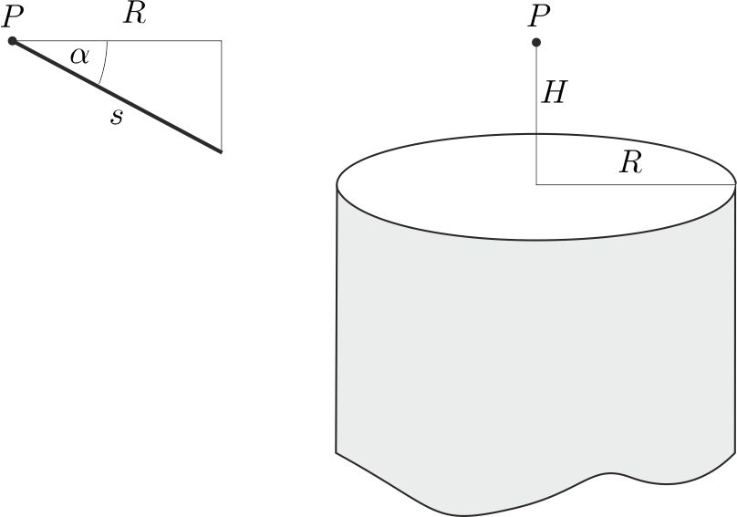

**Megoldás.**
 [ÍRTA: G. P.] Egy $\alpha$ hajlásszögű lejtőn lecsúszó $m$ tömegű testre $F=\mu mg\cos\alpha$ súrlódási erő hat, aminek hatására $s$ hosszú útszakaszon
 $Q=Fs=\mu mgs\cos\alpha$
 hő fejlődik, vagyis adott $Q,m,g$ és $\mu$ mellett
 $R\equiv s\cos\alpha=\dfrac{Q}{\mu mg}=\text{állandó}.$

 Az ábráról is leolvasható, hogy a kérdéses pontok a $P$ ponton átmenő függőleges egyenestől $R$ távolságra helyezkednek el, vagyis egy $R$ sugarú henger palástjára esnek.
 A test csak akkor csúszik le a lejtőn, ha $\tan\alpha>\mu,$ vagyis a lejtők alsó pontjai a $P$-re illeszkedő vízszintes sík alatt mélyebben vannak, mint
 $H=R\,\tan\alpha_\text{min}=R\mu=\dfrac{Q}{mg}.$

 Megjegyzés. A megoldás ekvivalens azzal a többé-kevésbé ismert állítással, hogy a lejtőn a súrlódási munka (felszabaduló hő) megegyezik azzal az értékkel, mintha a test vízszintesen, a lejtő alapja mentén mozogna.

