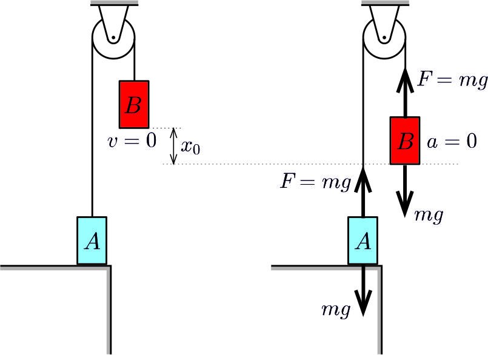
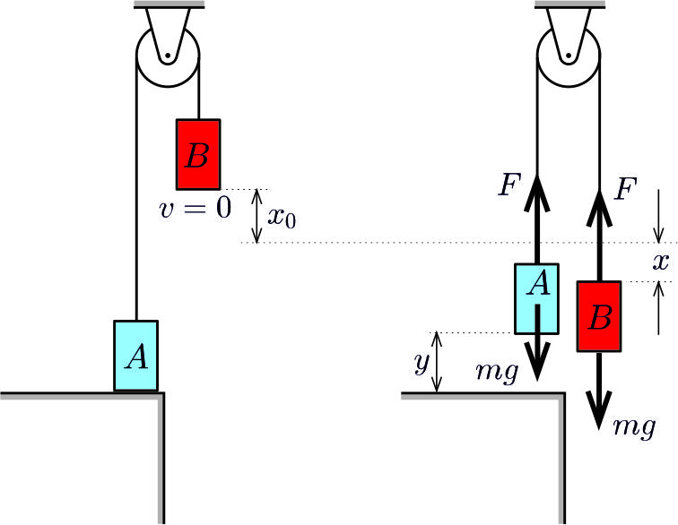
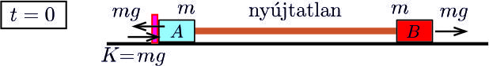
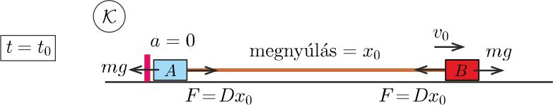
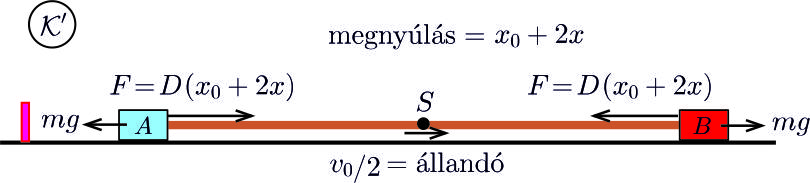

**I. megoldás.**
 Feltételezzük, hogy a gumiszál követi a Hooke-törvényt, vagyis a benne ébredő $F$ erő arányos az $x$ megnyúlással. Az arányossági tényezőt (a gumiszál ,,rugóállandóját'') jelöljük a szokásos módon $D$-vel.
 $a)$ A rendszer mozgása két szakaszra bontható. Az I. szakaszban az $A$ test mozdulatlan, a $B$ test pedig $t_0$ ideig harmonikus rezgőmozgást végez. Ez a szakasz addig tart, amíg a gumiszálban ébredő erő kisebb, mint $mg$, vagyis a $B$ test elmozdulása
 $(1)$ $x<\frac{mg}{D}=x_0.$
 A $B$ test sebessége kezdetben nulla, $t_0$ idő elteltével pedig a gyorsulása válik nullává, mert ekkor a gumiszál által kifejtett erő éppen az $mg$ nehézségi erő $(-1)$-szerese, tehát a testre ható eredő erő nulla ( 1. ábra ).

 1. ábra

 A harmonikus rezgőmozgás során a nulla sebességű és a nulla gyorsulású állapot között egy negyed periódusnyi idő telik el, vagyis
 $t_0=\frac{T}{4}=\frac{\pi}{2\omega}=\frac{\pi}{2}\sqrt{\frac{m}{D}},$
 és így
 $(2)$ $\omega=\frac{\pi}{2t_0}$
 Ezt (1)-gyel összevetve látjuk, hogy
 $(3)$ $x_0=\frac{g}{\omega^2}=\frac4{\pi^2}gt_0^2,$
 ekkora a $B$ test elmozdulása a $t_0$ idejű mozgás után.
 A továbbiak szempontjából lényeges, hogy a $B$ test sebessége a $t_0$ idejű mozgás után
 $(4)$ $v_0=x_0\omega=\frac{2}{\pi}gt_0.$

 $b)$ A mozgás második szakaszában mindkét test mozog. Tekintsük azt a helyzetet, amikor a $B$ test elmozdulása $x_0+x$, az $A$ test az asztal fölött $y$ magasságban van és az indulástól számítva $t_0+t$, vagyis az $A$ test megemelkedésének pillanatától mérve $t$ idő telt el. A gumiszál megnyúlása ekkor $x_0+x-y$, a szálat feszítő erő tehát
 $F=D(x_0+x-y).$

 2. ábra

 A testek mozgásegyenlete:
 $ma_x=mg-F=D(y-x), \qquad \text{illetve}\qquad ma_y=F-mg=D(x-y),$
 amiket így is felírhatunk:
 $(5)$ $a_x=\omega^2(y-x)$
 és
 $(6)$ $a_y=\omega^2(x-y),$
 és a kezdeti feltételek $t=0$ pillanatban:
 $(7)$ $x(0)=y(0)=0,\qquad v_x(0)=v_0, \qquad v_y(0)=0.$
 (5) és (6) összegéből látszik, hogy az $x(t)+y(t)$ mennyiség gyorsulása nulla, vagyis
 $(8)$ $x(t)+y(t)=v_0\cdot t.$
 Ez összhangban van a (7)-ben szereplő kezdeti feltételekkel.
 (5) és (6) különbségét képezve:
 $a_{(x-y)}=-2\omega^2 (x-y),$
 ami egy $\sqrt2\,\omega$ körfrekvenciájú harmonikus rezgőmozgás egyenlete. A kezdeti feltételeknek is eleget tevő megoldás:
 $(9) $ $x(t)-y(t)=\frac{v_0}{\sqrt2\,\omega}\sin\left(\sqrt2\,\omega t\right).$
 A $B$ test mozgását leíró függvény (8) és (9) összegéből:
 $x(t)=\frac{v_0}{2}\left(t+\frac1{\sqrt2\,\omega}\sin (\sqrt2\,\omega t) \right),$
 és ennek megfelelően a $B$ test sebessége:
 $v_x(t)=\frac{v_0}{2}\left(1+ \cos (\sqrt2\,\omega t) \right).$
 Ez a sebesség akkor válik nullává, amikor $\sqrt2\,\omega t =\pi,$ vagyis
 $t=t_1=\frac{\pi}{\sqrt2\,\omega}=\sqrt2\,t_0.$
 Ennek megfelelően a $B$ test sebessége az indulásától számítva
 $t_0+t_1=\left(1+\sqrt2\right)t_0\approx 2{,}41\,t_0$
 idő elteltével válik ismét nullává.

 $c)$ A gumiszálat feszítő erő akkor a legnagyobb, amikor az
 $x(t)-y(t)=\frac{v_0}{\sqrt2\,\omega}\sin\left(\sqrt2\,\omega t\right)$
 függvény maximális, nevezetesen
 $(x-y)_\text{max}=\frac{v_0}{\sqrt2\,\omega}=\frac1{\sqrt2}x_0$
 nagyságú. A gumiszálat feszítő erő ekkor
 $F_\text{max}=D\left(x_0+\frac1{\sqrt2}x_0\right)=\left(1+\frac1{\sqrt2}\right)mg\approx 1{,}71\ mg.$

**II. megoldás.**
 Az állócsiga, mivel a tömege elhanyagolható, a gumiszálban ható erőnek csak az irányát változtatja meg, a nagyságát nem. Emiatt megtehetjük, hogy a gumiszálat (gondolatban) kiegyenesítjük, és a két test mozgását egy vízszintes, súrlódásmentes lapon vizsgáljuk. Az állócsigán lógó testekre ható nehézségi erőt ebben a ,,kiegyenesített'' elrendezésben egy-egy vízszintesen, $mg$ nagyságú, ellentétes irányú külső erővel vehetjük figyelembe. Az eredeti asztal szerepét egy függőleges támaszték veszi át, amely egy ideig (amíg a gumiszálat feszítő erő kisebb, mint $mg$) megakadályozza az $A$ test elmozdulását ( 3. ábra ).

 3. ábra

 $a)$ A mozgás kezdeti szakaszában az $A$ test mozdulatlan, gyorsulása nulla. A gumiszálban ébredő $F$ erő és az $mg$ külső erő különbségét a függőleges támaszték által kifejtett $K=mg-F$ nagyságú nyomóerő ,,egyensúlyozza ki''. Mivel $K\ge0,$ ez a helyzet csak addig állhat fenn, amíg $B$ test elmozdulása nem lépi túl a kritikus
 $x_0=\frac{mg}{D}$
 értéket. (Itt és a továbbiakban az I. megoldás jelöléseit használjuk.)
 A $B$ test eközben az elmozdulásával arányosan csökkenő gyorsulással, tehát $\omega=\sqrt{D/m}$ körfrekvenciájú harmonikus rezgőmozgásnak megfelelő mozgást végez. A rezgőmozgás ,,egyensúlyi helyzete'' éppen az $x_0$ elmozdulásnál lesz, itt válik a $B$ test gyorsulása nullává. Kezdetben a $B$ test sebessége nulla, tehát $x_0$ elmozdulásáig éppen egy negyed periódus telik.
 $t_0=\frac14T=\frac14\cdot \frac{2\pi}{\omega},$
 vagyis
 $(10)$ $\omega=\frac{\pi}{2t_0},$
 és így
 $(11)$ $x_0=\frac{mg}{D}=\frac{g}{\omega^2}=\frac{4gt_0^2}{\pi^2}.$
 Az $A$ test megmozdulásának pillanatában ( 4. ábra ) a $B$ test valamekkora $v_0$ sebességgel rendelkezik. Ennek nagyságát a munkatétel alkalmazásával határozhatjuk meg:
 $mgx_0=\frac12Dx_0^2+\frac12mv_0^2,$
 ahonnan (10) és (11) felhasználásával:
 $(12)$ $v_0=\sqrt{2gx_0-\omega^2x_0^2}=\frac{g}{\omega}=\frac2{\pi}gt_0.$

 4. ábra

 $b)$ A mozgás további részében a külső erők ($mg$ és $-mg$) eredője nulla, tehát a két testből álló rendszer lendülete időben állandó, a kezdeti $mv_0$-lal egyezik meg.
 Térjünk át az asztal $\cal K$ koordináta-rendszeréről a tömegközépponti, $\cal K$-hoz képest $v_0/2$ sebességgel mozgó $\cal K'$ vonatkoztatási rendszerre. Ebben a rendszerben a gumiszál $S$ középpontja áll, az rögzítettnek is tekinthető.

 5. ábra

 A fél gumiszál rugóállandója $2D$, hiszen adott feszítőerő hatására a gumi fele csak feleannyit nyúlik meg, mint a gumiszál egésze. A testek kezdősebessége a tömegközépponti rendszereben:
 $v'_A=0-\frac{v_0}{2}=-\frac{v_0}{2}, \qquad \text{illetve}\qquad v'_B=v_0-\frac{v_0}{2}=+\frac{v_0}{2}.$
 Amikor a fél gumiszál hossza $\frac12x_0+x$, akkor a $B$ testre ható erő:
 $F(x)=-2D\left(\frac12x_0+x\right)+mg=-2Dx,$
 a $B$ test tehát
 $\omega'=\sqrt{\frac{2D}{m}}=\sqrt2\,\omega$
 körfrekvenciájú rezgésbe kezd.
 Amikor a $B$ test sebessége a $\cal K$ rendszerben nulla, akkor a tömegközépponti $\cal K'$ rendszerben a sebessége $-v_0/2$, vagyis a kezdeti érték $(-1)$-szerese. Ezt a sebességet az $A$ test megindulásától számítva éppen egy fél periódusnyi idő alatt éri el, ami
 $t_1=\frac{T'}{2}=\frac{\pi}{\omega'}=\frac{\pi}{\sqrt2\omega }=\sqrt2\,t_0.$
 A $B$ test elindulásától számítva az első megállásáig tehát
 $t_0+t_1=\left(1+\sqrt{2}\right)t_0$
 idő telik el.
 $c)$ A gumiszálat feszítő erőt a gumiszál legnagyobb megnyúlása határozza meg. Ez legkönnyebben a $\cal K'$ rendszerben kaphatjuk meg. Ha az egyes testek rezgési amplitúdója $A$, akkor a legnagyobb megnyúlás $x_0+2A$, és így
 $F_\text{max}=D\left(x_0+2A\right).$
 Az $A$ amplitúdót a munkatételből határozhatjuk meg:
 $\cfrac{m}{2}\left(\frac{v_0}{2}\right)^2=\frac12(2D)A^2,$
 ahonnan
 $A=\sqrt{\cfrac{m}{8D}}v_0=\frac{1}{\sqrt8}x_0,$
 vagyis
 $F_\text{max}=\left(1+\frac{1}{\sqrt{2}} \right) mg.$

