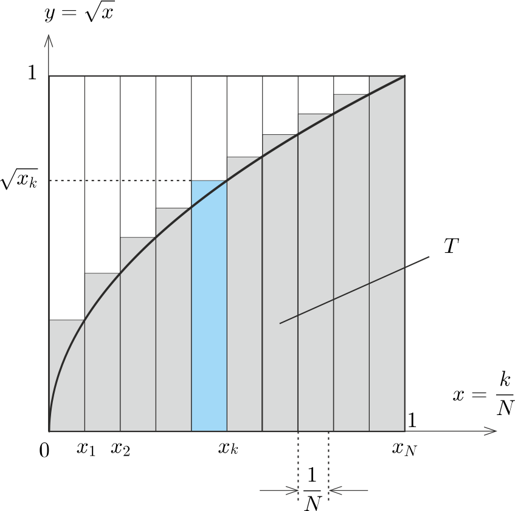
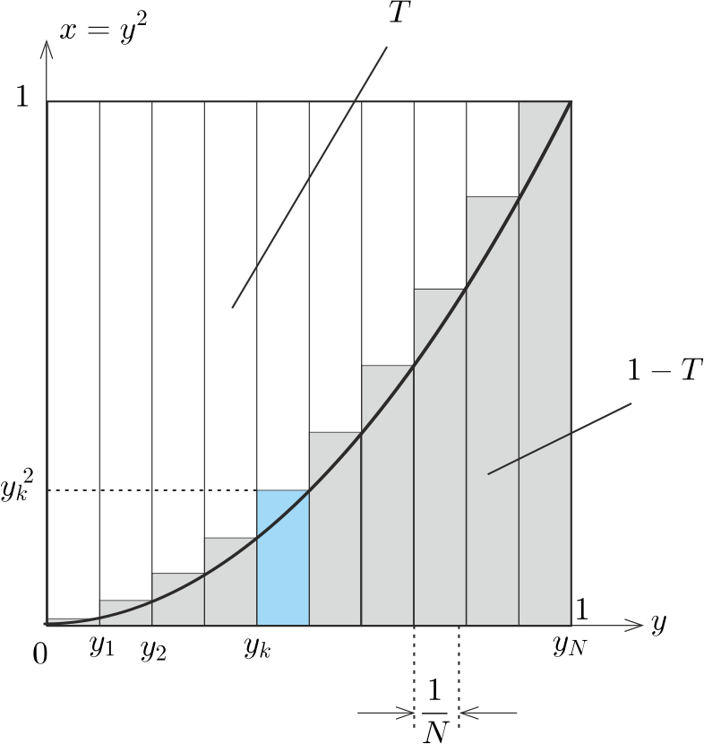

**Megoldás.**
 Legyen a pályaszakasz hossza $L$, az autó gyorsulása pedig $a=\frac{v_0^2}{2L}.$ Ha a pálya mentén $N$ számú ($N\gg1$) sebességmérőt helyeztek el, akkor ezek távolsága $L/N$. Számozzuk meg a sebességmérőket a startvonaltól kiindulva, így a $k$-adik mérő távolsága az indítási helytől
 $s_k=k\frac{L}{N},$
 az ott elhaladó autó sebessége pedig
 $v_k=\sqrt{2as_k}=\sqrt{2\cdot\frac{v_0^2}{2L}\cdot k\frac{L}{N}}=v_0\sqrt{\frac{k}{N}}.$
 A mért sebességek átlaga
 $\overline{v}=v_0\left(\frac1{N}\sum_{k=1}^N\sqrt{\frac{k}{N}}\right).
$
 A zárójelben álló kifejezés szemléletes geometriai jelentése: közelítőleg megegyezik az $y=\sqrt{x}$ függvénynek a $0\le x\le 1$ intervallumon vett görbe alatti területével (lásd az 1. ábrát ).

 1. ábra

 Ezt a $T$ területet pl. integrálszámítás segítségével ki lehet számítani (az eredmény: $T=\tfrac23)$, de elemi úton is meghatározható.
 A görbe alatti terület és a görbe feletti (a fekvő parabola és az $y=1$ egyenes közötti) terület összege nyilván 1. Ha tehát kiszámítjuk a görbe feletti $1-T$ terület nagyságát, a számunkra fontos másikat is megkapjuk.
 Tükrözzük az 1. ábrát az $y=x$ egyenesre, vagyis cseréljük fel az $x$ és $y$ változókat ( 2. ábra ).

 2. ábra

 Ezt a területet is téglalapok területének összegével közelíthetjük. (Ha $N\gg 1$, akkor a közelítés pontosnak mondható.)
 $1-T=\frac1{N}\sum_{k=1}^N \left(\frac{k}{N}\right)^2=\frac1{N^3}\sum_{k=1}^N k^2.$
 Ismert az első $N$ egész szám négyzetösszege:
 $\sum_{k=1}^N k^2=\frac{N(N+1)(2N+1)}{6}.$
 Ezek szerint
 $T\approx 1-\frac13\left(1+\frac{1}{N}\right)
\left(1+\frac{1}{2N}\right),$
 vagyis $N\gg1$ miatt
 $T\approx1-\frac13=\frac23,$
 és így a keresett átlagsebesség $\frac23v_0$.

