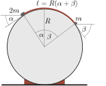

**Megoldás.**
 Jelöljük a két test egyensúlyi helyzetét jellemző szögeket $\alpha$-val és $\beta$-val (lásd az ábrát ).

 Az egyes testek akkora erőt fejtenek ki a fonálra, mintha $\alpha$, illetve $\beta$ hajlásszögű lejtőkön helyezkednének el. Az egyensúly feltétele:
 $2mg\sin\alpha=mg\sin\beta,$
 vagyis
 $2\sin\alpha=\sin\beta.$
 (Látható, hogy $\alpha<\beta$.) A fonál – a kitűzési ábra szerint – mindenhol hozzáfeszül a hengerhez, tehát $\beta<90^\circ$ és $\alpha<90^\circ$. (Az első feltételből már következik a második.)
 A szinuszfüggvény a hegyesszögek tartományában monoton növekszik, ezért nagyobb $\beta$ szöghöz nagyobb $\alpha$ és nagyobb $R(\alpha+\beta)$ fonálhossz tartozik. A fonál leghosszabb értéke tehát a legnagyobb megengedett $\beta=90^\circ$ értékhez tartozik. Ennél a szögnél
 $\sin\beta=1; \qquad \sin\alpha=\frac12,$
 tehát
 $\alpha+\beta=120^\circ=\cfrac{2\pi}{3}\ \text{rad},$
 és így
 $\ell_\text{max}=\frac{2\pi}{3}R\approx 42\ \rm cm.$

