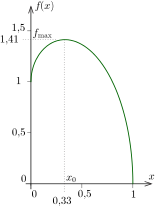
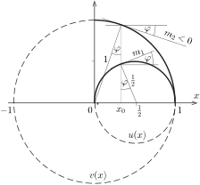
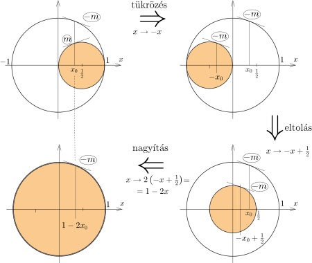

**Megoldás.**
 Mindkét hordónál a lyuk és a hordó teteje között $h-xh=h(1-x)$ a szintkülönbség, így mindkét borsugár kiáramlási sebessége a Torricelli-törvény szerint
 $v=\sqrt{2gh(1-x)}.$
 Amennyiben a lyuk $H$ magasan van a talaj felett, a borsugár egyes (tömegpontoknak tekinthető) darabkáinak esési ideje
 $T=\sqrt{\frac{2H}{g}},$
 így a borsugár a hordótól
 $s=vT=2\sqrt{Hh(1-x)}$
 távolságra csapódik a talajhoz. Az alsó hordónál $H=xh$, tehát
 $s_1(x)=2h\sqrt{x(1-x)},$
 a felső hordónál pedig $H=h+xh,$ így a hordótól való eltávolodása
 $s_2(x)=2h\sqrt{(1+x)(1-x)}.$
 A két becsapódási pont távolsága
 $\ell =s_1(x)+d+s_2(x)=d+2h\left(\sqrt{x(1-x)}+\sqrt{1-x^2}\right),$
 ahol $d$ a hordók átmérője, hiszen a maximális távolsághoz az is kell, hogy a lyukak a hordók átellenes oldalán legyenek. Mivel $h$ és $d$ ($x$-től független) állandók, Héraklész feladata az
 $f(x)=\sqrt{x(1-x)}+\sqrt{1-x^2}$
 függvény $0<x< 1$ intervallumon felvett legnagyobb értékének, vagyis a maximumának megtalálása.
 Erre hatféle módszert (!) is javasolhatunk neki. Az első egy grafikus közelítő módszer, a második felsőbb matematikát (differenciálszámítást) alkalmaz. Vannak még közelítésmentes, elemi megoldások is. A harmadik algebrai megoldás, a számtani-, a mértani- és a négyzetes közepekre vonatkozó egyenlőtlenségeket alkalmazza. A negyedik megoldási módszer lényege az $f(x)$ két tagja között fennálló ,,átskálázhatósági tulajdonság'' felismerése. Ennek az eljárásnak az az érdekessége, hogy bár $f(x)$ növekedési ütemére hivatkozik, de annak nagyságát (a többi módszertől eltérően) nem szükséges kiszámítanunk. Az ötödik (geometriai) módszer $f(x)$ növekedési (és csökkenési) ütemét vizsgálja, de nem igényli a differenciálszámítás ismeretét. Végül a hatodik megoldási mód körök egymásba transzformálhatóságát használja.

 1. módszer. Valamilyen rajzolóprogram segítségével ábrázoljuk $f(x)$-et. A grafikonról ( 1. ábra ) leolvashatjuk, hogy a függvény a maximumát $x\approx 0{,}33\approx \tfrac13$ értéknél veszi fel.

 1. ábra

 2. módszer. Az $f(x)$ függvény maximumánál teljesül, hogy
 $f'(x)\equiv \frac{1-2x}{2\sqrt{x(1-x)}}- \frac{2x}{2\sqrt{1-x^2}} =0,$
 ahonnan
 $(1-2x)^2(1-x)(1+x)=4x^3(1-x) .$
 Mivel $x<1$ (vagyis $x\ne 1)$, egyszerűsíthetünk $(1-x)$-szel:
 $(1-2x)^2(1+x)=4x^3,$
 azaz
 $(1-4x+4x^2)+(x-4x^2+4x^3)=4x^3,$
 vagyis
 $1-3x=0,$
 tehát a maximum helye
 $x_0=\frac13.$
 Behelyettesítéssel kapjuk, hogy
 $f_\text{max}=f(x_0)=\sqrt{\frac{2}{9}}+\sqrt{\frac{8}{9}}=\sqrt2,$
 és így
 $\ell_\text{max}=d+2\sqrt2 h.$
 Héraklésznek tehát a hordókat az alsó harmadrészüknél kell megfúrnia, egymással ellentétes oldalon, hogy teljesítse a próbát.

 3. módszer. Bontsuk fel $f(x)$-et két tényező szorzatára:
 $f(x)=\sqrt{1-x}\cdot\left(\sqrt{x}+\sqrt{1+x}\right),$
 és keressünk felső korlátot a második tényezőre. Kínálja magát az ötlet, hogy a számtani közép és a négyzetes közép közötti
 $\frac{a+b}{2}\le \sqrt{\frac{a^2+b^2}{2}}$
 egyenlőtlenséget alkalmazzuk, hiszen ekkor a négyzetgyökök négyzete két összevonható, lineáris kifejezés lesz. Az egyenlőség csak akkor áll fenn, ha $a=b$.
 Esetünkben $a=\sqrt{x}$ és $b=\sqrt{1+x}$, ezek minden $x$-re különbözőek, az egyenlőtlenség tehát nem lehet ,,éles''.
 $\sqrt{x}+\sqrt{1+x}<2\sqrt{\cfrac{x+(1+x)}{2} }=2\sqrt{x+\tfrac12}.$
 Visszatérve $f(x)$ felső korlátjának kereséséhez:
 $f(x)<2\sqrt{(1-x)\left(x+\tfrac12\right)}.$
 Itt most a mértani és a számtani közepekre vonatkozó
 $\sqrt{ab}\le \frac{a+b}{2}$
 egyenlőtlenséget alkalmazhatjuk:
 $f(x)<\frac{3}{2}.$
 Ez egy igaz állítás, de nem adja meg $f(x)$ legnagyobb értékét, hiszen semmilyen $x$-nél nem éri el $f(x)$ a $\frac{3}{2}$ értéket.
 Próbálkozhatunk azzal, hogy $\sqrt{1+x}$-et két egyenlő kifejezés összegére bontjuk:
 $\sqrt{1+x}=\sqrt{\tfrac14(1+x)}+\sqrt{\tfrac14(1+x)},$
 és három tagra írjuk fel a számtani és a négyzetes közepek
 $\frac{a+b+c}{3}\le \sqrt{\frac{a^2+b^2+c^2}{3}}$
 egyenlőtlenségét. (Az egynlőség $a=b=c$ esetén teljesül.) Jelen esetben
 $\sqrt{x}+\sqrt{\tfrac14(1+x)}+\sqrt{\tfrac14(1+x)} \le \sqrt{3\left(x+\frac{1+x}{2} \right)}=\frac{3}{\sqrt2}\sqrt{x+\frac{1}{3}}.$
 Az egyenlőség
 $x=\frac{1+x}{4},\qquad\text{vagyis}\qquad x=\frac13$
 esetén teljesül.
 A teljes $f(x)$-re ezt írhatjuk fel:
 $f(x)\equiv \sqrt{1-x}\left(\sqrt{x}+\sqrt{1+x}\right)\le
\frac{3}{\sqrt2}\sqrt{1-x}\sqrt{x+\frac{1}{3}}\le \frac{3}{\sqrt2}\frac{1-x+x+\tfrac13}{2}=\sqrt{2}. $
 Ez az egyenlőtlenság $1-x=x+\tfrac13$, azaz $x=\tfrac13$-nál válik élessé, tehát ugyanott, ahol a korábbi (a négyzetes középre vonatkozó). Emiatt állíthatjuk, hogy
 $f(x)\le \sqrt2,$
 és az egyenlőség $x=\frac13$-nál teljesül, vagyis itt veszi fel $f(x)$ a maximélis értékét.

 4. módszer. Vegyük észre, hogy az
 $f(x)=u(x)+v(x)= \sqrt{x(1-x)}+\sqrt{(1 + x)(1-x)}
$
 kifejezés két tagja lényegében azonos szerkezetű, így megfelelő ,,skálatranszformációval'' azonos alakra hozható. Ha
 $u(x)=\sqrt{x(1-x)},
$
 akkor
 $v(x)=\sqrt{(1+x)(1-x)}=2\, u(y), \qquad \text{ahol}\qquad y=\frac{1-x}{2}.
$
 Valóban:
 $2u(y)=2\,\sqrt{y(1-y)}=2\sqrt{\left(\frac{1-x}{2}\right)\left(1-\frac{1-x}{2}\right)}=\sqrt{(1+x)(1-x)}=v(x).$
 Ebből következően, ha az $u(x)$ érintőjének a meredeksége egy $x$ pontban $m(x)$, tehát a függvény értéke az $x+\Delta x$ pontban jó közelítéssel
 $u(x+\Delta x)\cong u(x)+m(x)\Delta x,
$
 akkor
 $v(x+\Delta x)=2u\left(\frac{1-x-\Delta x}{2} \right)\cong 2 u\left(\frac
{1-x}2 \right)-2\,m\left(\frac
{1-x}2 \right)\frac{\Delta x}{2},
$
 és így
 $f(x+\Delta x)=u(x+\Delta x)+v(x+\Delta x)\cong f(x)+ m(x)\,\Delta x - m(y) \,\Delta x.
$
 $f(x)$-nek ott van szélsőértéke, ahol az $x$ kis változtatására az értéke nem változik. Ez nyilván teljesül abban a pontban, ahol
 $y=\frac{(1-x)}{2}=x ,\qquad \mbox{azaz} \qquad x=\frac{1}{3}.
$
 Mivel az $f(x)$-ben a négyzetgyök alatt álló kifejezés egy lefelé nyíló parabolának felel meg, $f(x)$ konkáv függvény, tehát $f$-nek csak $x=\tfrac13$-nál van szélsőértéke, és az egy maximum . Ez tehát a keresett magasság érték, és ha a hordókon a lyukak így helyezkednek el, a borsugarak becsapódási pontja között a távolság
 $\ell_\text{max}=d+ 2\sqrt{2}h.
$

 5. módszer. $f(x)$ két tag összege. Jelöljük ezeket
 $u(x)=\sqrt{x(1-x)}\qquad \text{és}\qquad v(x)=
\sqrt{1-x^2}$
 módon, és ábrázoljuk a függvények grafikonját az $(x,u)$ és $(x,v)$ derékszögű koordináta-rendszerekben. Négyzetre emelés és teljes négyzetté alakítás után kapjuk, hogy
 $\left(x-\frac12\right)^2+u^2=\left(\frac12\right)^2,$
 illetve
 $x^2+v^2=1.$
 Látjuk, hogy mindkét görbe kör, pontosabban a 2. ábrán folytonos vonallal jelölt körív , hiszen
 $0\le x\le 1,\quad u\ge 0 \qquad\text{és}\qquad v\ge0.$

 2. ábra

 $f(x)=u(x)+v(x)$ maximumát keressük. Legyen $u(x)$ meredeksége (az érintőjének iránytangense az $x$ absszciszájú helyen $m_1(x)$, $v(x)$ meredeksége pedig $m_2(x)<0$. Keressük meg azt az $x_0$ értéket, amelynél
 $m_1(x_0)=-m_2(x_0)=m_0,$
 vagyis $f(x)$ növekedési üteme éppen nulla . A 2. ábráról leolvashatjuk, hogy egyrészt
 $\sin\varphi=\frac{\tfrac12-x_0}{\tfrac12}, $
 másrészt
 $\sin\varphi=x_0,$
 vagyis
 $1-2x_0=x_0, \qquad \text{azaz}\qquad x_0=\frac13.$
 (Kihasználtuk, hogy a kisebb kör sugara $1/2$, a nagyobbé 1, és az érintők merőlegesek a körök megfelelő sugarára.)
 A 2. ábráról azt is leolvashatjuk, hogy $x<x_0$ esetén
 $m_1(x)>m_0 \qquad \text{és} \qquad m_2(x)>-m_0,\qquad \text{tehát} \qquad m_1(x)+m_2(x)>0,$
 $x>x_0$ esetén pedig
 $m_1(x)<m_0 \qquad \text{és} \qquad m_2(x)<-m_0,\qquad
\text{vagyis} \qquad m_1(x)+m_2(x)<0.$
 Ezek szerint $f(x)$ monoton növekszik, amikor $x<x_0$, és monoton csökken, ha $x>x_0,$ tehát $x_0$-nál maximuma van.

 6. módszer. Induljunk ki most is az $f(x)$ függvény két tagjának megfelelő körökből. Olyan $x_0$ abszcisszájú pontokat keresünk, amelyhez tartozó érintők meredekségének nagysága megegyezik, csak az előjelük különböző. A 3. ábra vázlatosan mutatja, hogy három egyszerű geometriai transzformációval a (színesen jelölt) kis kört átvihetjük (áttranszformálhatjuk) a nagyobb körbe.

 3. ábra

 A tükrözés az $m$ meredekséget $(-m)$-re változtatja, az eltolás és a nagyítás pedig nem változtatja meg az érintő meredekségét. Ha olyan $x_0$ értéket választunk, amely a három transzformáció után éppen a kiindulási $x_0$ értékkel egyezik meg, akkor megtaláltuk $f(x)$ nulla meredekségű pontját, ami a keresett maximum helye.
 $1-2x_0=x_0, \qquad \text{vagyis}\qquad x_0=\frac13.$
 A hordókat tehát a magasságuk alsó egyharmadánál kell megfúrni, akkor lesz legnagyobb a borsugarak becsapódási pontjai közötti távolság.

