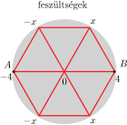
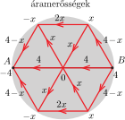
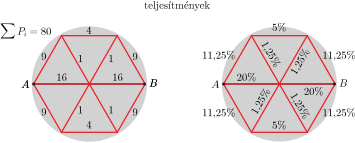

**Megoldás.**
 A teljesítmények százalékos megoszlása nem függ sem a hálózatra kapcsolt $U$ feszültségtől, sem az ellenálláshuzalok $R$ ellenállásától, hiszen mindegyik részteljesítmény $U^2/R$-rel arányos. Legyen pl. $U=8\ \rm V$ és $R=1\ \Omega$. (A továbbiakban az SI mértékegységeket nem írjuk ki.)
 Ha az $A$ pont potenciálja $-4$, a $B$ ponté $+4$, akkor a középpont potenciálja (a szimmetria miatt) nulla. A másik két pont potenciálja (ugyancsak a szimmetria miatt) $\pm x$ ( 1. ábra ). ($x$ értékét most még nem ismerjük.)

 1. ábra

 2. ábra

 Az áramerősségek ($R=1$ miatt) az egyes ellenálláshuzalok végpontjainak potenciálkülönbségével egyenlő ( 2. ábra ). A felső és az alsó ágak bármelyik csomópontjára felírható Kirchhoff-törvény szerint
 $4-x=x+2x,\qquad \text{vagyis}\qquad x=1.$
 Az áramerősségek négyzetével megegyező teljesítményeket, illetve azok százalékos megoszlását a ( 3. ábra ) mutatja.

 3. ábra

