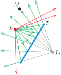
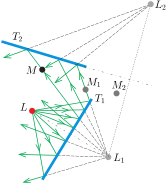
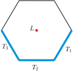
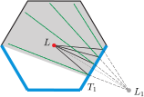
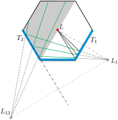
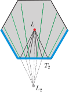
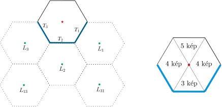

**Megoldás.**
 Általános megfontolások a síktükrök képalkotásáról, amelyek nem tartoznak szorosan a feladathoz, de a megoldás megértését segíthetik.

 Ha egy (pirosan jelölt) pontszerűnek tekinthető $L$ lámpa fényének egy része a függőleges $T$ síktükörre esik, akkor ezek a fénysugarak úgy verődnek vissza, mintha a lámpa a $T$-re vonatkoztatott, geometriai értelemben vett tükrözött $L_1$ pontjából indultak volna ki ( 1. ábra ). (Az ábrán a fénysugarak vízszintes síkra vett vetületét tüntettük fel. Ezen a vetületi képen a tükör egyenes szakasznak látszik.)

 1. ábra

 Nyilvánvaló, hogy a tükröződésben csak azok a fénysugarak vesznek részt, amelyek ténylegesen elérik a tükröt; ezeket zöld vonalakkal jelöltük. A tükröt elkerülő (pirosan jelölt) fénysugarak irányváltoztatás nélkül haladnak tovább. Ha a visszaverődő (zöld) fénysugarak útjában valahol egy $M$ megfigyelő tartózkodik és az $L_1$ pont felé néz, ott a lámpa látszólagos (virtuális) képét látja.
 Előfordulhat, hogy a $T_1$ tükrön visszaverődő fénysugarak egy része egy másik, $T_2$-vel jelölt tükörre esik ( 2. ábra ).

 2. ábra

 Ilyenkor a második tükörről úgy verődnek vissza a fénysugarak, mintha az $L_1$ virtuális kép $T_2$-re vett tükörképéből, az $L_2$ pontból indultak volna el.
 A tükörképet azok a fénysugarak hozzák létre, amelyek ténylegesen elérték a megfelelő tükröt. Az $M$ pontban álló megfigyelő például mindkét tükörképet lárhatja, ha a fejét megfelelő irányba fordítja. Az $M_1$ pontbeli szemlélő csak $L_1$-et látja, az $M_2$ pontból pedig egyik tükörképet sem észlelheti.
 Az eljárás tovább is folytatható. Ha a $T_2$ tükörről visszavert sugarak egy része eléri $T_1$-et (a 2. ábrán nem ez a helyzet), azok egy harmadik tükörképet hoznak létre és így tovább.

 Térjünk most rá az eredeti feladat megoldására. Jelöljük az elrendezésnek valamely vízszintes síkra való vetületén a $T_1$, $T_2$ és $T_3$ jelű tükröket kék, a nem tükröző falakat fekete, az $L$ lámpát pedig piros színnel ( 3. ábra ).

 3. ábra

 Vizsgáljuk először a fényforrásból a $T_1$ tükör felé induló, de a visszaverődésük után másik tükröt már nem érintő fénysugarakat. Ezek a fénysugarak úgy haladnak, mintha az $L_1$ virtuális képpontból indultak volna el, a szemünk tehát ott látja $L$ egyik tükörképét ( 4. ábra ). Ezeket a fénysugarakat a megfigyelő a 4. ábra szürkével jelölt tartományából figyelheti meg, amennyiben a $T_1$ tükör felé tekint.

 4. ábra

 Vannak olyan fénysugarak, amelyek a $T_1$ tükörről visszaverődve elérik a $T_3$ tükröt is. Ezek úgy haladnak tovább, mintha $L_1$-nek $T_3$-ra vett $L_{13}$ tükörképéből indultak volna el, tehát alkalmas (az 5. ábra szürkével jelölt) területén álló megfigyelő számára ott is képződik egy virtuális kép, ha a $T_3$ tükör felé néz. A továbbiakban a kétszer visszaverődött sugarak nem érnek el újabb tükröt.

 5. ábra

 A fényforrástól a $T_3$ tükör felé induló fénysugarak útját a 4. és 5. ábrának a jobb és a bal oldalát felcserélve kapjuk. Ezek két újabb látszólagos képet eredményeznek, $L_3$-t és $L_{31}$-et. (Az indexek balról jobbra olvasva a fényvisszaverődést okozó tükrök sorszámára utalnak.)
 A fényforrásból a $T_2$ tükörre eső fénysugarak úgy verődnek vissza, mintha az $L_2$ pontból indultak volna, ott tehát a lámpának virtuális képe keletkezik. Ezek a fénysugarak a továbbiakban nem ütköznek tükröző felületbe, mert a tükörmentes falak vagy áteresztik, vagy pedig elnyelik a fényt. Az $L_2$ képet a szoba bármelyik részén álló $M$ megfigyelő láthatja, ha a $T_2$ tükör felé néz ( 6. ábra ).

 6. ábra

 Összefoglalás. A lámpának összesen 5 tükörképe jelenik meg, ezek a 7. ábrán zöld színnel jelölt pontokban találhatóak. Az ábra jobb oldalán az látható, hogy a tükörszoba különböző részeiből a lámpának hány tükörképe figyelhető meg.

 7. ábra

