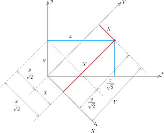
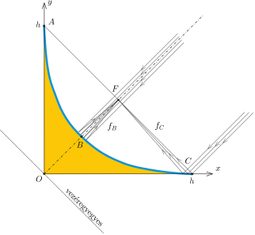
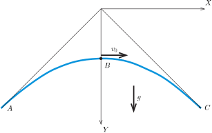
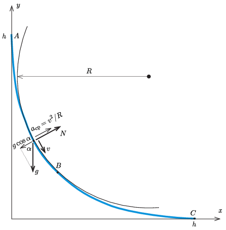

**Megoldás.**
 A megoldáshoz a következő lépések vezetnek el:

 – Meghatározzuk a burkológörbe alakját;
 – kiszámítjuk a kis test sebességét a kérdéses pontokban;
 – meghatározzuk a cső görbületi sugarát a szóban forgó pontokban;
 – és végül felírjuk a test Newton-féle mozgásegyenletét a burkológörbe érintőjére merőleges irányba, amiből megkapjuk a kérdezett nyomóerőt.

 1. A burkológörbe meghatározása.
 A $\xi$ paraméterhez tartozó egyenes egyenlete:
 $(1)$ $\frac{x}{\xi}+\frac{y}{h-\xi}=1.$
 Tekintsünk egy adott $(x,y)$ koordinátákkal rendelkező $P$ pontot, és számítsuk ki, hogy mekkora $\xi$ érték(ek)hez tartozó egyenes(ek) halad(nak) át ezen a ponton. Az ábrán is látszik, hogy ha $P$ a sárga tartományba esik, akkor két egyenes halad át rajta, ha $P$ a kék burkológörbén helyezkedik el, akkor csak egy (a burkolót érintő) egyenes halad át rajta, a fehér tartományba eső pontoknál pedig egyetlen $\xi$ sem elégíti ki az (1) egyenletet. Fejezzük ki $\xi$-t (1)-ből:
 $(2)$ $\xi^2+(y-x-h)\xi+xh=0.$
 Ennek a másodfokú egyenletnek akkor van pontosan 1 megoldása, ha az egyenlet diszkriminánsa nulla:
 $(y-x-h)^2-4xh=0,$
 amit így is felírhatunk:
 $(3)$ $2h(x+y)=(y-x)^2+h^2.$
 Belátjuk, hogy (3) egy olyan parabola egyenlete, amelynek szimmetriatengelye az $x$ tengellyel $45^\circ$-os szöget zár be.
 Az $(x,y)$ és a hozzá képest $45^\circ$-kal elforgatott $(X,Y)$ koordináta-rendszerek kapcsolata az 1. ábráról olvasható le:
 $X=\frac{x-y}{\sqrt2}, \qquad Y=\frac{x+y}{\sqrt2}.$

 1. ábra

 Ennek megfelelően a burkológörbe egyenlete:
 $(4)$ $Y=\frac{1}{\sqrt2 h}X^2+\frac{h}{2\sqrt2},$
 ami valóban egy parabolát ír le.

 2. A test sebességének meghatározása.
 A test kezdősebessége $v_A=0.$ A $\xi=h/2$ paraméterhez tartozó $B$ pont koordinátái: $x_B=y_B=h/4$, a $\xi=h$ értéknek megfelelő $C$ ponté pedig $x_C=h$ és $y_C=0$.
 Írjuk fel az energiamegmaradás törvényét az $A$ és $B$, valamint az $A$ és $C$ pontok közötti mozgásra:
 $(5)$ $\frac34mgh=\frac{1}{2}mv_B^2,\qquad \text{vagyis}\qquad v_B=\sqrt{\frac32gh},$
 valamint
 $(6)$ $mgh=\frac{1}{2}mv_C^2,\qquad \text{tehát}\qquad v_C=\sqrt{2gh}.$

 3. Görbületi sugarak kiszámítása.
 Egy síkgörbe simulókörének sugara (vagy ennek reciproka: a görbület) többféleképpen is meghatározható. Felsőbb matematikai módszerekkel (differenciálszámítással) a görbe egyenletéből közvetlenül megkaphatjuk a keresett sugár nagyságát, de elemi úton, fizikai (optikai vagy pontmechanikai) megfontolásokkal is célhoz érhetünk.
 Tekintsük a feladatban szereplő elrendezést egy forgásparaboloid alakú tükör síkbeli metszetének ( 2. ábra ).

 2. ábra

 A tükör $C$ pontjához érkező, a parabola tengelyével párhuzamos, tehát $45^\circ$-os beesési szögű fénysugár $45^\circ$-os szögben verődik vissza, az $A$ pont irányába halad. Az optikai tengelyt a $(h/2, h/2)$ koordinátájú $F$ pontban éri el, ez a pont tehát a tükör fókuszpontja. A $BF=f_B$ távolság $h/2\sqrt{2}$, és – a gömbtükör ismert tulajdonságai miatt – ennek kétszerese a parabola görbületi sugara a $B$ pontban:
 $(7)$ $R_B=2f_B=\frac{h}{\sqrt2}.$

 Megjegyzés. A parabola vezéregyenese az optikai tengelyre merőleges, tehát $AC$-vel párhuzamos, az origón áthaladó egyenes.

 Hasonló megfontolásokkal kapjuk meg a $C$ ponthoz tartozó görbületi sugár nagyságát is. A $C$ közelébe érkező párhuzamos sugárnyaláb is az $F$ pontban fókuszálódik, ilyen sugarakra tehát a fókusztávolság $f_C=h/\sqrt2$. Egy $R_C$ sugarú gömbtükörre nem merőlegesen, hanem $\alpha$ beesési szögben érkező fénysugarakra a leképezési törvény:
 $\frac{1}{t}+\frac{1}{k}=\frac{2}{R_C\,\cos\alpha}$
 (lásd Kós Géza: Lehet egy közelítéssel kevesebb? c. cikkét a Kömal 2010. évi 3. számának 174-180. oldalán, http://db.komal.hu/KomalHU/ ). Esetünkben $1/t=0$, $\alpha=45^\circ$ és $k=f_C=h/\sqrt2$, ahonnan
 $(8)$ $R_C=2h.$
 (Nyilván ugyanekkora $R_A$ is, de erre nincs szükségünk.)
 A görbületi sugarakat nemcsak optikai megfontolásokkal, hanem a vízszintes hajítás képleteiből is megkaphatjuk. Fordítsuk el (és tükrözzük) az $(X,Y)$ koordináta-rendszert úgy, hogy az $Y$ tengely mutasson függőlegesen lefelé ( 3. ábra ).

 3. ábra

 Tegyük fel a következő kérdést: Mekkora $v_0$ nagyságú, vízszintes irányú kezdősebességgel kell elhajítanunk egy kicsiny testet, hogy annak pályagörbéje éppen a (4) egyenlettel megadott legyen? Mivel
 $X=v_0t \qquad \text{és}\qquad Y=\frac{h}{2\sqrt2}+\frac{g}2t^2,$
 a pálya egyenlete
 $Y= \frac{h}{2\sqrt2}+\frac{g}{2v_0^2} X^2. $
 Ezt (4)-gyel összevetve leolvashatjuk, hogy
 $v_0^2=\frac{gh}{\sqrt2}.$
 Tudjuk, hogy a test gyorsulása mindenhol $g$, így a $B$ pontban is, ami akkor egyezik meg a $v_0^2/R_B$-vel, ha $R_B=h/\sqrt2$, ahogy azt már (7)-ben megkaptuk.
 A $C$ pontban, ahol a pályagörbe meredeksége $-1$, a hajítás törvényei szerint $v_C^2=\sqrt{2}gh$, a centripetális gyorsulása tehát
 $\frac{v_C^2}{R_C}=\frac{\sqrt2 gh}{R_C}=g\cos45^\circ=\frac{g}{\sqrt2}.$
 Innen kapjuk, hogy $R_C=2h,$ összhangban (8)-cal.

 4. A nyomóerők meghatározása.
 Most, hogy ismerjük a test sebességét és a pálya görbületi sugarát a kritikus pontokban, könnyen kiszámíthatjuk a cső által kifejtett nyomóerőket is. Ha a pálya valamelyik pontjában a görbe normálisa (az érintőjére merőleges irány) $\alpha$ szöget zár be a vízszintessel, a test sebessége $v$ és a görbületi sugár $R$, akkor (lásd a 4. ábrát ) a Newton-egyenlet szerint
 $N-mg\cos\alpha=\frac{mv^2}{R},$
 vagyis
 $N=mg\cos\alpha+\frac{mv^2}{R}.$

 4. ábra

 $a)$ Az $A$ pontnál $\alpha=90^\circ$ és $v_A=0$, így $N_A=0.$

 $b)$ A $B$ pontnál $\alpha=45^\circ$, $v_B=\sqrt{\tfrac32gh}$ és $R_B=\tfrac{h}{\sqrt2}$, ennek megfelelően $N_B=2\sqrt2\,mg\approx 2{,}8\,mg$.

 $c)$ Végül a pálya legalsó, $C$ pontjánál $\alpha=0^\circ$, $v_C=\sqrt{2gh}$ és $R_C=2h$, így $N_C=2mg$.

 (Látható, hogy a nyomóerők és $mg$ aránya nem függ $h$ konkrét értékétől.) A fentebb kiszámított $N$ erőket a cső fejti ki a lecsúszó testre. A kis test által a csőre kifejtett erők $N$ ellenerejei.

