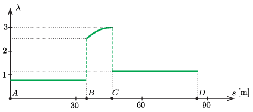

**Megoldás.**
 Ha egy $m$ tömegű testre a nehézségi erőn kívül $\boldsymbol{K}$ erő hat, akkor a mozgásegyenlet szerint
 $m\boldsymbol{g}+\boldsymbol{K}=m\boldsymbol{a},$
 vagyis
 $\boldsymbol{K}=m(\boldsymbol{a}-\boldsymbol{g}),$
 ahol $\boldsymbol{a}$ a test gyorsulásvektora. Megállapodás szerint a $\boldsymbol{K}$ erő ellenerejének nagyságát nevezik a test $G$ súlyának:
 $G=m\vert\boldsymbol{g}-\boldsymbol{a}\vert.$
 (Ezt a $G$ értéket mutatja az a mérleg, amit a gyorsuló test alá helyeznek.) A szokásos súly az álló helyzetben (vagy gyorsulásmentes körülmények között) mért súly: $G_0=mg.$ A feladatban kérdezett arányszám:
 $\lambda\equiv\frac{G}{G_0}=\frac{\vert\boldsymbol{g}-\boldsymbol{a}\vert}{g}.$
 I. Az $A$ és $B$ pont között a kis kocsi (és benne az emberek) lejtőirányú gyorsulása $a=g\sin\alpha$. Ugyanekkora a nehézségi erő lejtőirányú komponense is, ezek különbsége tehát nulla. Ennek megfelelően
 $\vert\boldsymbol{g}-\boldsymbol{a}\vert=g\cos\alpha$
 és így
 $\lambda=\cos\alpha\approx 0{,}87.$
 A mozgás ezen szakaszának hossza
 $s_1=R\,\cot\alpha\approx 34{,}6\,\mathrm{m}.$
 II. A mozgás második szakaszában (a $CB$ köríven) a test gyorsulása az érintőirányú gyorsulásból és a sugárirányú (centripetális) gyorsulásból tevődik össze. Az érintőleges gyorsulás és a nehézségi gyorsulás érintőirányú komponense megegyezik, ezek különbsége tehát nulla. A sugárirányú gyorsulás nagysága $v^2/R$, ahol $v$ a test pillanatnyi sebessége. A nehézségi gyorsulás sugárirányú komponense a centripetális gyorsulással ellentétes irányú és $g\cos\varphi$ nagyságú, ahol $\varphi$ ($\alpha>\varphi>0)$ a test pillanatnyi helyzetéhez tartozó sugárnak a függőlegessel bezárt szöge. Ennek megfelelően
 $\lambda=\frac{v^2}{Rg}+\cos\varphi.$
 A sebességet az energiamegmaradás törvényét alkalmazva kapjuk meg:
 $\frac{1}{2}mv^2=mgR\cos\varphi,\qquad\textrm{vagyis}\qquad v=\sqrt{2gR\cos\varphi},$
 és innen
 $\lambda=3\cos\varphi.$
 A körív hossza:
 $s_2=R\alpha=R\frac{\pi}{6}\approx 10{,}5\,\mathrm{m}.$
 Közvetlenül a $B$ pont elhagyása után $\lambda\approx 2{,}6$, a $C$ pont elérése előtti pillanatban pedig $\lambda=3{,}00.$ A megtett $s$ út és $\varphi$ közötti kapcsolat:
 $\varphi=\cot\alpha+\alpha-\frac{s}{R}.$
 III. A mozgás harmadik, fékezéses szakaszában a gyorsulás vízszintes irányú és $a=\frac{R}{\ell}g=\frac{1}{2}g$ nagyságú. Ennek megfelelően
 $\lambda=\frac{\sqrt{5}}{2}\approx 1{,}12.$
 A mozgás ezen szakaszának hossza $s_3=40\,\mathrm{m}$, a teljes út pedig $s_1+s_2+s_3\approx 85\,\mathrm{m}.$
 A $\lambda$ arányszámnak a megtett úttól való függését az ábra mutatja. Látható, hogy $\lambda(s)$ nem folytonos függvény, a $B$ és a $C$ pontokban ,,ugrása'' van. A Newton-törvény szerint (véges nagyságú erők esetén) csak a sebesség nem változhat meg hirtelen, a gyorsulásra nincs ilyen kikötés.

 Megjegyzés. A feladatban leírt ,,zökkenés'' elkerülése érdekében a vasúti pályák és az autópályák görbületi sugara csak fokozatosan változik, tehát egyesen szakaszhoz sosem csatlakozik körív.

