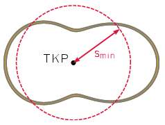
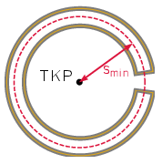

**Megoldás.**
 Tekintsünk egy tetszőleges felfüggesztési pontot, jelölje ennek a keret tömegközéppontjától mért távolságát $s$, a test erre vonatkozó tehetetlenségi nyomatékát $\Theta_s$. Utóbbi kapcsolatba hozható a tömegközépponti tehetetlenségi nyomatékkal a $\Theta_s=\Theta_0+Ms^2$ Steiner-tétel által. Ezt felhasználva, a kiválasztott tengelyhez tartozó lengésidő az alábbi alakot ölti:
 $(1)$ $T_s=2\pi\sqrt{\frac{\Theta_s}{Mgs}}=2\pi\sqrt{\frac{\Theta_0}{Mgs}+\frac{s}{g}}.$
 A gyök alatti kifejezés alulról becsülhető a számtani és mértani közepek közötti egyenlőtlenség segítségével:
 $\frac{\Theta_0}{Mgs}+\frac{s}{g}\ge\sqrt{\frac{4\Theta_0}{Mg^2}}.$
 Egyenlőség akkor lép fel, amikor a két tag megegyezik; ez a feltétel az alábbi speciális $s_\mathrm{min}$ érték esetén teljesül, amelyet az 1. ábrán is vázoltunk:
 $s_\mathrm{min}=\sqrt{\frac{\Theta_0}{M}}.$

 1. ábra

 Kérdés, hogy van-e olyan pontja a keretnek, amely a tömegközépponttól éppen ekkora távolságra esik. Hogy ezt megválaszoljuk, érdemes a tehetetlenségi nyomaték definícióját felhasználva $s_\mathrm{min}$ négyzetét szemléletesebb alakra hozni:
 $(2)$ $s_\mathrm{min}^2=\frac{\sum_{i}m_is_i^2}{\sum_im_i}=\langle s^2\rangle,$
 azaz $s_\mathrm{min}$ éppen a huzal egyes pontjaihoz tartozó $s$ távolságok négyzetes közepe. Mivel a középérték biztosan a legkisebb és legnagyobb távolságok közé esik, a huzal folytonossága miatt annak biztosan lesz legalább egy pontja, amely $s_\mathrm{min}$ távol helyezkedik el a tömegközépponttól. Az ehhez tartozó minimális $T_\mathrm{min}$ lengésidő az (1) egyenlethez visszatérve kiszámítható:
 $T_\mathrm{min}=2\pi\sqrt[4]{\frac{4\Theta_0}{Mg^2}}.$
 Végeredményben tehát ez lesz a mért lengésidők minimuma.
 Megjegyzés. Érdekesség, hogy a (2) egyenletből nem csupán az következik, hogy a huroknak legalább egy pontja a tömegközépponttól $s_\mathrm{min}$ távolságra esik, hanem az is, hogy legalább kettő. Ennek oka, hogy a hurok zárt, így bármely metszésponthoz, ahol a huzal az 1. ábrán jelölt körbe belép, kell tartoznia egy másik pontnak is, ahol kilép. Egyetlen érintési pont nem jöhet létre, hiszen a huzal nem lehet teljes egészében sem a körön belül, sem azon kívül. A két minimális lengésidejű pont esetére konstrukció is adható, például a 2. ábrán látható patkószerű hurok.

 2. ábra

