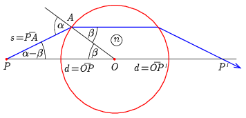

**Megoldás.**
 Jelöljük $A$-val azt a pontot, ahol a sugár a gömblencsébe belép, $s$-sel az $\overline{AP}$ szakasz hosszát, a beesési és a törési szög pedig legyen rendre $\alpha$ és $\beta$.

 Az $OAP$ háromszögre felírható szinusz tétel és a töréstörvény szerint
 $\frac{d}{s}=\frac{\sin(180^\circ -\alpha)}{\sin \beta}=n,$
 azaz
 $s=\frac{d}{n}.$
 A $\beta$ valamint az $\alpha-\beta$ szögekre felírható koszinusz tételnek megfelelően
 $s^2=R^2+d^2-2Rd\cos\beta,$
 illetve
 $R^2=s^2+d^2-2sd\cos(\alpha-\beta).$
 Ezekbe $s$-t behelyettesítve némi átrendezés után kapjuk, hogy
 $\cos\beta=\frac{d}{2 R}\,\left[1-\frac{1}{n^2}+{\left(\frac{R}{d}\right)}^2\right],$
 és
 $\cos\left(\alpha-\beta\right)=\frac{1}{2n}+\frac{n}{2}\,\left[1-{\left(\frac{R}{d}\right)}^2 \right].$
 Az elrendezésből adódóan természetes, hogy $d>R$, és az egyenleteknek csak akkor értelmezhető a megoldása, ha $1\geq\cos\beta\geq 0$, illetve $1\geq\cos\left(\alpha-\beta\right)\geq 0$ adódik. Egyszerűen látható, ha $d>R$, mindkét koszinusz pozitív. A
 $(\cos\beta=)\,\frac{d}{2 R}\,\left[1-\frac{1}{n^2}+{\left(\frac{R}{d}\right)}^2\right]\leq 1$
 feltétel azonos átalakításokkal az
 $\frac{R}{d}\geq 1-\frac{1}{n}$
 egyenlőtlenségre vezet, de ugyanezt kapjuk, ha a $1\geq\cos\left(\alpha-\beta\right)$ feltételből indulunk ki. Tehát a kérdésben szereplő sugármenet csak akkor lehetséges, ha
 $(5)$ $R<d\leq\frac{nR}{n-1}.$
 A feladatban szereplő $d=2R$, $n=3/2$ adatokkal:
$$\begin{align*}
 \cos\beta &=\frac{29}{36}\quad\to\quad\beta=36{,}4^\circ,\\
 \cos\left(\alpha-\beta\right)&=\frac{43}{48}\quad\to\quad\alpha-\beta=26{,}4^\circ.
\end{align*}$$

 Megjegyzés. A vastag lencsékről, amely kategóriába egy gömblencse is tartozik, lapunk 1967. évi 8-9. számában olvashatunk bővebben (Dr. Vermes Miklós, A vastag lencsék, Középiskolai Matematikai Lapok, 35. kötet 3-4. szám). Eszerint az (5) egyenlőtlenség jobb oldalán álló kifejezés pontosan a gömblencse $f=nR/2(n-1)$ fókusztávolságának a kétszerese. Fontos észrevétel, hogy egy ,,általános" $d<2f$ esetben a leképezési törvény szerint a $P$ pont képe a kétszeres fókusztávolságon kívül keletkezik. Ezzel nincs összhangban a vizsgált sugármenet. Az ellentmondás oka, hogy a leképezési törvény csak az optikai tengelyhez közel haladó sugarakat veszi figyelembe, de ez a sugár nem ilyen.

