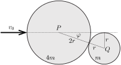
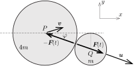

**Megoldás.**
 Az ütközés nagyon rövid ideje alatt a külső erők (az asztallap és a korongok közötti súrlódás) hatása figyelmen kívül hagyható, vagyis a két korongból álló rendszer zártnak tekinthető. Az ütközés során a teljes mozgásmennyiség (impulzus) vektora állandó marad. Az ütközés rugalmas, így a korongok összes mozgási energiája sem változik meg. A korongok közötti súrlódás elhanyagolható, emiatt a korongok nem jöhetnek forgásba, vagyis a mozgási energia tisztán a transzlációs mozgásból származik.
 Jelöljük a nagyobb korong ütközés előtti sebességvektorát $\boldsymbol{v}_0$-lal. Ha a kis korong tömege $m$, akkor a megadott feltételek miatt a nagyobb korong tömege nyilván $4m$ lesz. Az ütközés pillanatában (lásd az 1. ábrát ) a korongok $P$ és $Q$ középpontjára illeszkedő egyenesnek a nagyobb korong kezdeti mozgásirányával bezárt szöge:
 $(1)$ $\varphi=\arcsin\frac{r}{R+r}=\arcsin\frac{1}{3}=19{,}5^\circ.$

 1. ábra

 Az ütközés során a két korong között egy nagyon rövid ideig tartó, nagyon nagy $\boldsymbol{F}(t)$ erő lép fel, ami a kezdetben álló kis korongot $P\rightarrow Q$ irányba valamekkora $\boldsymbol{u}$ sebességgel meglöki. Eközben a nagy korong sebessége $\boldsymbol{v}$-re változik ( 2. ábra ). A kis korong az ütközés előtt állt, így $\boldsymbol{u}$ iránya nyilván megegyezik $\boldsymbol{F}$ irányával.

 2. ábra

 Az ábrán látható koordináta-rendszerben az impulzusmegmaradás törvénye szerint
 $4mv_0=4mv_x+mu\cos\varphi,$
 $0=4mv_y-mu\sin\varphi,$
 vagyis
 $(2)$ $v_x=v_0-\frac{u\cos\varphi}{4},$
 $(3)$ $v_y=-\frac{u\sin\varphi}{4}.$
 Az energiamegmaradás törvényét alkalmazva felírhatjuk, hogy
 $(4)$ $\frac{1}{2}(4m)v_0^2=\frac{1}{2}(4m)\left(v_x^2+v_y^2\right)+\frac{1}{2}mu^2.$
 (2)-t és (3)-t (4)-be helyettesítve az $u$ sebességnagyságra egy hiányos másodfokú egyenletet kapunk, aminek az egyik (számunkra érdektelen) megoldása $u=0$, a másik gyöke pedig
 $(5)$ $u=\frac{8}{5}v_0\cos\varphi=1{,}51\,v_0.$
 (2), (3) és (5) felhasználásával a korongok sebességkomponensei:
 $u_x=u\cos\varphi=1{,}42\,v_0,$
 $u_y=-u\sin\varphi=-0{,}50\,v_0,$
 $v_x=0{,}64\,v_0,$
 $v_y=0{,}13\,v_0.$
 Az ütközés után a nagy korong sebességnagyságának négyzete:
 $v^2=v_x^2+v_y^2=0{,}43\,v_0^2,$
 a kis korongé pedig
 $u^2=u_x^2+u_y^2=2{,}28\,v_0^2.$
 Az asztallapon csúszó korongok az asztallal való súrlódásuk miatt ugyanolyan ütemben egyenletesen lassulva mozognak, a megállásukig megtett útjuk a kezdősebességük négyzetével arányos. Ennek megfelelően a kisebb korong
 $d=\frac{u^2}{v^2}\cdot \text{5 cm}=26{,}5\,\mathrm{cm}$
 út megtétele után áll meg.
 A nagy korong az eredeti mozgásirányához képes
 $\alpha=\arctan\frac{v_y}{v_x}=11{,}1^\circ$
 szögben ,,balra'' térül el, a kis korong elmozdulásának iránya pedig ,,jobbra''
 $\beta=\arctan\frac{\vert u_y\vert}{u_x}=\varphi=19{,}5^\circ$
 a nagyobb korong kezdeti mozgásirányához viszonyítva.

