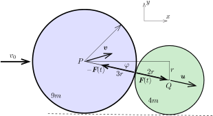
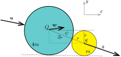

**I. megoldás.**
 Az ütközés nagyon rövid ideje alatt a külső erők (az asztallap és a korongok közötti súrlódás) hatása figyelmen kívül hagyható, vagyis a három korongból álló rendszer zártnak tekinthető. Az ütközések során a teljes mozgásmennyiség (impulzus) vektora állandó marad. Az ütközés rugalmas, így az ütköző korongok összes mozgási energiája sem változik meg. A korongok közötti súrlódás elhanyagolható, emiatt a korongok nem jöhetnek forgásba, vagyis a mozgási energia tisztán a transzlációs mozgásból származik.
 A korongok tömege az alapterületükkel, vagyis a sugaruk négyzetével arányos: $9m$, $4m$, $m$.
 Vizsgáljuk először a $9m$ és a $4m$ tömegű korong ütközését. Jelöljük a nagyobb korong ütközés előtti sebességvektorát $\boldsymbol{v}_0$-lal. Az ütközés pillanatában (lásd az 1. ábrát ) a korongok $P$ és $Q$ középpontjára illeszkedő egyenesnek a nagyobb korong kezdeti mozgásirányával bezárt szöge:
 $(1)$ $\varphi=\arcsin\frac{1}{5}=11{,}54^\circ.$
 1. ábra

 Az ütközés során a két korong között egy nagyon rövid ideig tartó, nagyon nagy $\boldsymbol{F}(t)$ erő lép fel, ami a kezdetben álló kisebb korongot $\overrightarrow{PQ}$ irányba valamekkora $\boldsymbol{u}$ sebességgel meglöki. Eközben a nagyobb korong sebessége $\boldsymbol{v}$-re változik. A kisebb korong az ütközés előtt állt, így $\boldsymbol{u}$ iránya nyilván megegyezik $\boldsymbol{F}$ irányával.
 Az ábrán látható koordináta-rendszerben az impulzusmegmaradás törvénye szerint
 $(9m)v_0=(9m)v_x+(4m)u\cos\varphi,$
 $0=(9m)v_y-(4m)u\sin\varphi,$
 vagyis
 $(2)$ $v_x=v_0-\frac{4}{9}{u\cos\varphi},$
 $(3)$ $v_y= \frac{4}{9}{u\sin\varphi}.$
 Az energiamegmaradás törvényét alkalmazva felírhatjuk, hogy
 $(4)$ $\frac{1}{2}(9m)v_0^2=\frac{1}{2}(9m)\left(v_x^2+v_y^2\right)+\frac{1}{2}(4m)u^2.$
 (2)-t és (3)-t (4)-be helyettesítve az $u$ sebességnagyságra egy hiányos másodfokú egyenletet kapunk, aminek az egyik (számunkra érdektelen) megoldása $u=0$, a másik gyöke pedig
 $(5)$ $u=\frac{18}{13}v_0\cos\varphi=\frac{18\sqrt{24}}{65}v_0\approx 1{,}36\,v_0.$
 (2), (3) és (5) felhasználásával a korongok sebességkomponensei:
 $u_x=u\cos\varphi=1{,}33\,v_0,$
 $u_y=-u\sin\varphi=-0{,}27\,v_0,$
 $v_x=0{,}41\,v_0,$
 $v_y=0{,}12\,v_0.$
 A $4m$ tömegű korong ezután ütközik az $m$ tömegű álló koronggal, és a sebességük az ütközés után $\boldsymbol{w}$-re és $\boldsymbol{z}$-re változik ( 2. ábra ). Az ütközés ferdeségére jellemző szög a második ütközésnél
 $\psi=\arcsin\frac{1}{3}\approx 19{,}47^\circ.$

 2. ábra

 A legkisebb korong ütközés utáni sebessége az erőlökéssel párhuzamos, vagyis $\overrightarrow{QS}$ irányú, derékszögű komponensei tehát $z_x=z\cos\psi$ és $z_y=-z\sin\psi$.
 Erre az ütközésre is felírhatjuk a megmaradási törvényeket:
 $(6)$ $(4m)u_x=(4m)w_x+m\,z_x,$
 $(7)$ $(4m)u_y=(4m)w_y+m\,z_y,$
 $(8)$ $\frac{1}{2}(4m)\left(u_x^2+u_y^2\right)=\frac{1}{2}(4m)\left(w_x^2+w_y^2\right)+\frac{1}{2}m\,z^2.$
 (6) és (7)-ből kifejezve $w_x$ és $w_y$-t, és ezeket (8)-ba helyettesítve $z$-re hiányos másodfokú egyenletet kapunk, aminek nullától különböző megoldása:
 $z=\frac{8}{5}\left(u_x\cos\psi-u_y\sin\psi\right)\approx 2{,}15\,v_0.$
 Ennek megfelelően a középső korong sebessége a második ütközés után
 $\boldsymbol{w}=(0{,}82;\,-0{,}09)\,v_0,$
 a legkisebb korongé
 $\boldsymbol{z}=(2{,}03;\,-0{,}72)\,v_0.$
 A legnagyobb korong végsebessége, mint azt korábban láttuk
 $\boldsymbol{v}=(0{,}41; \, 0{,}12)\,v_0.$

 Megjegyzés. Elképzelhető lenne, hogy a középső korong a második ütközés után még egyszer ütközik a legnagyobb méretű koronggal. Ez azonban a jelen esetben nem következik be, hiszen a $\boldsymbol{w}-\boldsymbol{v}$ relatív sebességvektor és a korongok középpontját összekötő $\overrightarrow{PQ}=(\sqrt{24};-1)$ vektor skalárszorzata pozitív, vagyis ezen két korong középpontjai a második ütközés után távolodnak egymástól.

 A legnagyobb korong az eredeti mozgásirányához képes
 $\alpha_3=\arctan\frac{v_y}{v_x}=16{,}3^\circ$
 szögben ,,balra'' (az óramutató járásával ellentétesen) térül el, a középső korong elmozdulásának iránya
 $\alpha_2=\arctan\frac{\vert w_y\vert}{w_x}=6{,}3^\circ,$
 míg a legkisebb korong
 $\alpha_2=\arctan\frac{\vert z_y\vert}{z_x}=-19{,}5^\circ$
 szögben ,,jobbra'' (az óramutató járásával megegyező irányba) térül el.
 Az asztallapon csúszó korongok az asztallal való súrlódásuk miatt ugyanolyan ütemben ($a=-\mu g$ ,,gyorsulással'') egyenletesen lassulva mozognak, a megállásukig megtett útjuk a kezdősebességük négyzetével arányos. Mivel
 $v^2:w^2:z^2=0{,}18:0{,}68:4{,}62\approx 5\,\mathrm{cm}:19\,\mathrm{cm}:128\,\mathrm{cm},$
 ha a legnagyobb korong $d=5\,\mathrm{cm}$ út megtétele után áll meg, akkor a középső kb. $19\,\mathrm{cm}$-re jut el, a legkisebb pedig majdnem $1{,}3\,\mathrm{m}$ utat tesz meg a megállásáig.

**II. megoldás.**
 A feladat a hivatkozott cikk összefüggései segítségével is megoldható. Az I. megoldás jelöléseit követjük, és a síkbeli vektoroknak komplex számokat feleltetünk meg. Így pl. $\boldsymbol{v}=(v_x,v_y)$ komplex megfelelője a $v=v_x+iv_y,$ és hasonlóan a többi vektornál is. ( Figyelem: Az I. megoldásban $v$ a $\boldsymbol{v}$ vektor nagyságát jelölte, itt viszont a teljes $\boldsymbol{v}$ vektornak megfeleltetett komplex számmal egyezik meg.)
 Ha egy nagyobb korong $\boldsymbol{v}_0$ sebességgel nekiütközik a nála $k$-szor kisebb tömegű álló korongnak, akkor az idézett cikk képleteinek megfelelően az ütközés után a nagyobb korong sebessége
 $v=\frac{kv_0+\mathrm{e}^{2i\alpha}\,\overline{v_0}}{k+1},$
 a kisebb korongé pedig
 $u=\frac{k}{k+1}(v_0-\mathrm{e}^{2i\alpha}\,\overline{v_0}).$
 A fenti képletekben $\alpha$ a korongok közös érintőjének a Gauss-számsík valós tengelyével bezárt szöge.
 Az első ütközésnél $k=\frac{9}{4}=2{,}25$, valamint
 $\alpha=\frac{\pi}{2}-\varphi=\arccos\frac{1}{5}=78{,}46^\circ=1{,}369\,\mathrm{rad},$
 és ennek megfelelően
 $\mathrm{e}^{2i\alpha}=-0{,}921+0{,}392\,i.$
 (A továbbiakban ezt a komplex számot $q$-val fogjuk jelölni.)
 Válasszuk a legnagyobb korong ütközés előtti sebességének $\vert\boldsymbol{v}_0\vert$ nagyságát 1-nek. Ekkor a legnagyobb korong kezdeti sebessége $v_0=1+0\cdot i=1$ valós szám, aminek a komplex konjugáltja is ugyanekkora.
 Az ütközés utáni sebességek
 $v=\frac{2{,}25+q}{3{,}25}=0{,}409+0{,}121\,i,\qquad\textrm{valamint}\qquad u=\frac{2{,}25}{3{,}25}(1-q)=1{,}329-0{,}271\,i.$

 Megjegyzés. A komplex számok közötti algebrai műveleteket akár ,,kézzel'', egy zsebszámológéppel is elvégezhetjük, de a GeoGebra vagy a WolframAlpha program segítségével sokkal gyorsabban és kényelmesebben célhoz érhetünk.

 A második ütközésnél a tömegarány $k'=4$, valamint
 $\alpha'=\frac{\pi}{2}-\psi=\arccos\frac{1}{3},$
 és ennek megfelelően
 $q'=\mathrm{e}^{2i\alpha'}=-0{,}778+0{,}629\,i.$
 A középső ($2r$ sugarú) korong ütközés előtti sebességét az első ütközésnél kiszámított $u$ komplex számmal adhatjuk meg.
 A második ütközés utáni sebességek:
 $w=\frac{4u+q'\overline{u}}{5}=0{,}823-0{,}092\,i,\qquad\textrm{illetve}\qquad z=\frac{4}{5}(u-q\overline{u} )=2{,}027-0{,}717\,i.$
 A korongok ütközések utáni sebességnégyzeteinek aránya
 $v\overline{v}:w\overline{w}:z\overline{z}=0{,}18:0{,}68:4{,}62,$
 és ugyanilyen arányban állnak a megállásukig megtett utak is.

