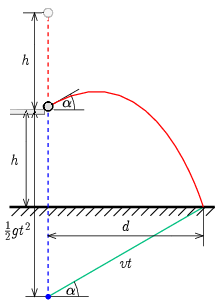

**I. megoldás.**
 A mozgás első szakaszában a golyó szabadeséssel megtesz $h$ utat, majd $v=\sqrt{2gh}$ sebességgel az asztal sarkához érkezik. Innen ugyanakkora sebességgel ismeretlen szögben elpattan (ferde hajítás), és szintén $h$ távolsággal mélyebben talajt ér. A ferde hajítások következő tulajdonságát fogjuk kihasználni: a $v$ sebességgel elhajított test $t$ idő múlva $vt$ távolságra lesz az ugyanakkor, ugyanonnan álló helyzetből induló, szabadeséssel gyorsuló képzeletbeli ponttól. Ez a pont $t$ időpontban a talajtól $h-\tfrac{1}{2}gt^2$ magasságban lesz. A két távolságból Pitagorasz tétellel kapjuk meg a hajítás $d$ vízszintes távolságát a $t$ ideig repülő golyóra:
 $d^2=(vt)^2-\left(h-\frac{1}{2}gt^2\right)^2=-\frac{1}{4}g^2t^4+3hgt^2-h^2,$
 ahol a második lépésben behelyettesítettük $v$ ismert értékét. A jobb oldali kifejezés az időnek negyedfokú, $t^2$-nek másodfokú polinomja, és csak egy bizonyos időtartományban pozitív – amikor talajt érhet a golyó. Hogy megtaláljuk az idő szerinti maximumát, alakítsuk teljes négyzetté:
 $d^2=-\left(\frac{1}{2}gt^2-3h\right)^2+8h^2.$
 Ezen már látszik, hogy akkor van maximuma, amikor a zárójelen belüli kifejezés zérus, azaz amikor $t=\sqrt{\tfrac{6h}{g}}$ ideig tart a ferde hajítás. A maximum értéke $d_\mathrm{max}^2=8h^2$, vagyis a vízszintes távolság maximuma
 $d_\mathrm{max}=2\sqrt2h.$

 II. megoldás. A golyó az asztal sarkától a vízszintessel $\alpha$ szöget bezáró, $v=\sqrt{2gh}$ nagyságú sebességgel pattan el. A pályához tartozó vízszintes és függőleges elmozdulás:
$$\begin{align*}
d&=\sqrt{2gh}\cos\alpha\,t\\
h&=\frac{1}{2}gt^2-\sqrt{2gh}\sin\alpha\,t,
\end{align*}$$
 ahol $t$ a repülési idő. A fenti két egyenletből álló egyenletrendszerben $t$-t és $\alpha$-t tekintjük ismeretlennek, és a maximális $d$-t keressük, ami mellett létezik rájuk megoldás. A két ismeretlen közül $\alpha$-t ejtsük ki először a következőképpen: fejezzük ki az első egyenletből $\cos\alpha$-t, a másodikból $\sin\alpha$-t:
$$\begin{align*}
\cos\alpha&=\frac{d}{\sqrt{2gh}t},\\
\sin\alpha&=\frac{\frac{1}{2}gt^2-h}{\sqrt{2gh}t}.
\end{align*}$$
 Ezután a $\sin^2\alpha+\cos^2\alpha=1$ azonosságot alkalmazva kiküszöböljük az $\alpha$ ismeretlent:
 $\left(\frac{\frac{1}{2}gt^2-h}{\sqrt{2gh}t}\right)^2+\left(\frac{d}{\sqrt{2gh}t}\right)^2=1,$
 amit kicsit átrendezve az I. megoldás induló egyenletéhez jutunk.

