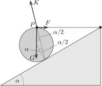

**Megoldás.**
 A hengerre a fonál által kifejtett $\boldsymbol{F}$ erő, a $\boldsymbol{G}$ nehézségi erő és a lejtő által kifejtett $\boldsymbol{K}$ erő hat.

 $\boldsymbol{F}$ és $\boldsymbol{G}$ hatásvonala az ábrán látható $P$ ponton halad át, ezen pontra nézve tehát nincs forgatónyomatékuk. Egyensúlyban az összes erő eredő forgatónyomatéka nulla, tehát a $\boldsymbol K$ erő hatásvonala is át kell haladjon a $P$ ponton. Ezek szerint $\boldsymbol{K}$ iránya a lejtőre merőleges egyenessel $\frac{\alpha}{2}$ szöget zár be. A lejtő irányú súrlódási erő és a lejtőre merőleges nyomóerő hányadosa $\tan\frac{\alpha}{2}\approx 0{,}27$, tehát a tapadási súrlódás együtthatója legalább ekkora kell, hogy legyen.

