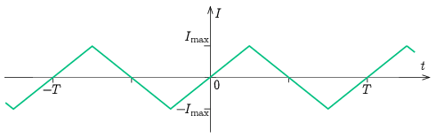
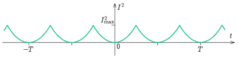
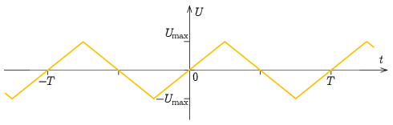
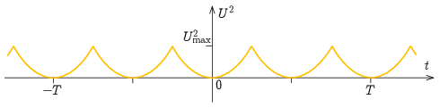

**Megoldás.**
 Az effektív érték a négyzetérték időátlagából vont gyöknek felel meg. Az $a)$ esetben a feszültséggenerátor, a $b)$ esetben pedig az áramgenerátor négyszögjeleket produkál, melyeknek a négyzete időben állandó, tehát ezek esetében a műszerek egyszerűen $U_{\mathrm{max}}$, illetve $I_{\mathrm{max}}$ értékeket fognak mutatni.
 $a)$ Az ideális induktivitásra kapcsolt állandó feszültség időben lineárisan változó áramot hoz létre az $U=L\frac{\Delta I}{\Delta t}$ összefüggés alapján. Esetünkben ez az áramerősség-idő függvény a $0\le t\le\tfrac{T}{4}$ intervallumban:
 $I(t)=\frac{U_{\mathrm{max}}}{L}t.$
 A periodikusan $+U_{\mathrm{max}}$ és $-U_{\mathrm{max}}$ között váltakozó feszültség hatására kialakuló áramerősség, illetve az áramerősség négyzetének időfüggését a következő grafikon mutatja:

 A fentiek alapján láthatjuk, hogy
 $I_{\mathrm{max}}=\frac{U_{\mathrm{max}}}{L}\frac{T}{4}=\frac{U_{\mathrm{max}}}{4Lf},$
 illetve
 $I_{\mathrm{max}}^2=\frac{U_{\mathrm{max}}^2}{L^2}\frac{T^2}{16}=\frac{U_{\mathrm{max}}^2}{16L^2f^2}.$
 Közismert, hogy az $y=x^2$ függvény görbe alatti területe a $[0,1]$ intervallumban $\tfrac{1}{3}$, így a grafikonokon látható periodikus áram effektív értéke:
 $I_\mathrm{eff}=\frac{I_\mathrm{max}}{\sqrt{3}}=\frac{U_{\mathrm{max}}}{4\sqrt{3}Lf}.$
 $b)$ Az előzőekhez nagyon hasonló a kondenzátor viselkedése, ha a fegyverzetére négyszögjelet produkáló áramgenerátort kapcsolunk. A kondenzátor töltése a $0\le t\le\tfrac{T}{4}$ időintervallumban lineárisan növekszik: $Q(t)=I_\mathrm{max}t$, és ekkor a fegyverzetein mérhető feszültség
 $U(t)=\frac{Q(t)}{C}=\frac{I_\mathrm{max}}{C}t$
 lesz. A feszültség-idő grafikon az origóra szimmetrikus háromszögjel lesz, ami teljesen hasonló, mint az $a)$ részben tárgyalt áram-idő grafikon.

 A feszültség maximális értéke
 $U_\mathrm{max}=\frac{I_\mathrm{max}}{C}\frac{T}{4}=\frac{I_\mathrm{max}}{4Cf},$
 és végül a feszültség effektív értéke:
 $U_\mathrm{eff}=\frac{U_\mathrm{max}}{\sqrt{3}}=\frac{I_{\mathrm{max}}}{4\sqrt{3}Cf}.$

