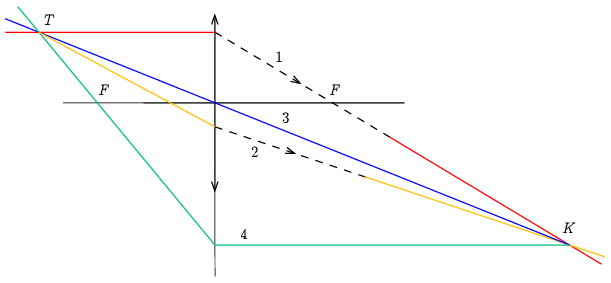

**Megoldás.**

 Hosszabbítsuk meg a két sugarat jobbra. Az (1) és (2) fénysugár metszéspontja a pontszerű fényforrás képe ($K$).
 A fókuszon átmenő (1) sugár a lencse előtt párhuzamos az optikai tengellyel, így ezt a fénysugarat a lencsétől balra is meg tudjuk szerkeszteni.
 $a)$ Megrajzolhatjuk a lencse középpontján és a képen átmenő (3) fénysugarat. Ez nem törik meg a lencsén, így a lencsétől balra is meghosszabbíthatjuk. Az (1) és (3) fénysugarak metszéspontja megadja a pontszerű fényforrás helyét ($T$). $b)$ Másik lehetőség ehelyett: megrajzolhatjuk a képbe az optikai tengellyel párhuzamosan érkező (4) fénysugarat. Ez a lencsétől balra átmegy a lencse másik fókuszán (amelyet körzővel megszerkeszthetünk, hiszen az optikai tengelyen ugyanolyan messze van a lencse középpontjától, mint a megadott fókusz). Az (1) és (4) fénysugarak metszéspontja is megadja a pontszerű fényforrás helyét.
 A feladat megoldásához nincs rá szükség, de végül berajzolhatjuk a (2) fénysugarat a lencsétől balra is.

