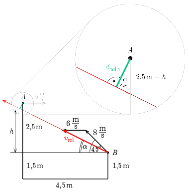

**Megoldás.**
 Vizsgáljuk a két test mozgását az $A$ pontból eldobott testtel együtt mozgó (vízszintesen $v_A=6\,\mathrm{m/s}$ sebességgel egyenletesen mozgó, függőlegesen lefelé $g$ gyorsulással gyorsuló) koordináta-rendszerből. Ebben a rendszerben a $B$ pontból $v_B=8\,\mathrm{m/s}$ sebességgel eldobott test $\boldsymbol{v}_\mathrm{rel}=\boldsymbol{v}_B-\boldsymbol{v}_A$ sebességgel egyenes vonalú egyenletes mozgást végez, sebességének iránya a vízszintessel
 $\alpha=\arctan\frac{v_B\sin 45^\circ}{v_A+v_B\cos 45^\circ}=\arctan\frac{4\sqrt{2}}{6+4\sqrt{2}}=25{,}9^\circ$
 szöget zár be. (Az $A$ pont pedig értelemszerűen nyugalomban van.)

 Az ábra alapján $h=4{,}5\,\mathrm{m}\cdot\tan\alpha=2{,}18\,\mathrm{m}$, a két eldobott test közötti minimális távolság pedig a kinagyított ábrarészlet alapján $d_\mathrm{min}=(2{,}5\,\mathrm{m}-h)\cos\alpha=0{,}28\,\mathrm{m}=28\,\mathrm{cm}$.

