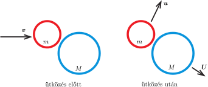
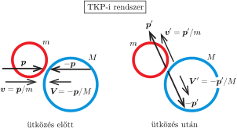

**Megoldás.**
 Egyenes ütközés esetén a karikák középpontja egy egyenes mentén mozog, emiatt az elmozdulás, sebesség és gyorsulás (előjeles) skalár mennyiségekkel adható meg. Nem egyenes ütközésnél az elmozdulás, a sebesség és a gyorsulás (síkbeli) vektorokkal írható le. Ez utóbbi az általánosabb eset, ami magában foglalja az egyenes ütközést is.
 A karikák tömege arányos a méretükkel (sugarukkal), emiatt a fékezőerő így írható fel: $\boldsymbol{F}=-km\boldsymbol{v}$, ahol $k$ egy állandó. A Newton-féle mozgásegyenlet szerint
 $m\boldsymbol{a}=-km\boldsymbol{v},$
 vagyis
 $\boldsymbol{a}+k\boldsymbol{v}=0.$
 Mivel a gyorsulásvektor a sebességvektor időbeli változásának ütemével (idő szerinti deriváltjával) egyezik meg, a sebességvektor pedig az $\boldsymbol{r}$ helyvektor változási ütemét adja meg, ha $\boldsymbol{a}+k\boldsymbol{v}=0,$ akkor
 $(1)$ $\boldsymbol{v}+k\boldsymbol{r}=\text{állandó vektor},$
 hiszen a változásának üteme nulla. Ha valamelyik karika kezdetben az $\boldsymbol{r}_0$ helyen $\boldsymbol{v}_0$ sebességgel mozgott, és az $r_1$ helyen áll meg, akkor az (1) megmaradási tétel szerint
 $\boldsymbol{v}_0+k\boldsymbol{r}_0=k\boldsymbol{r}_1,$
 vagyis az elmozdulásvektor az indulástól a megállásig:
 $\boldsymbol{L}_0=\boldsymbol{r}_1-\boldsymbol{r}_0=\frac{1}{k}\,\boldsymbol{v}_0.$
 A megadott feltétel szerint $L_0=v_0/k,$ vagyis $k=v_0/L_0.$ Ennek megfelelően a karika elmozdulásvektora a $\boldsymbol{v}$ kezdősebességű indulástól a megállásig
 $\boldsymbol{L}=\frac{L_0}{v_0}\boldsymbol{v}.$

 Megjegyzés. A karika
 $\frac{\mathrm{d}v(t)}{\mathrm{d}t}=-kv(t)$
 mozgásegyenlete a radioaktív bomlások egyenletével azonos alakú, és a megoldása:
 $v(t)=v_0\mathrm{e}^{-kt}.$
 Látszik, hogy véges hosszúságú idő alatt a sebesség nem válik nullává, tehát a karika elvben sohasem áll meg. Másrészt igaz, hogy néhányszor (mondjuk 5-ször) $1/k$ idő alatt a sebesség a kezdeti értéknek olyan kicsiny részére csökken, hogy gyakorlatilag nullának tekinthető.

 a) Legyen a kezdetben álló karika tömege $M$, a nekiütköző karikáé $m$. Az ütközés utáni sebességeket jelölje $\boldsymbol{U}$ és $\boldsymbol{u}$ ( 1. ábra ).

 1. ábra

 Egyenes ütközés esetén a sebességvektorok helyett elegendő azok (előjeles) nagyságával, $U$-val és $u$-val számolni. Nyilván $U>u$, és a két karika távolsága a megállásukkor
 $L=\frac{L_0}{v_0}U-\frac{L_0}{v_0}u=\frac{L_0}{v_0}(U-u).$
 Az impulzus- és az energiamegmaradás törvénye szerint
 $mv=mu+MU,\qquad\text{illetve}\qquad\frac{1}{2}mv^2=\frac{1}{2}mu^2+\frac{1}{2}MU^2.$
 Ez a két összefüggés egyértelműen meghatározza az ütközés utáni sebességeket:
 $u=\frac{m-M}{m+M}v,\qquad U=\frac{2m}{m+M}v,$
 tehát
 $U-u=\frac{2m}{m+M}v-\frac{m-M}{m+M}v=v,$
 és a keresett távolság:
 $L=\frac{v}{v_0}L_0.$
 Érdekes, hogy ez a távolság a karikák méretétől (tömegétől) függetlenül minden esetben ugyanakkora.

 b) Ha az ütközés nem egyenes, a megmaradási törvények nem határozzák meg egyértelműen a karikák ütközés utáni sebességét. Ennek ellenére igaz, hogy
 $\vert\boldsymbol{U}-\boldsymbol{u}\vert=v,$
 és emiatt a karikák elmozdulásvektorai $\boldsymbol{R}=\frac{L_0}{v_0}\boldsymbol{U}$ és $\boldsymbol{r}=\frac{L_0}{v_0}\boldsymbol{u}$, a végső távolságuk pedig
 $L=\vert\boldsymbol{R}-\boldsymbol{r}\vert=\vert\boldsymbol{U}-\boldsymbol{u}\vert\,\frac{L_0}{v_0}=\frac{v}{v_0}L_0.$
 Az ütközés utáni relatív sebesség nagyságáról háromféle módszerrel is belátjuk, hogy az $v$-vel egyezik meg.

 1. módszer: Megmaradási törvények alkalmazása. Az impulzus- és az energiamegmaradás törvénye szerint
 $m\boldsymbol{v}=m\boldsymbol{u}+M\boldsymbol{U},\qquad\text{illetve}\qquad\frac{1}{2}mv^2=\frac{1}{2}mu^2+\frac{1}{2}MU^2,$
 vagyis
 $(2)$ $\boldsymbol{v}=\boldsymbol{u}+\frac{M}{m}\boldsymbol{U},$
 és
 $(3)$ $v^2=u^2+\frac{M}{m}U^2.$
 A (2) egyenlet négyzetét (önmagával való skaláris szorzatát) (3)-mal összevetve kapjuk, hogy
 $(4)$ $2\boldsymbol{u}\cdot\boldsymbol{U}=\left(1-\frac{M}{m}\right)\,U^2.$
 Számítsuk ki most az $\boldsymbol{U}-\boldsymbol{u}$ vektor önmagával való skalárszorzatát, vagyis a relatív sebesség négyzetét:
 $\left(\boldsymbol{U}-\boldsymbol{u}\right)^2=U^2+u^2-2\boldsymbol{u}\cdot\boldsymbol{U}.$
 Felhasználva a (4), majd a (3) összefüggést, megkapjuk, hogy
 $\left(\boldsymbol{U}-\boldsymbol{u}\right)^2=U^2+u^2-\left(1-\frac{M}{m}\right)\,U^2=u^2+\frac{M}{m}U^2=v^2,$
 tehát $\vert\boldsymbol{U}-\boldsymbol{u}\vert=v$.

 2. módszer: Tömegközépponti rendszer előnyei. Ha két test relatív sebessége valamely vonatkoztatási rendszerben $\Delta\boldsymbol{v}$, akkor bármely másik, az eredetihez képest mozgó koordináta-rendszerben az egymáshoz viszonyított sebesség ugyanekkora $\Delta\boldsymbol{v}$. A ,,mozgó'' rendszerre való áttéréskor mindegyik sebességhez ugyanaz a vektor (a vonatkoztatási rendszerek egymáshoz viszonyított sebessége) adódik hozzá, ez tehát a sebességvektorok különbségéből kiesik. (Fizikus szaknyelven szólva: a relatív sebesség Galilei-invariáns mennyiség .)
 Két test tömegközépponti (TKP) rendszerében a testek impulzusa (lendülete) $\boldsymbol{p}$ és $-\boldsymbol{p}$. A testek rugalmas ütközésekor az impulzusok a TKP-i rendszerben $\boldsymbol{p}'$ és $-\boldsymbol{p}'$-re változnak. Amennyiben az ütközés rugalmas, a $p^2$-tel, illetve $p'^2$-tel arányos mozgási energia megmaradó mennyiség, fennáll tehát $\vert\boldsymbol{p}\vert=\vert\boldsymbol{p}'\vert$. A testek sebessége a TKP-i rendszerben egymással ellentétes irányú. A sebességkülönbség is arányos $p$-vel, illetve $p'$-vel. Mivel az ütközésnél az impulzusok nagysága nem változik, a sebességkülönbségek nagysága is változatlan marad ( 2. ábra ).

 2. ábra

 Az eredeti (laboratóriumi) rendszerben a sebességkülönbség nagysága $v$. A Galilei-invariancia miatt ugyanekkora kell, hogy legyen az ütközés utáni sebességkülönbség is, vagyis $\vert\boldsymbol{U}-\boldsymbol{u}\vert=v$.

 3. módszer: Síkbeli vektorok komplex számokkal. A KöMaL 2024. évi áprilisi számában megjelent Komplex számok a fizikában I. cikk szerint bármely síkbeli $\boldsymbol{w}=(w_x,w_y)$ vektornak kölcsönösen egyértelműen megfeleltethető egy komplex szám: $w^*=w_x+iw_y$. (A $^*$ azt jelzi, hogy komplex számról van szó, amely különbözik a $\boldsymbol{w}$ vektor $w$-vel jelölt hosszától.)
 A ,,komplex vektorokkal'' kényelmesen tárgyalhatók bizonyos fizikai problémák, pl. síkban mozgó testek ütközése. Az idézett cikkben leírtak szerint (a jelöléseket a jelen esethez igazítva), ha egy $M$ tömegű, álló karikának egy másik, $m$ tömegű karika $w^*=v$ sebességgel nekiütközik, akkor a két test sebessége az ütközés után
 $u^*=\left(\frac{m}{M+m}+\frac{M}{M+m}\mathrm{e}^{2i\alpha}\right)v\qquad\text{és}\qquad U^*=\frac{m}{M+m}\left(1-\mathrm{e}^{2i\alpha}\right)v,$
 ahol $\alpha$ az ütközés ,,ferdeségére'' jellemző szög. A két test relatív sebessége
 $u^*-U^*=\mathrm{e}^{2i\alpha}\,v,$
 melynek nagysága (a komplex szám abszolút értéke):
 $\vert\boldsymbol{u}-\boldsymbol{U}\vert=\vert u^*-U^*\vert=\left|\mathrm{e}^{2i\alpha}\right|v=v.$

