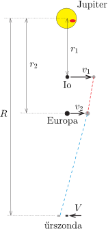

**Megoldás.**
 Belátjuk, hogy a leírt jelenség csak akkor jöhet létre, ha az űrszonda a holdakkal ellentétes irányba kering a Jupiter körül.

 Megjegyzés. A Cassini űrszonda ténylegesen nem keringett a Jupiter körül, hanem elhaladt az óriásbolygó mellett, és annak gravitációs lendítését (is) kihasználva jutott el a Szaturnusz közelébe. Emiatt szerepel a feladat szövegében ,,egy, a bolygó körül keringő űrszonda'', ami tehát nem a Cassini.

 Jelöljük az Io keringési sugarát (a Jupiter középpontjától mért átlagos távolságot) $r_1$-gyel, az Europa pályasugarát $r_2$-vel, az űrszondáét pedig $R$-rel. A megfelelő keringési sebességek legyenek $v_1,\,v_2$ és $V$.

 Az ábráról leolvasható, hogy a 2-es jelzésű Europa akkor tudja – látszólag – megelőzni az 1-es jelzésű Io holdat, ha egy kicsiny $t$ idő alatt teljesül, hogy
 $(1)$ $\frac{v_2t+Vt}{R-r_2} >\frac{v_1t+Vt}{R-r_1}.$
 Használjuk még ki, hogy Kepler III. törvénye szerint
 $T^2\sim \frac{r^2}{v^2}\sim r^3,\qquad \text{vagyis}\qquad v \sim \frac{1}{\sqrt{r}}.$
 Eszerint (1) így is felírható:
 $\frac{\frac{1}{\sqrt{r_2}}+\frac{1}{\sqrt{R}}}{R-r_2}>\frac{\frac{1}{\sqrt{r_1}}+\frac{1}{\sqrt{R}}}{R-r_1},$
 azaz
 $\frac{1}{\sqrt{Rr_2}\left(\sqrt{R}-\sqrt{r_2}\right)}>\frac{1}{\sqrt{Rr_1}\left(\sqrt{R}-\sqrt{r_1}\right)},$
 tehát
 $\sqrt{r_1}\left(\sqrt{R}-\sqrt{r_1}\right)>\sqrt{r_2}\left(\sqrt{R}-\sqrt{r_2}\right),$
 $(2)$ $\sqrt{R} \left(\sqrt{r_2}-\sqrt{r_1}\right)<r_2-r_1,$
 és így
 $\sqrt{R}<\frac{r_2-r_1}{\sqrt{r_2}-\sqrt{r_1}}=\sqrt{r_1}+\sqrt{r_2},$
 azaz
 $(3)$ $R<\Bigl(\sqrt{r_1}+\sqrt{r_2}\Bigr)^2.$

 Megjegyzés. Ha az űrszonda a holdakkal megegyező irányba kering, akkor (1)-ben $V$ előjele negatívra változik, és a fentiekkel megegyező lépések után (2) helyett a
 $(2^*)$ $\sqrt{R} \left(\sqrt{r_1}-\sqrt{r_2}\right)>r_2-r_1 $
 feltételt kapjuk. Ez azonban semekkora $R$-re nem teljesül, hiszen $r_1<r_2$ miatt a bal oldal negatív, a jobb oldal pedig pozitív.

 Táblázati adatok szerint $r_1=421{,}8\cdot 10^3\,\mathrm{km}$ és $r_2=671{,}8\cdot 10^3\,\mathrm{km}$, innen (3)-ból kapjuk: az űrszonda pályasugara legfeljebb 2,16 millió km lehet.

