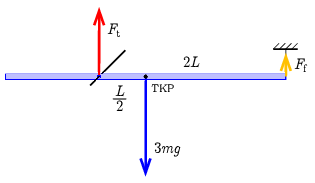

**Megoldás.**
 a) Az erőegyensúly és forgatónyomaték-egyensúly (a tengelyre vonatkoztatva):
$$\begin{gather*}
F_\mathrm{t}+F_\mathrm{f}=3mg,\\
3mg\frac{L}{2}=F_\mathrm{f}\cdot2L,
\end{gather*}$$
 amiből a tengely és a fonál által kifejtett (függőlegesen felfelé mutató) erő
 $F_\mathrm{t}=\frac{9}{4}mg,\qquad\textrm{illetve}\qquad F_\mathrm{f}=\frac{3}{4}mg.$

 b) A mechanikai energia megmaradása alapján
 $3mg\frac{L}{2}=\frac{1}{2}\Theta\omega^2,$
 ahol
 $\Theta=\Theta_0+3m\left(\frac{L}{2}\right)^2=\frac{1}{12}\cdot 3m\left(3L\right)^2+3m\left(\frac{L}{2}\right)^2=3mL^2.$
 Ebből a rúd szögsebessége
 $\omega=\sqrt{\frac{g}{L}},$
 a végpont sebessége pedig
 $v=2L\omega=2\sqrt{Lg}.$

 c) A legalsó helyzetben a függőleges erők eredője gyorsítja a tömegközéppontot a tengely felé:
 $F_\mathrm{t}'-3mg=3m\omega^2\frac{L}{2},$
 amiből a tengely által (függőlegesen felfelé) kifejtett erő:
 $F_\mathrm{t}'=3m\omega^2\frac{L}{2}+3mg=\frac{9}{2}mg.$

