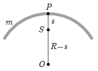

**Megoldás.**
 Jelöljük a kör középpontját $O$-val, a belőle kivágott ív tömegét $m$-mel, az $S$ tömegközéppont és a $P$ alátámasztási pont távolságát pedig $s$-sel. ($s$ függ a körív ,,nyílásszögétől''.) A fizikai inga lengésidő-képlete szerint
 $T=2\pi\sqrt{\frac{\Theta_P}{mgs}},$
 ahol $\Theta_P$ a körívnek a $P$ pontra vonatkoztatott tehetetlenségi nyomatéka.

 Számítsuk ki $\Theta_P$-t a Steiner-tétel felhasználásával! Nyilván $\Theta_O=mR^2$, hiszen az ív minden pontja $R$ távol van a kör középpontjától. Alkalmazzuk a Steiner-tételt a $P$ pontra és az $O$ pontra:
 $\Theta_P=\Theta_S+ms^2,$
 $\Theta_O=\Theta_S+m(R-s)^2.$
 A két egyenlet különbségéből $\Theta_S$ kiesik:
 $\Theta_P-mR^2=ms^2-m(R-s)^2,$
 vagyis
 $\Theta_P=2mRs,$
 a lengésidő tehát
 $T=2\pi\sqrt{\frac{\Theta_P}{mgs}}=2\pi\sqrt{\frac{2R}{g}}.$
 Meglepő módon a lengésidő nem függ $s$-től, vagyis nem függ a körív nyílásszögétől. A feltett kérdésekre tehát az a válasz, hogy mindhárom alakzat lengésideje (kis kitérések esetén) ugyanakkora .

